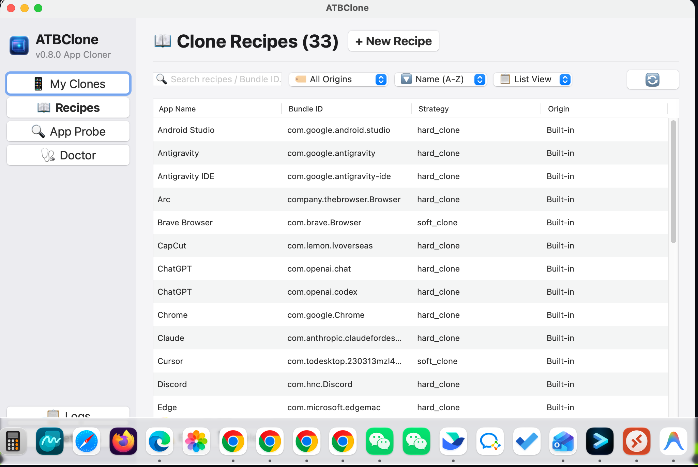

[中文版](Readme_zh.md)  [English](Readme.md) | 📖 **[用户使用手册 (中文)](docs/guide/zh-cn/README.md)** | **[User Guide (EN)](docs/guide/en/README.md)**

# ATBClone (macOS 应用多开引擎)

> 🚀 **ATBClone** 是一个专为 macOS 设计的现代化应用程序多开（Multi-Instancing）与分身管理引擎。支持独立数据隔离、独立网络代理（HTTP / SOCKS5）、自动化规则匹配、重签名与沙盒解除。
>
> 📖 **新手小白入门指引？** 请查阅手把手图文操作指南：**[ATBClone 中文使用手册](docs/guide/zh-cn/README.md)** | **[English Manual](docs/guide/en/README.md)**。

<p align="center">
  
  
</p>

---

## 📥 软件下载 (Download)

请前往 [GitHub Releases](https://github.com/aitobox/ATBClone/releases) 页面下载最新版本的 ATBClone。

Release 页面主要提供两个发布文件，**核心功能完全一致**：

| 发布包 | 适用人群 | 说明 |
| :--- | :--- | :--- |
| **`ATBClone-arm-0.9.7.dmg`** | 👶 **普通用户 / 小白用户（强烈推荐）** | macOS 原生 GUI 桌面客户端安装包 (`.dmg`)。提供现代化卡片式图形界面，零终端操作门槛，开箱即用。 |
| **`ATBCloneCli.tar.gz`** | ⚡ **专业用户 / 开发者** | 独立二进制命令行工具归档（`ATBCloneCli`）。无需安装 Python 环境，专为终端极客、脚本自动化与高级运维场景打造。 |

> 💡 **使用建议与指引**：
> - **普通用户 / 小白用户**：请**优先下载并使用 GUI 图形界面版 (`.dmg`)**。图形化操作简单直观，支持卡片化浏览、一键克隆、状态查看、快捷启动与偏好设置。
> - **专业用户 / 开发者**：推荐使用 **CLI 命令行工具 (`ATBCloneCli` / `atbclone`)**，支持丰富的子命令、深度架构探测、批量脚本与灵活参数调优。

---

## ✨ 核心特性

- 📦 **双引擎克隆架构 (Dual-Engine Cloning Mechanism)**：
  - **硬克隆 (Hard Clone)**：面向原生/社交与独立架构应用（微信、QQ、Telegram、AI 客户端、Chrome、Edge、Arc 等）。完整复制 App Bundle，修改 `Info.plist` 与 Bundle Identifier，通过二进制劫持启动脚本注入独立 `HOME` / `TMPDIR` 数据目录，支持按需剥离 App Sandbox 沙盒限制，并完成 Ad-hoc 重新签名。
  - **软克隆 (Soft Clone)**：面向现代代码编辑器与浏览器（Cursor、VS Code、Firefox、Brave、Tor、Zed 等）。生成轻量级启动器包装（Wrapper Bundle），自动注入 `--user-data-dir` / `--profile` 参数与独立代理环境变量。
- 🔍 **智能应用探测 (App Prober)**：遇到未预设规则的任意 macOS 应用程序时，自动分析其 Mach-O 架构、Frameworks 与代码签名沙盒权限，动态决定软/硬克隆策略并提取推荐规则。
- 🌐 **独立网络代理 (Isolated Network Proxies)**：为每个分身实例配置独立的 HTTP 或 SOCKS5 代理（支持认证），与系统主网络及母体应用互不干扰。
- 📑 **规则引擎 (Recipe Engine)**：内置 33+ 常用应用与 AI Agent 工具分身规则，支持通过 `~/ATBClone/recipes/` 本地优先级覆盖自定义规则。
- 🪄 **交互式向导 (Interactive Wizard)**：全流程引导式 CLI，支持终端拖拽 `.app` 路径、自动命名递增、自定义数据目录与快捷代理配置。
- 🔄 **生命周期管理**：查看已有分身（`list`）、主应用升级后一键重克隆并保留用户数据（`update`）、安全删除分身（`remove` 支持 `--with-data` / `--keep-data` 与交互确认）。
- 🛡️ **安全与提权机制**：默认克隆至 `~/Applications` 无需 root/sudo 权限；如需写入系统级 `/Applications` 采用原生单次 `osascript` 授权提权；严格使用 `shlex.quote` 保证路径转义安全。


---

## 🖥️ 图形化界面使用指南 (GUI — 推荐普通用户使用)

> 💡 **新手与普通用户提示**：如果您不习惯终端命令行操作，请直接从 [GitHub Releases](https://github.com/aitobox/ATBClone/releases) 下载 `ATBClone-arm-0.9.7.dmg` 安装包，将 `ATBClone.app` 拖入 `应用程序` 文件夹即可直接运行使用！

macOS 原生桌面图形客户端提供直观、全功能的应用分身管理：

1. **仪表盘与分身卡片 (Dashboard)**：
   - 以现代卡片式布局清晰展示所有分身应用，直观查看应用图标、克隆策略、独立代理状态与创建时间。
   - 支持一键启动分身、一键升级（同步原应用并完整保留聊天记录与登录数据）以及安全卸载清理。
2. **可视化新建分身向导**：
   - 支持拖拽或文件选择器选取任意 `.app` 应用本体。
   - 自动匹配内置规则或动态触发深度架构探测。
   - 可视化自定义分身名称、显示标题、独立数据目录（如外接移动硬盘）以及 HTTP/SOCKS5 专属代理配置。
3. **内置规则库 (Recipe Library)**：
   - 分类浏览内置的 33+ 热门应用规则（微信、QQ、Chrome、Cursor、ChatGPT、Claude 等），查看沙盒剥离与隔离策略。
4. **应用深度探测器 (App Prober)**：
   - 可视化检测任意未知应用的 Mach-O 架构、Frameworks 与沙盒权限，一键生成专属分身规则。
5. **系统健康自检 (Doctor)**：
   - 一键自检系统版本、Xcode 命令行工具、代码签名环境与存储权限，保障分身稳定运行。
6. **多语言与菜单栏托盘**：
   - 内置多国语言支持（简体中文、繁體中文、English、日本語、한국어 等），支持最小化至 macOS 菜单栏托盘常驻。

*(开发者如需从源码启动 GUI：运行 `bash scripts/run_gui.sh` 或 `python -m atbclone.gui`)*

---

## 🚀 命令行工具使用指南 (CLI — 专业用户 / 脚本自动化)

> ⚡ **专业用户与自动化场景**：CLI 工具（`atbclone` 或独立二进制 `ATBCloneCli`）提供完整的终端控制能力，支持丰富的子命令与漂亮的 Rich 终端输出，适合极客与脚本集成。

### 1. 交互式向导（CLI 引导模式）

无需记忆参数，根据终端提示一步步操作：
```bash
atbclone wizard
```
*流程包括：拖入 `.app` 路径 ➔ 自动匹配分身规则 ➔ 设置分身名称 ➔ 设置显示名称与图标 ➔ 选择输出路径 ➔ 自定义数据目录（若支持） ➔ 可选配置代理 ➔ 确认生成。*

---

### 2. 命令行快速克隆 (`clone`)

#### 基础克隆（自动递增编号，默认输出至 `~/Applications`）
```bash
atbclone clone /Applications/WeChat.app
```

#### 指定分身名称与输出目录
```bash
atbclone clone /Applications/WeChat.app --name "微信工作版" --output-dir ~/Applications
```

#### 自定义数据存储目录 (`--data-dir`)
对于支持数据隔离的应用（如 Chromium 系列、Firefox、微信等），可指定自定义数据存储路径（例如放置于外部 SSD 或专属工作区）：
```bash
atbclone clone /Applications/Chrome.app --name "Chrome-Custom" --data-dir /Volumes/ExternalSSD/ChromeData
```
*注：系统会自动探测应用是否支持数据隔离；若目标应用无数据隔离规则（如 Zed），将自动拦截并提示错误。*

#### 未预设规则应用克隆（自动触发深度探测）
克隆未内置规则的应用时，ATBClone 会自动触发 App Prober 探测架构与沙盒权限，动态生成最佳规则后执行克隆：
```bash
atbclone clone /Applications/ATBCmder.app --name "ATBCmder-Work"
```

#### 为分身配置专属独立网络代理 (HTTP / SOCKS5)
```bash
# 配置 HTTP 代理
atbclone clone /Applications/Telegram.app \
  --name "Telegram-Proxy" \
  --proxy-host 127.0.0.1 \
  --proxy-port 7890 \
  --proxy-type http

# 配置 SOCKS5 代理
atbclone clone /Applications/ChatGPT.app \
  --name "ChatGPT-US" \
  --proxy-host 127.0.0.1 \
  --proxy-port 1080 \
  --proxy-type socks5
```

---

### 3. 查看分身列表 (`list`)

通过漂亮的 Rich 表格查看所有由 ATBClone 管理的分身状态：
```bash
atbclone list
```
输出示例：
```
┏━━━━━━━━━━┳━━━━━━━━━┳━━━━━━━━━━━━━━━━━━━━━━┳━━━━━━━━━━━━┳━━━━━━━━━━━━━━━━━━┳━━━━━━━━━━━━━━━━━━━━━━━━┓
┃ 名称     ┃ 原 APP  ┃ Bundle ID            ┃ 策略       ┃ 创建时间         ┃ 代理                   ┃
┡━━━━━━━━━━╇━━━━━━━━━╇━━━━━━━━━━━━━━━━━━━━━━╇━━━━━━━━━━━━╇━━━━━━━━━━━━━━━━━━╇━━━━━━━━━━━━━━━━━━━━━━━━┩
│ 微信2    │ 微信    │ com.tencent.xinWeChat │ hard_clone │ 2026-08-18 22:30 │ 未开启                 │
│ TG-Proxy │ Telegram│ ru.keepcoder.Telegram │ hard_clone │ 2026-08-18 22:45 │ http://127.0.0.1:7890  │
│ Chrome2  │ Chrome  │ com.google.Chrome    │ hard_clone │ 2026-08-18 23:00 │ 未开启                 │
└──────────┴─────────┴━━━━━━━━━━━━━━━━━━━━━━┴━━━━━━━━━━━━┴━━━━━━━━━━━━━━━━━━┴━━━━━━━━━━━━━━━━━━━━━━━━┘
```

---

### 4. 更新原应用后的分身同步 (`update`)

当 App Store 或官网更新了主应用版本时，一键更新分身，**保留所有聊天记录与登录状态（数据目录不丢失）**：
```bash
atbclone update 微信2
```

---

### 5. 删除分身 (`remove`)

#### 交互式删除（推荐）
在终端中直接执行删除时，系统会交互式询问是否同时清理数据目录：
```bash
atbclone remove 微信2
# 交互提示：是否同时删除数据目录 /Users/.../ATBClone/Data/微信2？[y/N]
```

#### 显式同时删除分身应用及数据目录 (`--with-data`)
```bash
atbclone remove 微信2 --with-data
```

#### 显式仅删除应用本体并保留数据 (`--keep-data`)
```bash
atbclone remove 微信2 --keep-data
```
*注：若分身应用或数据目录位于需要管理员权限的系统目录（如 `/Applications`），系统会自动通过一次提权安全清理。*


---

### 6. 分身规则管理与自定义扩展 (`recipe`)

#### 列出所有内置应用分身规则
```bash
atbclone recipe list
```

#### 查看特定应用的分身规则 YAML
```bash
atbclone recipe show com.tencent.xinWeChat
```

#### 自定义与覆盖分身规则
在 `~/ATBClone/recipes/<bundle_id>.yaml` 放置 YAML 规则文件即可自动优先加载覆盖：
```yaml
# 示例：~/ATBClone/recipes/com.example.customapp.yaml
bundle_id: com.example.customapp
app_name: CustomApp
strategy: hard_clone
app_type: cocoa # 可选类型：cocoa, electron, chromium, firefox, generic
strip_sandbox: false # false (推荐): 依托 macOS 原生容器沙盒隔离；true: 强制剥离沙盒
environment_injection:
  HOME: '{{ATB_DATA_DIR}}/Home'
  TMPDIR: '{{ATB_DATA_DIR}}/Tmp'
proxy:
  enabled: true
  type: http
  host: 127.0.0.1
  port: 7890
```

---

### 7. 深度应用探测与分身规则生成 (`probe`)

对任意本地 `.app` 进行深度架构与代码签名权限探测，分析其运行内核（Chromium / Electron / Gecko / Native）、沙盒状态，并输出推荐的 ATBClone Recipe YAML：

#### 基础探测与终端展示
```bash
atbclone probe /Applications/ATBCmder.app
```

#### 探测并直接保存至本地规则库 (`~/ATBClone/recipes/<bundle_id>.yaml`)
```bash
atbclone probe /Applications/ATBCmder.app --save
```

#### 导出分身规则到指定文件
```bash
atbclone probe /Applications/ATBCmder.app -o /path/to/recipe.yaml
```

#### 机器可读 JSON 输出
```bash
atbclone probe /Applications/ATBCmder.app --json
```

---

### 8. 查看版本与系统信息 (`version`)

```bash
# 查看详细系统与运行环境信息
atbclone version

# 仅输出版本号
atbclone version --short
# 或
atbclone --version
```

---

## 📋 内置分身规则 (Built-in Recipes)

| 类别 | 应用名称 | Bundle Identifier | 克隆策略 | 应用类型 (App Type) | 沙盒解除 (Strip Sandbox) |
| :--- | :--- | :--- | :--- | :--- | :---: |
| **即时通讯 & 协同办公** | 微信 (WeChat) | `com.tencent.xinWeChat` | Hard Clone | `cocoa` | ✘ |
| | QQ | `com.tencent.qq` | Hard Clone | `electron` | ✘ |
| | 企业微信 (WeCom) | `com.tencent.WeWorkMac` | Hard Clone | `chromium` | ✘ |
| | 飞书 (Lark) | `com.electron.lark` | Hard Clone | `electron` | ✘ |
| | Telegram (原生 Swift) | `ru.keepcoder.Telegram` | Hard Clone | `cocoa` | ✘ |
| | Telegram Desktop | `org.telegram.desktop` | Hard Clone | `generic` | ✘ |
| | LINE | `jp.naver.line.mac` | Hard Clone | `cocoa` | ✘ |
| | Slack | `com.tinyspeck.slackmacgap` | Hard Clone | `electron` | ✘ |
| | Discord | `com.hnc.Discord` | Hard Clone | `electron` | ✘ |
| | Skype | `com.skype.skype` | Hard Clone | `electron` | ✘ |
| **AI 客户端** | Claude | `com.anthropic.claudefordesktop` | Hard Clone | `electron` | ✘ |
| | ChatGPT (Codex) | `com.openai.codex` | Hard Clone | `cocoa` | ✘ |
| | ChatGPT (标准版) | `com.openai.chat` | Hard Clone | `cocoa` | ✘ |
| | Gemini | `com.google.GeminiMacOS` | Hard Clone | `cocoa` | ✘ |
| | Antigravity | `com.google.antigravity` | Hard Clone | `electron` | ✘ |
| | Antigravity IDE | `com.google.antigravity-ide` | Hard Clone | `electron` | ✘ |
| **浏览器** | Google Chrome | `com.google.Chrome` | Hard Clone | `chromium` | ✘ |
| | Microsoft Edge | `com.microsoft.edgemac` | Hard Clone | `chromium` | ✘ |
| | Brave Browser | `com.brave.Browser` | Soft Clone | `chromium` | — |
| | Firefox | `org.mozilla.firefox` | Soft Clone | `firefox` | — |
| | Tor Browser | `org.torproject.torbrowser` | Soft Clone | `firefox` | — |
| | Arc Browser | `company.thebrowser.Browser` | Hard Clone | `chromium` | ✘ |
| **音视频与社交娱乐** | 哔哩哔哩 (Bilibili) | `com.bilibili.bilibiliPC` | Hard Clone | `electron` | ✘ |
| | 抖音 (Douyin) | `com.bytedance.douyin.desktop` | Hard Clone | `electron` | ✘ |
| | 网易云音乐 | `com.netease.163music` | Hard Clone | `chromium` | ✘ |
| | Steam | `com.valvesoftware.steam` | Hard Clone | `cocoa` | ✘ |
| **生产力与实用工具** | WPS Office | `com.kingsoft.wpsoffice.mac` | Hard Clone | `cocoa` | ✘ |
| | 剪映专业版 | `com.lemon.lvpro` | Hard Clone | `chromium` | ✘ |
| | CapCut | `com.lemon.lvoverseas` | Hard Clone | `chromium` | ✘ |
| **开发工具** | Cursor | `com.todesktop.230313mzl4w4u92` | Soft Clone | `electron` | — |
| | VS Code | `com.microsoft.VSCode` | Soft Clone | `electron` | — |
| | Android Studio | `com.google.android.studio` | Hard Clone | `generic` | ✘ |
| | Zed | `dev.zed.Zed` | Soft Clone | `generic` | — |

---

## 🛠️ 开发与环境依赖 (Development Setup)

- **操作系统**：macOS 13.0+ (Apple Silicon arm64 / Intel x86_64)
- **Python**：Python 3.12+（`build_cli.sh` 编译时强制要求；推荐使用 Conda）
- **系统开发工具**：已安装 Xcode Command Line Tools（提供 `codesign`, `xcode-select`, `PlistBuddy`）

```bash
# 1. 安装 Xcode Command Line Tools (若尚未安装)
xcode-select --install

# 2. 切换到项目目录并激活 Conda 环境，以可编辑模式安装全部依赖 (含 GUI)
conda activate ATBClone
pip install -e ".[dev,gui]"

# 3. 运行环境自检
atbclone doctor
```

---

## 🏷️ 语义化版本管理 (Version Management)

项目采用标准的语义化版本号格式 `x.y.z`（当前版本：`0.9.7`），并提供了专用的版本管理脚本 `scripts/manage_version.py`：

```bash
# 1. 检查各配置文件版本是否一致
python scripts/manage_version.py --show

# 2. 语义化升级版本 (patch: 0.9.7 -> 0.9.8, minor: 0.9.7 -> 0.10.0, major: 0.9.7 -> 1.0.0)
python scripts/manage_version.py --bump patch
python scripts/manage_version.py --bump minor
python scripts/manage_version.py --bump major

# 3. 指定显式版本
python scripts/manage_version.py 0.9.7

# 4. 预览变更（不实际写入文件）
python scripts/manage_version.py --bump patch --dry-run
```

*脚本会自动同步更新 `pyproject.toml`、`src/atbclone/__init__.py` 等目标文件的版本定义。*

---

## 🏗️ 独立二进制构建与打包 (Build)

项目提供了自动化构建与打包脚本，支持独立 CLI 二进制及 GUI DMG 安装包构建：

```bash
# 1. 构建 CLI 独立二进制 (生成于 dist/ATBCloneCli)
bash scripts/build_cli.sh

# 2. 构建 GUI 原生安装包 (生成于 dist/ATBClone-0.9.7.dmg)
bash scripts/build_gui.sh
```

构建完成后将在 `dist/` 目录生成产物：
```bash
# 验证 CLI 独立二进制
./dist/ATBCloneCli --help
./dist/ATBCloneCli version
./dist/ATBCloneCli doctor
./dist/ATBCloneCli probe /Applications/ATBCmder.app
```

---

## 🧪 运行测试

本项目严格遵循 TDD 与自动化验证规范，包含完整的单元测试与集成测试：

```bash
PYTHONPATH=src conda run -n ATBClone python -m pytest tests/ -v
```

---

## 📂 目录与数据存储架构

```
~/ATBClone/
├── config.yaml           # 用户配置与偏好设置 (语言、托盘等)
├── clones.yaml           # 全局分身状态追踪记录
├── recipes/              # 用户自定义分身规则存放目录 (可选覆盖)
└── Data/                 # 各分身独立的数据隔离目录
    ├── 微信2/
    │   ├── Home/         # 隔离的独立用户主目录
    │   └── Tmp/          # 隔离的临时目录
    └── Chrome2/          # Chrome 独立 User Data 目录
```

```
src/atbclone/
├── cli/                  # CLI 命令行层 (Click + Rich)
│   ├── cmd_clone.py      # 克隆主命令 (支持未配置规则自动探测)
│   ├── cmd_doctor.py     # 环境检测
│   ├── cmd_list.py       # 分身列表
│   ├── cmd_probe.py      # 应用深度架构探测与规则生成
│   ├── cmd_recipe.py     # 分身规则管理
│   ├── cmd_remove.py     # 分身删除
│   ├── cmd_update.py     # 分身更新
│   ├── cmd_version.py    # 版本与系统信息展示
│   └── cmd_wizard.py     # 交互式向导
├── core/                 # 核心领域模型与克隆引擎
│   ├── app_inspector.py  # App 元数据检查与自动编号
│   ├── app_prober.py     # 深度架构探测、沙盒检查与动态规则生成
│   ├── clone_task.py     # 克隆任务实体
│   ├── engines.py        # Soft & Hard 克隆执行引擎
│   ├── models.py         # 基础模型
│   └── state.py          # YAML 状态管理
├── gui/                  # 原生 macOS GUI 桌面客户端层 (Toga / Briefcase)
│   ├── components/       # 可复用 UI 组件 (分身卡片、侧边栏、顶部栏)
│   ├── services/         # GUI 业务服务桥接 (clone, doctor, probe, recipe, tray)
│   └── views/            # GUI 视图 (仪表盘、规则库、探测器、自检、设置、日志)
├── executor/             # 底层执行器 (Direct Subprocess / AppleScript 提权)
│   └── runner.py
└── recipes/              # 规则模型、加载器与 33 个内置规则
    ├── builtin/          # 内置 YAML 规则
    ├── loader.py         # 规则匹配与优先级加载
    └── models.py         # Pydantic 校验模型
```

---

## 📄 License 与 Release Notes

- **开源协议**: GPL-3.0 License.
- **更新日志 (Release Notes)**: [English](docs/release/ReleaseNote.md) | [简体中文](docs/release/ReleaseNote_zh.md) | [繁體中文](docs/release/ReleaseNote_zh_TW.md) | [日本語](docs/release/ReleaseNote_ja.md) | [한국어](docs/release/ReleaseNote_ko.md) | [Deutsch](docs/release/ReleaseNote_de.md) | [Français](docs/release/ReleaseNote_fr.md) | [Русский](docs/release/ReleaseNote_ru.md) | [Español](docs/release/ReleaseNote_es.md)

