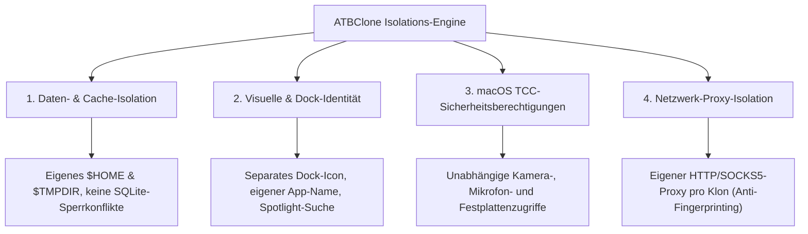

# 📖 ATBClone Benutzerhandbuch (Deutsche Version)

[English Version](../en/) | [簡體中文](../zh/) | [繁體中文](../zh-hant/) | [日本語](../ja/) | [한국어](../ko/) | Deutsche Version | [Français](../fr/) | [Español](../es/) | [Русский](../ru/)

Willkommen beim offiziellen **ATBClone Benutzerhandbuch**. Dieses Handbuch führt Sie Schritt für Schritt durch alle Funktionen zur Multi-Instanz-Ausführung und Sandbox-Isolation von macOS-Anwendungen — von grundlegenden Workflows für Einsteiger über benutzerdefinierte Rezepte bis hin zu internen Architekturanalysen und Systemdiagnosen.

---

## 🧭 Kapitel-Navigation

| Kapitel | Titel | Zielgruppe | Hauptthemen |
| :--- | :--- | :--- | :--- |
| **[Kapitel 1](01-basic-operations.md)** | **[Grundlegende Bedienung & Klon-Verwaltung](01-basic-operations.md)** | 👶 **Einsteiger / Standardnutzer** | 7-Schritte-Assistent, Starten, Datenverzeichnis direkt öffnen, **verlustfreie Synchronisation** nach Updates der Haupt-App, Tabellenansicht (**Batch-Update & Batch-Löschen**), sicheres Entfernen. |
| **[Kapitel 2](02-advanced-custom-recipes.md)** | **[Benutzerdefinierte Rezepte & Basisparameter](02-advanced-custom-recipes.md)** | ⚡ **Fortgeschrittene Nutzer** | **App Prober (Intelligenter Scanner)** zur Erkennung unbekannter Apps, visueller Rezept-Editor, **Erklärung der Basisparameter** (`bundle_id`, `strategy`, `strip_sandbox`, `proxy`). |
| **[Kapitel 3](03-under-the-hood-and-internals.md)** | **[Funktionsweise & Erweiterte Parameter](03-under-the-hood-and-internals.md)** | 🔬 **Power-User / Entwickler** | Soft- vs. Hard-Clone-Mechanismen, **Hard-Clone Kerntechnologien & Binary Wrapper Hijack**, Trennung von Logik und Daten, **Erweiterte YAML-Parameter** (`environment_injection`, `symlink_whitelist`, Pfad-Makros). |
| **[Kapitel 4](04-faq-and-troubleshooting.md)** | **[Häufig gestellte Fragen (FAQ), Diagnose & Feedback](04-faq-and-troubleshooting.md)** | 🩺 **Alle Nutzer** | Wichtige FAQs (Datensicherheit, Speicherpfade & Migration, Bann-Prävention, kein Root erforderlich), Doctor-Systemprüfung, **Klon-Details kopieren & GitHub Issues melden**. |

---

## 🌟 Warum ATBClone?

Auf macOS scheitern herkömmliche Klon-Methoden (wie einfaches Kopieren per `cp -R` oder Terminal-Aliase) häufig, da moderne Apps Benutzerpräferenzen, SQLite-Datenbanken und Keychain-Schlüsselbundelemente systemweit teilen.

ATBClone löst dies durch eine eigens entwickelte **Vierfach-Isolation (Quadruple Isolation)**:

1. **📦 Daten- & Cache-Isolation**: Jeder Klon erhält ein eigenes isoliertes Benutzerverzeichnis (`$HOME`) oder `--user-data-dir`. Mehrere Konten können parallel laufen, ohne lokale Datenbanken zu blockieren.
2. **🎨 Visuelle & Dock-Identität**: Klone besitzen individuelle Namen und Icons. Sie erscheinen separat in Spotlight, Launchpad und im macOS Dock.
3. **🛡️ Systemberechtigungen (TCC) Isolation**: Durch modifizierte `CFBundleIdentifier`-Werte behandelt macOS Klone als eigenständige Apps mit separaten TCC-Berechtigungen (Kamera, Mikrofon etc.).
4. **🌐 Netzwerk-Proxy-Isolation**: Leiten Sie den Datenverkehr bestimmter Klone über dedizierte HTTP- oder SOCKS5-Proxys, ohne das Host-Netzwerk zu beeinträchtigen.

---

## 📚 Wichtige Begriffe & Glossar

* **Haupt-App (Host App)**: Das Originalprogramm auf Ihrem Mac (meist in `/Applications`).
* **Klon-App (Clone App)**: Die von ATBClone erzeugte Instanz (Standard: `~/ATBClone/Apps`).
* **Hard Clone (Physische Kopie & Wrapper Hijack)**: Dupliziert das Bundle, ändert die Bundle-ID, schleust Umgebungsvariablen ein und signiert neu. Ideal für Messenger wie WeChat, Telegram, Slack und Discord.
* **Soft Clone (Launcher-Wrapper)**: Erstellt einen schlanken Starter mit individuellen Parametern (`--user-data-dir`). Perfekt für Browser und Editoren (Cursor, VS Code, Chrome).
* **Rezept (Recipe)**: YAML-Konfigurationsdatei mit Klon- und Startanweisungen.
* **Isoliertes Datenverzeichnis**: Der Speicherort für Chats, Caches und Datenbanken (Standard: `~/ATBClone/Data/<KlonName>`).

---

## 🚀 Schnellstart

1. **Herunterladen & Installieren**: Laden Sie `ATBClone-*.dmg` von [GitHub Releases](https://github.com/aitobox/ATBClone/releases) herunter und ziehen Sie `ATBClone.app` in `/Applications`.
2. **Starten**: Öffnen Sie ATBClone aus dem Launchpad.
3. **Assistent starten**: Klicken Sie oben rechts auf **"+ Neuer Klon"**.
4. **7 Schritte ausführen**: App wählen ➔ Rezept prüfen ➔ Namen vergeben ➔ Pfade bestätigen ➔ **"Jetzt klonen"**.
5. **Loslegen**: Klicken Sie auf **"Starten"** oder öffnen Sie den Klon via Spotlight!

---

> [!NOTE]
> **Mehrsprachigkeit**: Diese Dokumentation ist in 9 Sprachen verfügbar. Nutzen Sie das Sprachauswahlmenü in der oberen Leiste.
