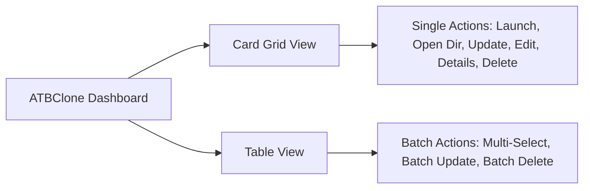

# Chapter 1: Basic Operations & Clone Management

This chapter walks you through creating your first cloned application step-by-step using the interactive 7-step wizard, followed by daily management workflows including launching, data inspection, updating after host upgrades, batch operations, and safe deletion.

---

## 📑 Table of Contents

- [Creating a Cloned Application (7-Step Wizard)](#creating-a-cloned-application-7-step-wizard)
  - [Step 1: Select Primary Application](#step-1-select-primary-application)
  - [Step 2: Inspect Recipe & Strategy](#step-2-inspect-recipe--strategy)
  - [Step 3: Clone Identity & UI Language](#step-3-clone-identity--ui-language)
  - [Step 4: Installation Destination](#step-4-installation-destination)
  - [Step 5: Dedicated Data Directory](#step-5-dedicated-data-directory)
  - [Step 6: Network Proxy Configuration (Optional)](#step-6-network-proxy-configuration-optional)
  - [Step 7: Confirmation & Execution](#step-7-confirmation--execution)
- [Managing Cloned Applications](#managing-cloned-applications)
  - [Launching Cloned Applications](#launching-cloned-applications)
  - [Directly Opening the Data Directory](#directly-opening-the-data-directory)
  - [Editing Clone Configuration](#editing-clone-configuration)
  - [Updating Clones After Primary App Upgrades](#updating-clones-after-primary-app-upgrades)
  - [Batch Operations (Batch Update & Batch Delete)](#batch-operations-batch-update--batch-delete)
  - [Safe Deletion (Keeping vs. Purging Data)](#safe-deletion-keeping-vs-purging-data)

---

## 🪄 Creating a Cloned Application (7-Step Wizard)

Click the **"+ New Clone"** button in the top right corner of the ATBClone dashboard to launch the interactive wizard.

```text
+-------------------------------------------------------------+
|  🧙 Create New Clone - Step 1 of 7                          |
|                                                             |
|  Select Target Application (.app)                           |
|  [/Applications/WeChat.app                   ] [ Browse... ]|
|                                                             |
|  [ Cancel ]                                 [ Next Step > ] |
+-------------------------------------------------------------+
```

### Step 1: Select Primary Application
1. Click **"Browse..."** to open the native macOS file picker (defaults to `/Applications`).
2. Select the target application bundle (e.g., `WeChat.app`, `Telegram.app`, `Google Chrome.app`, or `Cursor.app`).
3. Click **"Next Step >"**.

> [!TIP]
> You can also manually paste the full path of any `.app` located anywhere on your disk (including external drives).

---

### Step 2: Inspect Recipe & Strategy
ATBClone automatically inspects the chosen application:
* **Built-in Match**: If the app matches one of our 33+ built-in recipes, ATBClone automatically selects the optimal strategy (e.g., `Hard Clone` for WeChat, `Soft Clone` for Cursor/VS Code).
* **Smart Prober**: If the app is not in the built-in library, the engine dynamically scans its Mach-O binary and sandbox entitlements, determining the best strategy automatically.
* **Strategy Selection**: You can manually toggle between:
  * `hard_clone`: Duplicates the bundle, mutates bundle ID, and injects binary wrapper scripts.
  * `soft_clone`: Lightweight launcher shell passing isolated parameters.

Click **"Next Step >"** to proceed.

---

### Step 3: Clone Identity & UI Language
Customize how your clone appears on your system:

```text
Clone Name:    [ WeChat2                         ]  (Used for folder naming & internal ID)
Display Name:  [ WeChat Work                     ]  (Visible in Dock, Spotlight & Finder)
UI Language:   [ English (en)                  v ]  (Independent interface locale)
```

1. **Clone Name**: Alphanumeric identifier (e.g., `WeChat2`, `Telegram-Work`).
2. **Display Name**: The friendly title shown in the macOS Dock, Spotlight search, and Finder window titles. By default, it syncs with the Clone Name until you customize it.
3. **UI Language**: Set an independent language locale for this clone (e.g., keep your primary app in Chinese, but run the clone in English or Japanese).

Click **"Next Step >"**.

---

### Step 4: Installation Destination
Choose where the newly created cloned `.app` bundle will reside:

* **Default (`~/ATBClone/Apps` — Recommended)**: Installs directly into your user ATBClone applications folder. **Requires zero administrator passwords or root elevation.**
* **System (`/Applications`)**: Installs alongside standard system apps. ATBClone will request standard macOS authorization once via native dialog.

Click **"Next Step >"**.

---

### Step 5: Dedicated Data Directory
Configure where the clone will store its isolated databases, chat logs, cache, and preferences:

* **Default (`~/ATBClone/Data/<CloneName>`)**: Automatically creates an isolated data sandbox.
* **Custom Path / External SSD**: Click **"Browse..."** to select an external storage drive, secondary volume, or custom encrypted container.

> [!NOTE]
> For applications that do not support dynamic data redirection (such as certain fixed-path command tools), the wizard will display a notice that the data directory is managed by the system.

Click **"Next Step >"**.

---

### Step 6: Network Proxy Configuration (Optional)
If you want this specific clone to route its network traffic through a dedicated proxy (e.g., to separate work and personal network environments or prevent IP association):

1. Toggle the **"Enable Dedicated Proxy"** switch.
2. Choose protocol: `HTTP`, `HTTPS`, or `SOCKS5`.
3. Enter your local proxy host (default: `127.0.0.1`) and port (e.g., `7890` or `1080`).

Click **"Next Step >"**.

---

### Step 7: Confirmation & Execution
Review the summary configuration card:

* **Source Application**: `/Applications/WeChat.app`
* **Clone Name**: `WeChat2`
* **Strategy**: `hard_clone`
* **Destination**: `~/ATBClone/Apps/WeChat2.app`
* **Data Storage**: `~/ATBClone/Data/WeChat2`
* **Proxy**: `http://127.0.0.1:7890`

Click **"Clone Now 🚀"**. The progress bar will track physical copying, Plist mutation, sandbox stripping, wrapper injection, and ad-hoc code re-signing. Once complete, your new clone is ready for use!

---

## 🎛️ Managing Cloned Applications

ATBClone offers two visual modes for browsing your clones: **Card Grid View** (rich visual cards) and **Table View** (compact list with multi-selection support).



### Launching Cloned Applications
* **From ATBClone**: Click the prominent **"Launch"** button on the application card or table row.
* **From macOS Spotlight**: Press `Cmd + Space`, type your clone's Display Name (e.g. `WeChat Work`), and press `Enter`.
* **From Dock / Finder**: Double-click `~/ATBClone/Apps/WeChat2.app` directly.

---

### Directly Opening the Data Directory
Need to inspect downloaded files, clean up storage, or copy offline files?
* Click **"Open Dir"** on the clone card or action bar.
* Finder will instantly open the dedicated storage folder (`~/ATBClone/Data/<CloneName>`).

---

### Editing Clone Configuration
Need to rename your clone, change its UI language, or adjust its proxy server?
1. Click **"Edit"** on the clone card or table toolbar.
2. In the **Edit Clone** window, adjust:
   * **Display Name**: Update how the app is labeled in the Dock and Finder.
   * **Language Locale**: Switch language between English, 简体中文, 日本語, etc.
   * **Proxy Settings**: Enable, disable, or modify proxy host/port.
3. Click **"Save Changes"**. Changes take effect on the next application launch.

---

### Updating Clones After Primary App Upgrades
When your primary application (e.g., WeChat or Chrome) is upgraded through the Mac App Store or auto-updater:

1. Open ATBClone.
2. Select your clone and click **"Update"**.
3. ATBClone will seamlessly re-clone the latest binary code from the updated primary application while **preserving 100% of your user data, login sessions, and chat histories**.

> [!IMPORTANT]
> **Zero Data Loss Guarantee**: Because ATBClone strictly isolates application executable binaries from your user data directory, re-cloning or updating never touches your local database or chat history.

---

### Batch Operations (Batch Update & Batch Delete)
When managing multiple cloned applications:

1. Switch to **Table View** via the top toolbar view mode toggle.
2. Use standard macOS multi-selection:
   * `Cmd + Click`: Select multiple non-contiguous rows.
   * `Shift + Click`: Select a contiguous range of rows.
3. The bottom action bar will adapt dynamically:
   * **"Update (N Clones)"**: Upgrades all selected clones sequentially.
   * **"Delete (N Clones)"**: Deletes all selected clones in a single operation.

---

### Safe Deletion (Keeping vs. Purging Data)
When clicking **"Delete"** (or during batch deletion), ATBClone provides a safe two-tier confirmation dialog:

```text
+-------------------------------------------------------------+
|  ⚠️ Delete Cloned Application                                |
|                                                             |
|  Are you sure you want to remove 'WeChat2'?                 |
|                                                             |
|  [X] Also permanently delete data directory (~/ATBClone/...) |
|                                                             |
|  [ Cancel ]                         [ Confirm Delete ]      |
+-------------------------------------------------------------+
```

* **Keep Data (Unchecked - Default)**: Removes the `.app` bundle from `~/ATBClone/Apps` while preserving your chats, preferences, and databases in `~/ATBClone/Data/WeChat2`. You can recreate the clone later and immediately resume where you left off.
* **Purge Data (Checked)**: Permanently removes both the `.app` bundle and the entire data storage directory.

---

## ⏭️ Next Steps

* To learn how to clone unlisted or niche applications and understand recipe parameters, continue to **[Chapter 2: Custom Recipes for Niche Apps](02-advanced-custom-recipes.md)**.
* For under-the-hood engine mechanics, proceed to **[Chapter 3: Under the Hood & Advanced Parameters](03-under-the-hood-and-internals.md)**.
* For FAQs and issue reporting, visit **[Chapter 4: FAQ & Diagnostic Troubleshooting](04-faq-and-troubleshooting.md)**.
