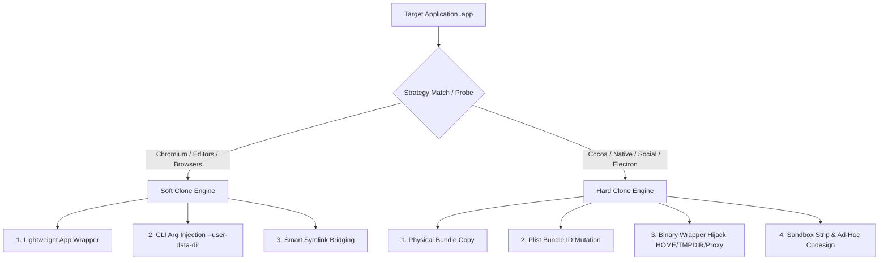

# Chapter 3: Under the Hood & Advanced Parameters

This chapter dives deep into the technical architecture of ATBClone. It explores how **Soft Clone** and **Hard Clone** engines work at the Mach-O and system level, how **Binary Wrapper Hijacking** achieves environmental deception, why our **Data-Logic Decoupling** guarantees zero data loss, and what every advanced recipe parameter does.

---

## 📑 Table of Contents

- [Architectural Overview](#architectural-overview)
- [Cloning Mechanics: Soft Clone vs. Hard Clone](#cloning-mechanics-soft-clone-vs-hard-clone)
  - [1. Soft Clone (Launcher Mode)](#1-soft-clone-launcher-mode)
  - [2. Hard Clone (Deep Sandbox & Wrapper Hijack)](#2-hard-clone-deep-sandbox--wrapper-hijack)
- [The "Three Axes" of Hard Cloning](#the-three-axes-of-hard-cloning)
  - [Axis 1: Bundle ID Mutation (Genetic Re-identification)](#axis-1-bundle-id-mutation-genetic-re-identification)
  - [Axis 2: Binary Wrapper Hijack & Environment Deception](#axis-2-binary-wrapper-hijack--environment-deception)
  - [Axis 3: Sandbox Stripping & Local Ad-Hoc Re-Signing](#axis-3-sandbox-stripping--local-ad-hoc-re-signing)
- [Data-Logic Decoupling Architecture](#data-logic-decoupling-architecture)
- [Advanced Recipe Parameters Reference](#advanced-recipe-parameters-reference)
  - [1. `app_type` (Engine & Framework Type)](#1-app_type-engine--framework-type)
  - [2. `environment_injection` (Environment Hijacking)](#2-environment_injection-environment-hijacking)
  - [3. `launch_args` (Command-Line Argument Injection)](#3-launch_args-command-line-argument-injection)
  - [4. `symlink_whitelist` (System Path Bridging)](#4-symlink_whitelist-system-path-bridging)
  - [5. Dynamic Path Macros](#5-dynamic-path-macros)
- [Advanced Recipe YAML Example](#advanced-recipe-yaml-example)
- [Next Steps](#next-steps)

---

## 🏗️ Architectural Overview

macOS enforces strict isolation boundaries around application identities, user directories, and system security frameworks (such as TCC and Gatekeeper). Standard desktop multi-instancing tools fail because macOS applications frequently:

1. Lock SQLite database files in shared user containers (`~/Library/Application Support/...`).
2. Query the system Keychain for credentials using their hardcoded `CFBundleIdentifier`.
3. Rely on helper sub-processes (Mach Ports / XPC services) that verify code signature entitlements.

ATBClone bridges these challenges through dynamic strategy orchestration:



---

## ⚙️ Cloning Mechanics: Soft Clone vs. Hard Clone

### 1. Soft Clone (Launcher Mode)
* **Design Philosophy**: Zero disk waste, instant launch, lightweight delegation.
* **Mechanism**: 
  1. Creates a minimal `.app` directory structure (less than 200 KB) in `~/ATBClone/Apps/<CloneName>.app`.
  2. Generates an independent `Info.plist` with a custom bundle ID and icon.
  3. Places an executable launcher script in `Contents/MacOS/<Executable>` that directly invokes the primary application's Mach-O binary while passing dedicated data directory flags:
     ```bash
     #!/bin/bash
     ORIGINAL_BIN="/Applications/Google Chrome.app/Contents/MacOS/Google Chrome"
     USER_DATA="$HOME/ATBClone/Data/Chrome2"
     
     exec "$ORIGINAL_BIN" --user-data-dir="$USER_DATA" "$@" >/dev/null 2>&1 &
     ```

---

### 2. Hard Clone (Deep Sandbox & Wrapper Hijack)
* **Design Philosophy**: Total physical independence, isolated Dock identity, independent TCC permissions.
* **Mechanism**:
  1. Performs a full duplicate of the `.app` bundle.
  2. Modifies `CFBundleIdentifier` in `Info.plist`.
  3. Strips sandbox restrictions if necessary.
  4. Intercepts process startup by renaming the binary and installing a wrapper launcher script.
  5. Strips extended quarantine attributes (`xattr -cr`) and re-signs all frameworks and nested helpers using ad-hoc code signatures (`codesign --force --deep --sign -`).

---

## 🪓 The "Three Axes" of Hard Cloning

ATBClone's proprietary Hard Cloning engine relies on three coordinated techniques:

### Axis 1: Bundle ID Mutation (Genetic Re-identification)
macOS uses the `CFBundleIdentifier` string in `Info.plist` to track per-app permissions (camera, microphone, accessibility), Dock identity, and Notification Center queues.

ATBClone uses `/usr/libexec/PlistBuddy` to mutate this identity (e.g., `com.tencent.xinWeChat` becomes `com.tencent.xinWeChat.atbclone.WeChat2`). This causes macOS to treat the clone as a completely distinct application entity.

---

### Axis 2: Binary Wrapper Hijack & Environment Deception
To isolate user data without altering compiled Mach-O binary code, ATBClone intercepts the execution entry point:

1. The compiled executable `Contents/MacOS/WeChat` is renamed to `Contents/MacOS/WeChat.bin`.
2. A lightweight bash wrapper script is written in place of `Contents/MacOS/WeChat` and marked executable (`chmod +x`):
   ```bash
   #!/bin/bash
   DIR=$(dirname "$0")
   
   # Data Directory Isolation
   export HOME="/Users/username/ATBClone/Data/WeChat2/Home"
   export TMPDIR="/Users/username/ATBClone/Data/WeChat2/Tmp"
   
   # Dedicated Network Proxy (if enabled)
   export HTTP_PROXY="http://127.0.0.1:7890"
   export HTTPS_PROXY="http://127.0.0.1:7890"
   export ALL_PROXY="socks5://127.0.0.1:7890"
   
   # Launch renamed binary with all original arguments
   exec "$DIR/WeChat.bin" "$@"
   ```
3. When the clone starts, the wrapper deceives the application into writing its databases and caches to the isolated `$HOME` folder instead of your real user home.

---

### Axis 3: Sandbox Stripping & Local Ad-Hoc Re-Signing
Applications distributed through the Mac App Store contain the `com.apple.security.app-sandbox` entitlement, which restricts filesystem writes to `~/Library/Containers/<OriginalBundleID>`.

When `strip_sandbox: true` is configured:
1. ATBClone extracts the code signing entitlements using `codesign -d --entitlements :-`.
2. Removes the `<key>com.apple.security.app-sandbox</key>` XML node.
3. Re-injects the sanitized entitlements and performs deep ad-hoc code re-signing:
   ```bash
   codesign --force --deep --sign - --entitlements /tmp/clean_entitlements.plist "/Applications/WeChat2.app"
   ```

---

## 🔄 Data-Logic Decoupling Architecture

A major issue with naive application duplication is that updating the primary application (e.g., via the Mac App Store) leaves cloned apps stuck on outdated versions.

ATBClone solves this through **Data-Logic Decoupling**:

```text
[ Application Logic / Executable ]         [ User Data & Chat Databases ]
~/ATBClone/Apps/WeChat2.app                 ~/ATBClone/Data/WeChat2/
  ├── Contents/Info.plist                    ├── Home/
  ├── Contents/MacOS/WeChat (Wrapper)        │   ├── Library/Application Support/...
  ├── Contents/MacOS/WeChat.bin              │   ├── Library/Preferences/...
  └── Contents/Frameworks/                   └── Tmp/
```

* **The Logic Tier** (`.app` bundle) is completely stateless.
* **The Data Tier** (`~/ATBClone/Data/<CloneName>`) stores all persistent databases, cookies, and local chat archives.

When you click **"Update"**, ATBClone can safely discard and recreate the `.app` bundle from the upgraded primary app. The newly generated clone immediately remounts the existing data directory, achieving **100% seamless, non-destructive upgrades**.

---

## 🛠️ Advanced Recipe Parameters Reference

When authoring or modifying recipes in `~/ATBClone/recipes/<bundle_id>.yaml`, the following advanced parameters are available:

### 1. `app_type` (Engine & Framework Type)
* **Type**: `enum` (`cocoa`, `electron`, `chromium`, `firefox`, `generic`, default: auto-detected)
* **Description**: Guides how ATBClone manages sub-processes and argument formatting:
  * `cocoa`: Standard native Swift/Objective-C application.
  * `electron`: Electron + Node.js desktop app (Slack, Discord, QQ, Lark).
  * `chromium`: Chromium-based application (Chrome, Edge, Arc).
  * `firefox`: Gecko-based browser engine.
  * `generic`: Non-standard or generic Mach-O binaries.

---

### 2. `environment_injection` (Environment Hijacking)
* **Type**: `map<string, string>`
* **Description**: Custom environment variables injected into the binary wrapper script before launching.

```yaml
environment_injection:
  HOME: "{{ATB_DATA_DIR}}/Home"
  TMPDIR: "{{ATB_DATA_DIR}}/Tmp"
  XDG_CONFIG_HOME: "{{ATB_DATA_DIR}}/Config"
  ELECTRON_ENABLE_LOGGING: "true"
```

---

### 3. `launch_args` (Command-Line Argument Injection)
* **Type**: `list<string>`
* **Description**: Extra command-line arguments appended when launching the binary.

```yaml
launch_args:
  - "--user-data-dir={{ATB_DATA_DIR}}"
  - "--disable-features=Translate"
```

---

### 4. `symlink_whitelist` (System Path Bridging)
* **Type**: `list<string>`
* **Description**: Paths inside the isolated pseudo-`$HOME` that should be automatically symlinked back to your real user home directory. This prevents loss of system keychain credentials, developer keys, or system fonts.

```yaml
symlink_whitelist:
  - "Library/Keychains"    # Retain macOS Keychain access for persistent logins
  - ".ssh"                 # Retain SSH keys for Git and terminal tools
  - "Library/Fonts"        # Retain access to custom installed system fonts
```

---

### 5. Dynamic Path Macros
You can use dynamic template macros inside `environment_injection` and `launch_args`. ATBClone resolves them at clone creation time:

| Macro | Description | Example Resolution |
| :--- | :--- | :--- |
| `{{ATB_DATA_DIR}}` | Full path to the clone's dedicated data directory | `/Users/username/ATBClone/Data/WeChat2` |
| `{{CLONE_NAME}}` | Name of the clone instance | `WeChat2` |
| `{{BUNDLE_ID}}` | Original application bundle identifier | `com.tencent.xinWeChat` |
| `{{ORIGINAL_BIN}}` | Path to the host app's executable Mach-O binary | `/Applications/WeChat.app/Contents/MacOS/WeChat` |

---

## 📄 Advanced Recipe YAML Example

```yaml
# ========================================================
# ATBClone Advanced Recipe - Cursor AI Editor
# Saved at: ~/ATBClone/recipes/com.todesktop.230313mzl4w4u92.yaml
# ========================================================

bundle_id: com.todesktop.230313mzl4w4u92
app_name: Cursor
strategy: soft_clone
app_type: electron
strip_sandbox: false

environment_injection:
  HOME: "{{ATB_DATA_DIR}}/Home"
  VSCODE_PORTABLE: "{{ATB_DATA_DIR}}/UserData"

launch_args:
  - "--user-data-dir={{ATB_DATA_DIR}}/UserData"
  - "--extensions-dir={{ATB_DATA_DIR}}/Extensions"

symlink_whitelist:
  - "Library/Keychains"
  - ".ssh"
  - ".gitconfig"

proxy:
  enabled: false
  type: http
  host: 127.0.0.1
  port: 7890
```

---

## ⏭️ Next Steps

* To read our FAQ, run diagnostic system health checks, or learn how to report an issue on GitHub, continue to **[Chapter 4: FAQ & Diagnostic Troubleshooting](04-faq-and-troubleshooting.md)**.
