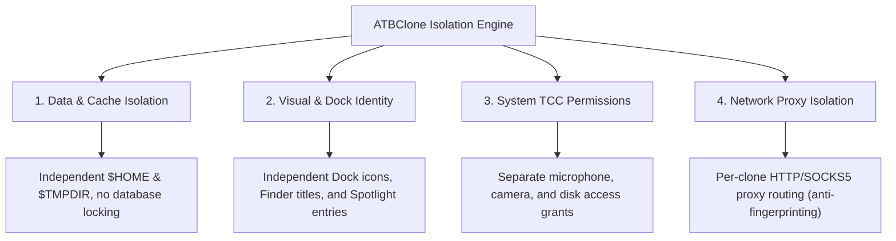

# 📖 ATBClone User Guide & Manual (English)

Welcome to the official **ATBClone User Manual**. This guide provides step-by-step instructions, practical workflows, architectural deep-dives, and troubleshooting tips to help you master application multi-instancing and sandbox isolation on macOS.

---

## 🧭 Navigation Roadmap

Whether you are a beginner looking to run two instances of WeChat or Telegram, or a power user configuring custom proxy routes and Mach-O sandbox stripping, choose your path below:

| Chapter | Title | Primary Audience | Key Topics Covered |
| :--- | :--- | :--- | :--- |
| **[Chapter 1](01-basic-operations.md)** | **[Basic Operations & Clone Management](01-basic-operations.md)** | 👶 **Beginners / Everyday Users** | 7-step creation wizard, launching apps, opening data folders, updating clones after host upgrades, batch updates, and safe deletion. |
| **[Chapter 2](02-advanced-custom-recipes.md)** | **[Custom Recipes for Niche Apps](02-advanced-custom-recipes.md)** | ⚡ **Intermediate Users** | Using **App Prober** to scan unlisted apps, visual Recipe Editor, and basic parameters reference (`bundle_id`, `strategy`, `strip_sandbox`, `proxy`). |
| **[Chapter 3](03-under-the-hood-and-internals.md)** | **[Under the Hood & Advanced Parameters](03-under-the-hood-and-internals.md)** | 🔬 **Power Users / Geeks** | Soft vs. Hard clone mechanics, Sandbox stripping, Binary Wrapper Hijack, data-logic separation, and advanced YAML macros (`environment_injection`, `symlink_whitelist`). |
| **[Chapter 4](04-faq-and-troubleshooting.md)** | **[FAQ & Diagnostic Troubleshooting](04-faq-and-troubleshooting.md)** | 🩺 **All Users** | High-frequency questions (data safety, account ban risks, storage paths), Doctor system diagnostics, and GitHub Issue reporting via Clone Details. |

---

## 🌟 Why ATBClone?

Traditional application cloning methods on macOS (such as simply copying an `.app` bundle via `cp -R` or using basic terminal aliases) frequently break because modern macOS apps share user preferences, databases, and Keychain items.

ATBClone solves this by delivering **Quadruple Isolation**:

1. **📦 Data & Cache Isolation**: Each clone operates in its own isolated user home (`$HOME`) or custom `--user-data-dir`. Multiple accounts can log in simultaneously without locking local SQLite databases or overwriting caches.
2. **🎨 Visual & Interactive Isolation**: Clones feature unique names, customizable app icons, and distinct entries in Spotlight, Launchpad, and the macOS Dock.
3. **🛡️ System Permissions (TCC) Isolation**: Because hard clones possess distinct `CFBundleIdentifier` values, macOS treats them as distinct applications. Camera, microphone, accessibility, and local network permissions are managed independently.
4. **🌐 Network Traffic Isolation**: You can route a specific clone through an independent HTTP or SOCKS5 proxy without affecting host system traffic or your primary application instance.

---

## 📚 Core Concepts & Glossary

Before getting started, here are key concepts used throughout this manual:

* **Primary Application (Host App)**: The original `.app` bundle installed on your Mac (usually located in `/Applications`).
* **Clone Application**: The secondary instance generated by ATBClone (by default saved to `~/Applications`).
* **Hard Clone (Physical Duplicate & Wrapper Hijack)**: Duplicates the application bundle, mutates its bundle identifier, injects environment wrappers, and re-signs the binary. Best for social and native apps (WeChat, Telegram, QQ, Lark, Discord).
* **Soft Clone (Launcher Wrapper)**: Creates a lightweight launcher shell that passes isolated command-line arguments (`--user-data-dir` or `--profile`) without copying hundreds of megabytes. Best for browsers and code editors (Cursor, VS Code, Firefox, Brave, Zed).
* **Recipe**: A structured YAML configuration describing how ATBClone should clone, isolate, and launch a specific application.
* **Isolated Data Directory**: The folder on disk where a clone stores its chats, configurations, downloads, and cache files (by default located in `~/ATBClone/Data/<CloneName>`).

---

## 🚀 Quick Start Guide

1. **Download & Install**: Grab `ATBClone-arm-0.9.7.dmg` from [GitHub Releases](https://github.com/aitobox/ATBClone/releases). Open the DMG and drag `ATBClone.app` into `/Applications`.
2. **Launch ATBClone**: Open ATBClone from Launchpad or `/Applications`.
3. **Start the Wizard**: Click the **"+ New Clone"** button on the top right of the dashboard.
4. **Follow the 7 Steps**: Pick your app, customize the name, and click **"Clone Now"**.
5. **Run Your Clone**: Click **"Launch"** or open it directly from Spotlight or your Dock!

---

> [!NOTE]
> **Language Versions**: This documentation is also being translated into 简体中文, 繁體中文, 日本語, and other languages. Please check the `docs/guide/` directory for updates.
