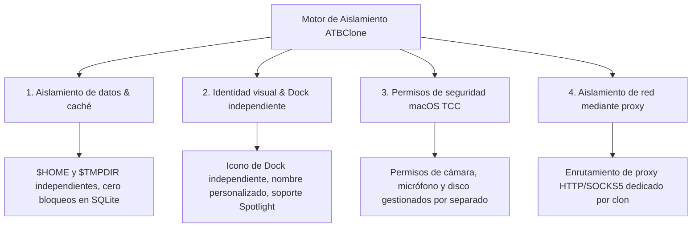

# 📖 Manual de Usuario de ATBClone (Versión en español)

[English Version](../en/) | [簡體中文](../zh/) | [繁體中文](../zh-hant/) | [日本語](../ja/) | [한국어](../ko/) | [Deutsch](../de/) | [Français](../fr/) | Versión en español

Bienvenido al **Manual Oficial de Usuario de ATBClone**. Esta guía le acompañará paso a paso en el dominio de las capacidades de ejecución multi-instancia y aislamiento en sandbox para aplicaciones de macOS, desde operaciones básicas hasta diagnósticos y arquitectura interna.

---

## 🧭 Navegación por capítulos

| Capítulo | Título | Audiencia | Temas principales |
| :--- | :--- | :--- | :--- |
| **[Capítulo 1](01-basic-operations.md)** | **[Operaciones básicas & Gestión de clones](01-basic-operations.md)** | 👶 **Principiantes / Todos** | Asistente interactivo en 7 pasos, lanzamiento, acceso directo a la carpeta de datos, **actualizaciones sincronizadas sin pérdida de datos**, vista de tabla (**actualización y eliminación por lotes**), desinstalación segura. |
| **[Capítulo 2](02-advanced-custom-recipes.md)** | **[Recetas personalizadas & Parámetros básicos](02-advanced-custom-recipes.md)** | ⚡ **Usuarios intermedios** | Uso de **App Prober (Sonda inteligente)** para escanear apps no listadas, editor visual de recetas, **parámetros esenciales** (`bundle_id`, `strategy`, `strip_sandbox`, `proxy`). |
| **[Capítulo 3](03-under-the-hood-and-internals.md)** | **[Funcionamiento interno & Parámetros avanzados](03-under-the-hood-and-internals.md)** | 🔬 **Avanzados / Desarrolladores** | Mecanismos de Soft vs Hard Clone, **pilares de Hard Clone y secuestro de wrapper binario (Wrapper Hijack)**, arquitectura desacoplada de datos y lógica, **parámetros YAML avanzados** (`environment_injection`, `symlink_whitelist`, macros dinámicas). |
| **[Capítulo 4](04-faq-and-troubleshooting.md)** | **[Preguntas frecuentes (FAQ), Diagnóstico & Soporte](04-faq-and-troubleshooting.md)** | 🩺 **Todos los usuarios** | Preguntas frecuentes (seguridad de datos, rutas de almacenamiento y migración, prevención de bloqueos, sin necesidad de permisos root), diagnóstico con Doctor, **extracción de detalles de clones y reporte de Issues en GitHub**. |

---

## 🌟 ¿Por qué elegir ATBClone?

En macOS, los métodos tradicionales de clonación (como simplemente copiar `.app` con `cp -R` o crear alias en la Terminal) fallan constantemente porque las aplicaciones modernas comparten preferencias, bases de datos y elementos del llavero a nivel del sistema.

ATBClone resuelve esto ofreciendo un **Aislamiento Cuádruple (Quadruple Isolation)**:

1. **📦 Aislamiento de datos y caché**: Cada clon opera con su propio `$HOME` o `--user-data-dir`. Múltiples cuentas pueden coexistir sin colisión de bases de datos.
2. **🎨 Identidad visual y Dock**: Cada clon tiene su propio nombre e icono en Spotlight, Launchpad y el Dock.
3. **🛡️ Aislamiento de permisos (TCC)**: Al contar con un `CFBundleIdentifier` único, macOS gestiona los permisos de privacidad de forma aislada.
4. **🌐 Tráfico de red por proxy**: Posibilidad de asignar un proxy HTTP o SOCKS5 dedicado a cada clon sin alterar la red del sistema anfitrión.

---

## 📚 Glosario y conceptos clave

* **Aplicación anfitriona (Host App)**: La aplicación original instalada en su Mac (generalmente en `/Applications`).
* **Aplicación clonada (Clone App)**: La instancia generada por ATBClone (por defecto en `~/ATBClone/Apps`).
* **Hard Clone (Duplicación física y secuestro de wrapper)**: Duplica el bundle, modifica el Bundle ID, inyecta scripts de entorno y refirma. Ideal para apps de mensajería (WeChat, Telegram, Discord, Slack).
* **Soft Clone (Lanzador wrapper)**: Crea un lanzador ligero que pasa parámetros de datos aislados (`--user-data-dir`). Ideal para navegadores y editores (Cursor, VS Code, Chrome).
* **Receta (Recipe)**: Archivo YAML con las instrucciones de aislamiento y arranque.
* **Directorio de datos aislado**: Carpeta donde se guardan chats, cachés y ajustes (`~/ATBClone/Data/<NombreClon>`).
