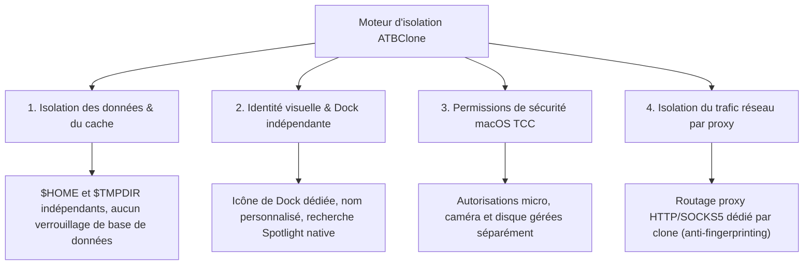

# 📖 Guide d'utilisation ATBClone (Version française)

[English Version](../en/) | [簡體中文](../zh/) | [繁體中文](../zh-hant/) | [日本語](../ja/) | [한국어](../ko/) | [Deutsch](../de/) | Version française

Bienvenue dans le **Guide officiel d'utilisation d'ATBClone**. Ce manuel vous accompagne pas à pas dans la création d'instances multiples et l'isolation en bac à sable (sandbox) d'applications macOS — des opérations de base pour débutants aux analyses architecturales avancées et diagnostics système.

---

## 🧭 Plan du guide

| Chapitre | Titre | Public visé | Points clés |
| :--- | :--- | :--- | :--- |
| **[Chapitre 1](01-basic-operations.md)** | **[Opérations de base & Gestion des clones](01-basic-operations.md)** | 👶 **Débutants / Tous utilisateurs** | Assistant en 7 étapes, lancement, ouverture directe du dossier de données, **mises à jour synchronisées sans perte de données**, vue tableau (**mises à jour et suppressions par lot**), suppression sécurisée. |
| **[Chapitre 2](02-advanced-custom-recipes.md)** | **[Recettes personnalisées & Paramètres de base](02-advanced-custom-recipes.md)** | ⚡ **Utilisateurs intermédiaires** | Utilisation d'**App Prober (Sonde intelligente)** pour analyser des apps non répertoriées, éditeur visuel de recettes, **paramètres essentiels** (`bundle_id`, `strategy`, `strip_sandbox`, `proxy`). |
| **[Chapitre 3](03-under-the-hood-and-internals.md)** | **[Fonctionnement interne & Paramètres avancés](03-under-the-hood-and-internals.md)** | 🔬 **Experts / Développeurs** | Mécanismes Soft vs Hard Clone, **piliers du Hard Clone & détournement de wrapper binaire**, architecture données-logique découplée, **paramètres YAML avancés** (`environment_injection`, `symlink_whitelist`, macros de chemin). |
| **[Chapitre 4](04-faq-and-troubleshooting.md)** | **[FAQ, Diagnostic système & Support](04-faq-and-troubleshooting.md)** | 🩺 **Tous utilisateurs** | FAQ fréquentes (sécurité des données, chemins de stockage & migration, prévention des bannissements, fonctionnement sans droits root), diagnostic Doctor, **copie des détails du clone & signalement d'issues GitHub**. |

---

## 🌟 Pourquoi choisir ATBClone ?

Sur macOS, les méthodes traditionnelles de clonage (comme une simple copie par `cp -R` ou des alias dans le Terminal) échouent fréquemment car les applications modernes partagent leurs préférences utilisateur, bases de données SQLite et trousseaux d'accès au niveau système.

ATBClone résout ce problème grâce à une **quadruple isolation (Quadruple Isolation)** native :

1. **📦 Isolation des données & du cache** : Chaque clone dispose de son propre répertoire personnel isolé (`$HOME`) ou `--user-data-dir`. Plusieurs comptes peuvent s'exécuter en parallèle sans conflit de bases de données ou de cache.
2. **🎨 Identité visuelle & Dock indépendante** : Les clones possèdent leurs propres noms et icônes, et apparaissent de manière autonome dans Spotlight, le Launchpad et le Dock.
3. **🛡️ Permissions de sécurité (TCC) isolées** : Grâce à des identifiants `CFBundleIdentifier` uniques, macOS considère chaque clone comme une entité distincte avec ses propres autorisations système.
4. **🌐 Isolation réseau par proxy** : Acheminez le trafic de certains clones via des proxys HTTP ou SOCKS5 distincts sans altérer la connexion réseau de l'hôte.

---

## 📚 Concepts clés & Glossaire

* **Application hôte (Host App)** : L'application d'origine installée sur votre Mac (généralement dans `/Applications`).
* **Application clonée (Clone App)** : L'instance générée par ATBClone (par défaut dans `~/ATBClone/Apps`).
* **Hard Clone (Duplication physique & détournement de wrapper)** : Copie complète du bundle, modification du Bundle ID, injection de scripts d'environnement et re-signature. Recommandé pour WeChat, Telegram, Slack et Discord.
* **Soft Clone (Wrapper de lanceur)** : Crée un lanceur léger transmettant des arguments de données isolés (`--user-data-dir`). Idéal pour les navigateurs et éditeurs de code (Cursor, VS Code, Chrome).
* **Recette (Recipe)** : Fichier YAML décrivant les règles de clonage et d'isolation d'une application.
* **Répertoire de données isolé** : Dossier où sont stockés les discussions, réglages et caches (par défaut `~/ATBClone/Data/<NomDuClone>`).

---

## 🚀 Démarrage rapide

1. **Téléchargement & Installation** : Téléchargez `ATBClone-*.dmg` depuis les [GitHub Releases](https://github.com/aitobox/ATBClone/releases) et glissez `ATBClone.app` dans `/Applications`.
2. **Lancement** : Ouvrez ATBClone depuis le Launchpad.
3. **Assistant** : Cliquez sur **"+ Nouveau clone"** en haut à droite.
4. **Suivez les 7 étapes** : Choisissez l'application ➔ Vérifiez la recette ➔ Nommez le clone ➔ Validez les chemins ➔ **"Cloner maintenant"**.
5. **Profitez** : Cliquez sur **"Lancer"** ou démarrez votre clone via Spotlight !
