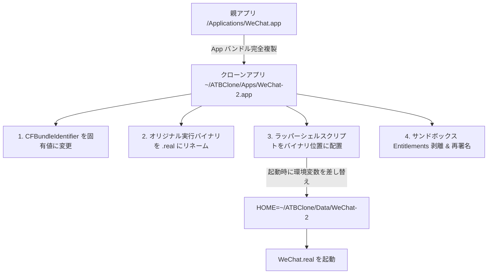

# 第3章：動作原理の解説と高度な設定パラメータ

本章では、ATBClone の深層アーキテクチャ、ソフトクローンとハードクローンの低レベル実装、バイナリラッパーハイジャック技術、そして高度なカスタムレシピを作成するための全パラメータと動的マクロについて詳細に解説します。

---

## 📑 目次

- [クローン分離アーキテクチャの比較](#_1)
  - [ソフトクローン (Soft Clone) の内部構造](#soft-clone)
  - [ハードクローン (Hard Clone) の内部構造](#hard-clone)
- [ハードクローン「3つのコア技術」解説](#3)
  - [1. バンドル識別子 (Bundle ID) の改変](#1-bundle-id)
  - [2. バイナリラッパーハイジャック (Wrapper Hijack)](#2-wrapper-hijack)
  - [3. サンドボックス剥離とアドホック再署名](#3-)
- [データとロジックの完全分離設計](#_2)
- [高度なレシピパラメータ解説](#_3)
  - [1. environment_injection (環境変数注入)](#1-environment_injection)
  - [2. symlink_whitelist (シンボリックリンク白名単)](#2-symlink_whitelist)
  - [3. launch_arguments (起動引数)](#3-launch_arguments)
  - [4. plist_overrides (Info.plist 上書き)](#4-plist_overrides-infoplist-)
  - [5. 動的パス環境変数マクロ](#5)
- [高度なカスタムレシピの完全な YAML サンプル](#yaml)

---

## 🏗️ クローン分離アーキテクチャの比較

### ソフトクローン (Soft Clone) の内部構造
ソフトクローンは、Chromium や Electron、またはコマンドライン引数によるデータディレクトリ切り替えに対応したアプリケーション向けの手法です。親アプリのバイナリ（数十〜数百MB）を複製せず、軽量なランチャースクリプト（約数KB）のみを生成します。

```text
[Soft Clone ランチャー] 
       │ 起動引数を付与して呼び出し
       ▼
/Applications/Cursor.app/Contents/MacOS/Cursor --user-data-dir="~/ATBClone/Data/Cursor-Work"
```

* **メリット**：ディスク消費がほぼゼロ、作成・アップデートが一瞬で完了。
* **制限事項**：Dock でアプリアイコンが元の親アプリにグループ化される場合があり、システム TCC 権限は親アプリと共有されます。

---

### ハードクローン (Hard Clone) の内部構造
ハードクローンは、WeChat、LINE、Telegram、Discord、Slack など、独立したシステム識別と完全なデータ隔離が必要なすべてのネイティブアプリに対応します。



---

## ⚡ ハードクローン「3つのコア技術」解説

### 1. バンドル識別子 (Bundle ID) の改変
`Info.plist` 内の `CFBundleIdentifier`（例：`com.tencent.xinWeChat`）を固有のクローン用識別子（例：`com.tencent.xinWeChat.atbclone.work`）に書き換えます。これにより、macOS システムはこれを完全に別のアプリとして認識し、通知設定、TCC 安全許可、ウィンドウ管理が完全に独立します。

### 2. バイナリラッパーハイジャック (Wrapper Hijack)
ハードクローンの中核技術です：
1. `Contents/MacOS/<Executable>` を `<Executable>.real` にリネームします。
2. 同名の POSIX シェルスクリプトを新規作成し、実行権限（`chmod +x`）を付与します。
3. ラッパー内で以下の環境変数をフック・再定義してから、バックグラウンドの `.real` バイナリを実行します：
   * `export HOME="<Isolated Data Dir>"`
   * `export TMPDIR="<Isolated Data Dir>/tmp"`
   * `export XDG_DATA_HOME="<Isolated Data Dir>/Library/Application Support"`
   * `export XDG_CONFIG_HOME="<Isolated Data Dir>/Library/Preferences"`

これにより、親アプリ側のコードを一行も改変することなく、あらゆるファイル I/O とローカルストレージアクセスを強制的に独立したデータフォルダへ誘導します。

### 3. サンドボックス剥離とアドホック再署名
macOS の App Sandbox が有効なアプリは、システムによって厳密に `~/Library/Containers/<BundleID>` へのアクセスしか許可されません。ATBClone はバイナリから `com.apple.security.app-sandbox` フラグを取り除き、macOS 標準の `codesign -f -s -` コマンドでアドホック再署名を行います。これにより、アプリは任意のカスタムデータディレクトリへ自在にアクセスできるようになります。

---

## 💎 データとロジックの完全分離設計

ATBClone は **「プログラムロジック（Apps）」** と **「ユーザーデータ（Data）」** を完全に分離して管理します：

* **ロジック層 (`~/ATBClone/Apps/`)**：いつでも安全に再作成・削除・上書き同期が可能。
* **データ層 (`~/ATBClone/Data/`)**：ユーザーのチャット履歴、ローカルキャッシュ、設定情報が永続化。

親アプリがバージョンアップされた際も、古いクローンアプリ本体を置き換えるだけで、データフォルダは一切手を触れずに保持されるため、安全かつ確実な無損失アップデートが保証されます。

---

## ⚙️ 高度なレシピパラメータ解説

### 1. environment_injection (環境変数注入)
クローンアプリ起動時に追加で注入する環境変数をキー・バリュー形式で指定します：

```yaml
environment_injection:
  ELECTRON_ENABLE_LOGGING: "1"
  NODE_ENV: "production"
  SSL_CERT_FILE: "{DATA_DIR}/certs/ca.pem"
```

### 2. symlink_whitelist (シンボリックリンク白名単)
分離された環境内でも、特定のシステムリソースやフォント、ハードウェア支援機能のみ親アプリと共有したい場合に使用します：

```yaml
symlink_whitelist:
  - "~/Library/Fonts"
  - "~/Library/ColorSync"
```

### 3. launch_arguments (起動引数)
起動時に自動付与されるコマンドラインフラグを設定します：

```yaml
launch_arguments:
  - "--disable-gpu-shader-disk-cache"
  - "--no-first-run"
```

### 4. plist_overrides (Info.plist 上書き)
`Info.plist` の特定キーをカスタマイズします：

```yaml
plist_overrides:
  NSHighResolutionCapable: true
  LSUIElement: false
```

### 5. 動的パス環境変数マクロ
レシピ内の文字列に以下のマクロを埋め込むと、実行時に実際のパスへと自動置換されます：

* `{DATA_DIR}`：対象クローンの専用データ保存先パス。
* `{CLONE_NAME}`：クローンアプリの表示名。
* `{BUNDLE_ID}`：生成された新しい Bundle Identifier。
* `{HOST_APP}`：元の親アプリのフルパス。

---

## 📋 高度なカスタムレシピの完全な YAML サンプル

```yaml
version: "1.0"
name: "Discord"
description: "Discord 用のプロキシ＆環境変数注入付きハードクローン設定"

bundle_id: "com.hnc.discord"
strategy: "hard_clone"
strip_sandbox: true

injection_mode: "wrapper_hijack"

# ネットワークプロキシ
proxy:
  type: "socks5"
  host: "127.0.0.1"
  port: 10808

# 環境変数注入
environment_injection:
  DISCORD_USER_DATA_DIR: "{DATA_DIR}/discord_data"

# 起動引数
launch_arguments:
  - "--start-minimized"

# シンボリックリンク共有白名単
symlink_whitelist:
  - "~/Library/Audio"
```
