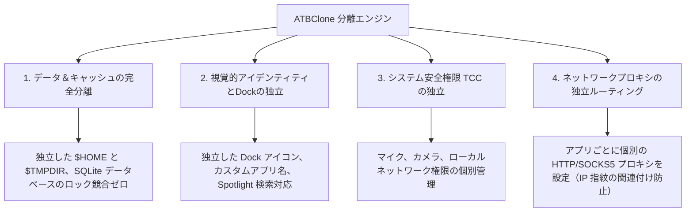

# 📖 ATBClone ユーザーマニュアル（日本語版）

[English Version](../en/) | [簡體中文](../zh/) | [繁體中文](../zh-hant/) | 日本語版

**ATBClone 公式ユーザーマニュアル**へようこそ。本マニュアルでは、macOS アプリの多重起動（マルチインスタンス）およびサンドボックス完全分離機能の使い方について、初心者向けの基本操作から、クローン管理、カスタムレシピの作成、内部アーキテクチャの解説、システム診断、トラブルシューティングに至るまで、ステップバイステップで詳しく解説します。

---

## 🧭 チャプターナビゲーション

利用目的やスキルレベルに応じて、最適なチャプターをご参照ください：

| チャプター | タイトル | 対象読者 | 主な内容 |
| :--- | :--- | :--- | :--- |
| **[第1章](01-basic-operations.md)** | **[基本操作とクローン管理](01-basic-operations.md)** | 👶 **一般ユーザー / 初心者** | 7ステップ対話型ウィザード、クイック起動、データフォルダへの直接アクセス、親アプリ更新時の**無損失同期アップデート**、**一括更新・一括削除**、安全な削除（データ保持 vs 完全消去）。 |
| **[第2章](02-advanced-custom-recipes.md)** | **[カスタムレシピの作成と基本パラメータ](02-advanced-custom-recipes.md)** | ⚡ **中級ユーザー** | **App Prober（スマートプローブ）** による未対応アプリのスキャン、ビジュアルレシピエディタ、**基本パラメータ解説**（`bundle_id`、`strategy`、`strip_sandbox`、`proxy`）。 |
| **[第3章](03-under-the-hood-and-internals.md)** | **[動作原理の解説と高度な設定パラメータ](03-under-the-hood-and-internals.md)** | 🔬 **パワーユーザー / 開発者** | ソフトクローンとハードクローンの内部メカニズム、**ハードクローン「3つのコア技術」とバイナリラッパーハイジャック (Wrapper Hijack)** の深層分析、データ・ロジック分離設計、**高度なパラメータ**（`environment_injection`、`symlink_whitelist`、動的パス環境変数マクロ）。 |
| **[第4章](04-faq-and-troubleshooting.md)** | **[よくある質問 (FAQ)・システム診断・フィードバック](04-faq-and-troubleshooting.md)** | 🩺 **全ユーザー** | 高頻度 FAQ（データの安全性、保存先とバックアップ移行、アカウントBANリスクの防止策、管理者パスワード不要の仕組み）、Doctor システム環境診断、**クローン詳細情報の抽出と GitHub Issue 報告ガイド**。 |

---

## 🌟 なぜ ATBClone を選ぶのか？

macOS 環境において、従来のアプリ多重起動手法（単純な `cp -R` による App コピーやターミナルでのシンボリックリンク作成など）は、クラッシュしたり動作しなくなったりすることが多発します。これは、現代の macOS アプリがユーザー環境設定、システムキーチェーン、ローカルデータベースを共有しているためです。

ATBClone は独自開発のエンジン構造により、真の**「4重分離（Quadruple Isolation）」**を実現しています：

1. **📦 データ＆キャッシュの完全分離**：各クローンは専用の独立したホームディレクトリ（`$HOME`）またはカスタムデータディレクトリ（`--user-data-dir`）を保持します。複数アカウントで同時にログインしても、ローカルデータベースやキャッシュが衝突することはありません。
2. **🎨 視覚的アイデンティティとDockの独立**：クローンアプリは独立した名称とアプリアイコンを持ち、Spotlight 検索、Launchpad（起動台）、Dock（プログラムウ）すべてにおいて個別のアプリケーションとして認識されます。
3. **🛡️ システム権限 (TCC) の独立**：ハードクローンは `CFBundleIdentifier` を書き換えることで新しいシステム識別子を獲得するため、カメラ、マイク、アクセシビリティなどのシステム許可設定が元の親アプリと完全に独立します。
4. **🌐 ネットワークプロキシの独立ルーティング**：指定したクローンアプリに個別の HTTP または SOCKS5 プロキシを設定可能です。ホスト全体のネットワーク環境に影響を与えることなく、アプリ単位で異なる外部 IP を使用できます。

---

## 📚 主要コンセプト・用語集

マニュアルをお読みいただくにあたり、以下の主要な用語をご確認ください：

* **親アプリ (Host App)**：お使いの Mac にインストールされている元の正規アプリケーション（通常 `/Applications` に配置）。
* **クローンアプリ (Clone App)**：ATBClone エンジンによって生成された独立インスタンス（デフォルト保存先：`~/ATBClone/Apps`）。
* **ハードクローン (Hard Clone / 実体複製＋ラッパーハイジャック)**：App バンドル全体を複製し、固有の Bundle ID に書き換え、環境変数インジェクションスクリプトを注入してコード署名を再適用します。LINE、WeChat、Telegram、Discord、Slack などのネイティブアプリに最適です。
* **ソフトクローン (Soft Clone / ランチャーラッパー)**：軽量な起動ラッパーシェルのみを生成し、起動引数（`--user-data-dir` や `--profile`）でデータパスを切り替えます。Cursor、VS Code、Chrome、Edge、Firefox などのブラウザや開発ツールに最適です。
* **レシピ (Recipe)**：対象アプリをどのように複製・分離・起動するかを定義した YAML 形式の指示書。
* **データディレクトリ (Isolated Data Directory)**：クローンアプリがチャット履歴、設定、キャッシュ、データベースを格納する専用フォルダ（デフォルト：`~/ATBClone/Data/<クローン名>`）。

---

## 🚀 クイックスタート

1. **ダウンロードとインストール**：[GitHub Releases](https://github.com/aitobox/ATBClone/releases) から最新の `ATBClone-*.dmg` をダウンロードします。DMG を開き、`ATBClone.app` を `/Applications` フォルダにドラッグ＆ドロップします。
2. **ATBClone を起動**：Launchpad またはアプリケーションフォルダから ATBClone を起動します。
3. **ウィザードを開始**：メイン画面右上の **「+ 新規クローン」** ボタンをクリックします。
4. **7ステップの案内に従う**：対象アプリを選択 ➔ レシピを確認 ➔ クローン名を入力 ➔ インストール先とデータ保存先を確認 ➔ **「クローンを実行」** をクリックします。
5. **利用開始**：**「起動」** ボタンをクリックするか、Spotlight 検索や Dock から直接クローンを立ち上げます！

---

> [!NOTE]
> **多言語対応**：本マニュアルは English、簡體中文、繁體中文、日本語など複数の言語で提供されています。ヘッダーの言語セレクターからいつでも切り替えが可能です。
