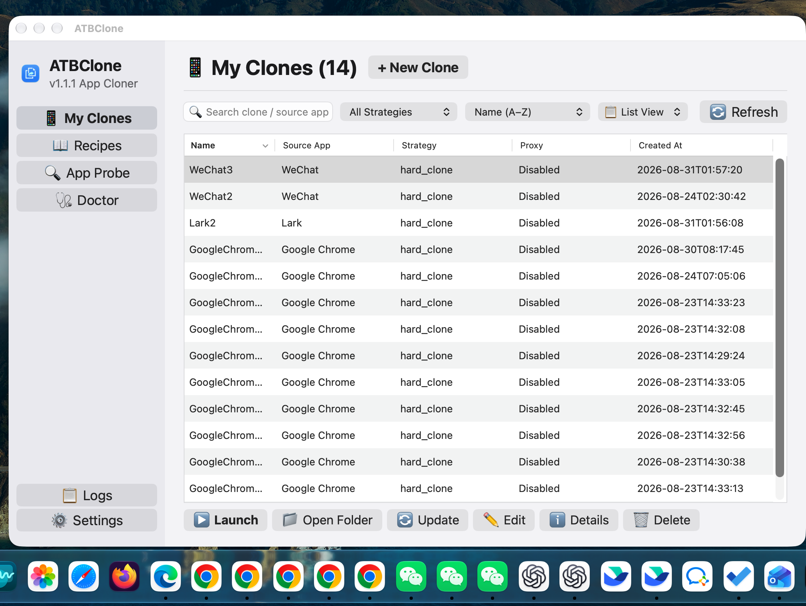

# 제1장: 기본 조작 및 클론 관리



이 장에서는 7단계 대화형 마법사를 통해 첫 번째 클론 앱을 생성하는 방법을 안내하며, 빠른 실행, 데이터 디렉토리 원클릭 열기, 원본 앱 업데이트 시 무손실 동기화 업데이트, 테이블 뷰 일괄 작업 및 안전한 삭제를 포함한 일상적인 관리 기법을 상세히 다룹니다.

---

## 📑 목차

- [클론 애플리케이션 생성 (7단계 마법사)](#-7)
  - [1단계: 대상 애플리케이션 선택](#1)
  - [2단계: 레시피 및 격리 전략 확인](#2)
  - [3단계: 클론 식별 정보 및 언어 설정](#3)
  - [4단계: 설치 대상 경로 확인](#4)
  - [5단계: 전용 데이터 디렉토리 설정](#5)
  - [6단계: 독립 네트워크 프록시 설정 (선택 사항)](#6-)
  - [7단계: 설정 확인 및 복제 실행](#7-)
- [클론 애플리케이션 관리](#_1)
  - [클론 앱 실행 방법](#_2)
  - [데이터 디렉토리 원클릭 이동](#_3)
  - [클론 구성 수정](#_4)
  - [원본 앱 업데이트 시 무손실 동기화 업데이트](#_5)
  - [테이블 뷰 일괄 작업 (일괄 업데이트 및 일괄 삭제)](#-)
  - [안전 삭제 (데이터 유지 vs 완전 삭제)](#-vs-)

---

## 🪄 클론 애플리케이션 생성 (7단계 마법사)

ATBClone 대시보드 우측 상단의 **"+ 새 클론"** 버튼을 클릭하여 마법사를 시작합니다.

```text
+-------------------------------------------------------------+
|  🧙 새 클론 생성 - 1 / 7 단계                                |
|                                                             |
|  대상 애플리케이션 (.app) 선택                                |
|  [/Applications/WeChat.app                   ] [ 찾아보기.. ]|
|                                                             |
|  [ 취소 ]                                      [ 다음 단계 > ]|
+-------------------------------------------------------------+
```

### 1단계: 대상 애플리케이션 선택
1. **"찾아보기..."** 버튼을 클릭하여 macOS 네이티브 파일 선택기를 엽니다 (기본 위치: `/Applications`).
2. 대상 애플리케이션 번들(예: `WeChat.app`, `Telegram.app`, `Google Chrome.app`, `Cursor.app` 등)을 선택합니다.
3. **"다음 단계 >"** 를 클릭합니다.

> [!TIP]
> 외장 드라이브나 임의의 위치에 있는 `.app` 번들도 절대 경로를 직접 입력하여 지정할 수 있습니다.

---

### 2단계: 레시피 및 격리 전략 확인
ATBClone 은 선택한 애플리케이션을 자동으로 정밀 분석합니다:

* **내장 레시피 매칭**: 33개 이상의 내장 레시피에 포함된 앱인 경우 최적의 전략이 자동 선택됩니다 (예: WeChat 은 `Hard Clone`, Cursor 및 VS Code 는 `Soft Clone`).
* **스마트 프로버 (Smart Prober)**: 목록에 없는 앱이라도 Mach-O 바이너리와 샌드박스 권한을 동적으로 스캔하여 최적의 전략을 추천합니다.
* **전략 전환**:
  * `hard_clone`: 앱 번들을 물리적으로 복제하고 번들 ID 및 환경 변수 래퍼를 주입합니다.
  * `soft_clone`: 바이너리를 복제하지 않고 데이터 격리 인자를 전달하는 경량 런처를 생성합니다.
* **주입 방식 (Injection Strategy)**: 하드 클론 시 다음 주입 기술을 선택할 수 있습니다:
  * `wrapper_hijack` (권장): 바이너리 래퍼 셸을 통한 환경 격리로 최고의 안정성을 보장합니다.
  * `posix_spawn` / `dyld_insert_libraries`: 저수준 API 후킹 격리 방식.

---

### 3단계: 클론 식별 정보 및 언어 설정
1. **클론 이름**: 한글, 영문 또는 숫자로 알아보기 쉬운 이름을 지정합니다 (예: `WeChat-업무용`, `Telegram-부계정`).
2. **Bundle Identifier**: 고유한 식별자가 자동 생성됩니다 (예: `com.tencent.xinWeChat.atbclone.work`).
3. **앱 아이콘**: 기본 아이콘이 복사되며, 원하는 `.icns` 또는 `.png` 이미지를 드래그하여 맞춤 아이콘으로 변경할 수 있습니다.
4. **UI 언어 재정의**: 클론 앱의 인터페이스 표시 언어를 한국어, 영어, 일본어, 중국어 등으로 고정할 수 있습니다.

---

### 4단계: 설치 대상 경로 확인
클론 앱 자체의 저장 위치를 지정합니다.
* **기본 경로**: `~/ATBClone/Apps/<클론이름>.app`
* Spotlight 및 Launchpad 에서 자연스럽게 인식되도록 기본 경로를 유지하는 것이 권장됩니다.

---

### 5단계: 전용 데이터 디렉토리 설정
클론 앱이 사용할 대화 내용, 캐시, 설정 파일의 저장 위치를 지정합니다.
* **기본 경로**: `~/ATBClone/Data/<클론이름>`
* **데이터-로직 완전 분리**: 프로그램 실행 파일(`Apps/`)과 사용자 데이터(`Data/`)가 완전히 분리되어 있어 앱을 재설치하거나 업데이트해도 데이터가 유실되지 않습니다.

---

### 6단계: 독립 네트워크 프록시 설정 (선택 사항)
클론 앱별로 독립된 네트워크 트래픽 경로를 지정할 수 있습니다:
* **프록시 유형**: `HTTP` / `HTTPS` / `SOCKS5`
* **호스트 및 포트**: 예: `127.0.0.1:7890`
* **인증 지원**: 계정 및 비밀번호 인증 프록시 완벽 지원.

---

### 7단계: 설정 확인 및 복제 실행
설정 요약 정보를 검토한 후 **"지금 복제"** 를 클릭합니다. 진행률 표시줄이 100% 에 도달하면 완료됩니다!

---

## 🖥️ 클론 애플리케이션 관리

### 클론 앱 실행 방법
* **대시보드에서**: 대상 카드의 **"실행"** 버튼 클릭.
* **Spotlight 검색**: `Cmd + Space` 를 누르고 클론 이름을 입력하여 즉시 실행.
* **Dock 고정**: 생성된 앱을 독에 고정하여 일반 네이티브 앱처럼 클릭 실행.

### 데이터 디렉토리 원클릭 이동
카드 우측의 **"폴더 열기"** 아이콘을 클릭하면 Finder 가 즉시 열리며 전용 데이터 디렉토리(`~/ATBClone/Data/<클론이름>`)로 이동합니다.

### 클론 구성 수정
카드의 **"설정 / 편집"** 버튼을 클릭하여 할당된 프록시, 실행 인수, 앱 아이콘 등을 언제든지 재설정할 수 있습니다.

### 원본 앱 업데이트 시 무손실 동기화 업데이트
App Store 나 웹사이트를 통해 원본 앱이 새 버전으로 업데이트된 경우:
1. ATBClone 메인 화면에서 대상 카드의 **"업데이트"** 버튼을 클릭합니다.
2. 엔진이 **사용자 데이터를 100% 보존한 상태로** 최신 바이너리와 리소스 파일만 클론으로 안전하게 동기화합니다.

### 테이블 뷰 일괄 작업 (일괄 업데이트 및 일괄 삭제)
우측 상단 보기 전환 메뉴에서 "테이블 뷰"를 선택하면:
* 체크박스를 통해 여러 클론을 한 번에 다중 선택할 수 있습니다.
* 하단 툴바의 **"선택 항목 일괄 업데이트"** 또는 **"선택 항목 일괄 삭제"** 를 실행할 수 있습니다.

### 안전 삭제 (데이터 유지 vs 완전 삭제)
클론을 삭제할 때 두 가지 옵션이 제공됩니다:
* **앱 본체만 삭제**: 클론 실행 파일(`.app`)만 삭제하고 대화 기록과 설정 데이터는 보존합니다.
* **완전 삭제 (데이터 포함)**: 앱 실행 파일과 데이터 디렉토리를 모두 휴지통으로 이동합니다.
