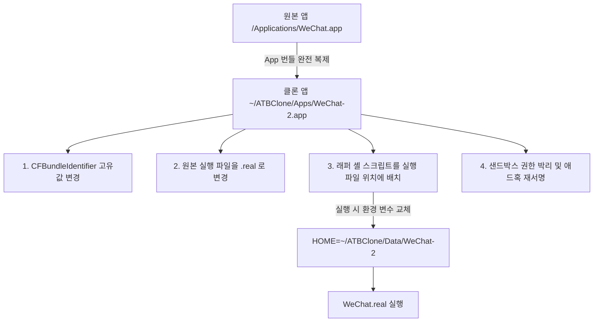

# 제3장: 내부 동작 원리 및 고급 매개변수 심층 분석

본 장에서는 ATBClone 의 심층 아키텍처, 소프트 클론과 하드 클론의 저수준 구현 원리, 바이너리 래퍼 하이재킹 기술, 고급 YAML 매개변수 및 동적 경로 매크로를 상세히 분석합니다.

---

## 📑 목차

- [격리 아키텍처 메커니즘 비교](#_1)
  - [소프트 클론 (Soft Clone) 내부 구조](#soft-clone)
  - [하드 클론 (Hard Clone) 내부 구조](#hard-clone)
- [하드 클론 3대 핵심 기술 분석](#3)
  - [1. 번들 식별자 (Bundle ID) 변조](#1-bundle-id)
  - [2. 바이너리 래퍼 하이재킹 (Wrapper Hijack)](#2-wrapper-hijack)
  - [3. 샌드박스 박리 및 애드혹 재서명](#3-)
- [데이터-로직 완전 분리 아키텍처](#-)
- [고급 레시피 매개변수 해설](#_2)
  - [1. environment_injection (환경 변수 주입)](#1-environment_injection)
  - [2. symlink_whitelist (심볼릭 링크 화이트리스트)](#2-symlink_whitelist)
  - [3. launch_arguments (실행 인수)](#3-launch_arguments)
  - [4. plist_overrides (Info.plist 재정의)](#4-plist_overrides-infoplist-)
  - [5. 동적 경로 매크로 변수](#5)
- [고급 사용자 정의 레시피 전체 YAML 예시](#yaml)

---

## 🏗️ 격리 아키텍처 메커니즘 비교

### 소프트 클론 (Soft Clone) 내부 구조
소프트 클론은 Chromium, Electron 또는 커맨드라인 인수를 통한 데이터 디렉토리 변경을 공식 지원하는 앱에 적합합니다. 수백 메가바이트의 바이너리를 복제하지 않고 수 킬로바이트 수준의 경량 런처 스크립트만 생성합니다.

```text
[Soft Clone 런처]
       │ 실행 인수 전달
       ▼
/Applications/Cursor.app/Contents/MacOS/Cursor --user-data-dir="~/ATBClone/Data/Cursor-Work"
```

* **장점**: 디스크 사용량 제로에 수렴, 생성 및 업데이트가 1초 내에 완료.
* **제약**: Dock 아이콘이 원본 앱과 묶일 수 있으며, TCC 권한이 원본과 공유됩니다.

---

### 하드 클론 (Hard Clone) 내부 구조
하드 클론은 WeChat, 카카오톡, Telegram, Discord, Slack 등 완벽한 시스템 독립성과 데이터 격리가 필요한 모든 네이티브 앱에 적용됩니다.



---

## ⚡ 하드 클론 3대 핵심 기술 분석

### 1. 번들 식별자 (Bundle ID) 변조
`Info.plist` 의 `CFBundleIdentifier`(예: `com.tencent.xinWeChat`)를 고유 식별자(`com.tencent.xinWeChat.atbclone.work`)로 수정합니다. macOS 는 이를 완전히 새로운 앱으로 인식하여 알림, TCC 보안 권한, 윈도우 관리를 독립 처리합니다.

### 2. 바이너리 래퍼 하이재킹 (Wrapper Hijack)
하드 클론의 핵심 기술입니다:
1. `Contents/MacOS/<Executable>` 바이너리를 `<Executable>.real` 로 이름을 바꿉니다.
2. 동일한 이름의 POSIX 셸 스크립트를 생성하고 실행 권한(`chmod +x`)을 부여합니다.
3. 래퍼 스크립트에서 다음 환경 변수를 가로채 재정의한 후 백그라운드의 `.real` 바이너리를 호출합니다:
   * `export HOME="<격리된 데이터 경로>"`
   * `export TMPDIR="<격리된 데이터 경로>/tmp"`
   * `export XDG_DATA_HOME="<격리된 데이터 경로>/Library/Application Support"`
   * `export XDG_CONFIG_HOME="<격리된 데이터 경로>/Library/Preferences"`

이 방식을 통해 원본 코드를 단 한 줄도 수정하지 않고도 모든 파일 I/O 와 로컬 저장소를 지정된 독립 폴더로 유도합니다.

### 3. 샌드박스 박리 및 애드혹 재서명
App Sandbox 가 활성화된 앱은 시스템에 의해 `~/Library/Containers/<BundleID>` 경로로 접근이 엄격히 제한됩니다. ATBClone 은 바이너리에서 샌드박스 권한 플래그를 제거하고 macOS 표준 `codesign -f -s -` 로 재서명하여 임의의 사용자 지정 데이터 폴더에 자유롭게 접근할 수 있도록 권한을 개방합니다.

---

## 💎 데이터-로직 완전 분리 아키텍처

ATBClone 은 **"프로그램 로직(Apps)"** 과 **"사용자 데이터(Data)"** 를 완전히 분리하여 관리합니다:

* **로직 계층 (`~/ATBClone/Apps/`)**: 언제든지 안전하게 재생성, 삭제, 덮어쓰기 가능.
* **데이터 계층 (`~/ATBClone/Data/`)**: 대화 내용, 로컬 캐시, 설정이 안전하게 영구 보존.

원본 앱이 업데이트되어도 앱 본체만 최신 파일로 교체되고 데이터 디렉토리는 그대로 유지되므로 무손실 업데이트가 보장됩니다.

---

## ⚙️ 고급 레시피 매개변수 해설

### 1. environment_injection (환경 변수 주입)
클론 앱 실행 시 추가로 주입할 환경 변수를 지정합니다:

```yaml
environment_injection:
  ELECTRON_ENABLE_LOGGING: "1"
  NODE_ENV: "production"
  SSL_CERT_FILE: "{DATA_DIR}/certs/ca.pem"
```

### 2. symlink_whitelist (심볼릭 링크 화이트리스트)
격리 환경 내에서도 폰트, 색상 프로필 등 특정 시스템 리소스만 원본과 공유하려는 경우:

```yaml
symlink_whitelist:
  - "~/Library/Fonts"
  - "~/Library/ColorSync"
```

### 3. launch_arguments (실행 인수)
실행 시 자동으로 추가될 커맨드라인 플래그:

```yaml
launch_arguments:
  - "--disable-gpu-shader-disk-cache"
  - "--no-first-run"
```

### 4. plist_overrides (Info.plist 재정의)
`Info.plist` 의 특정 키를 사용자 정의 값으로 덮어씁니다:

```yaml
plist_overrides:
  NSHighResolutionCapable: true
  LSUIElement: false
```

### 5. 동적 경로 매크로 변수
* `{DATA_DIR}`: 대상 클론의 전용 데이터 디렉토리 경로.
* `{CLONE_NAME}`: 클론 앱의 이름.
* `{BUNDLE_ID}`: 생성된 새 Bundle Identifier.
* `{HOST_APP}`: 원본 앱의 전체 경로.

---

## 📋 고급 사용자 정의 레시피 전체 YAML 예시

```yaml
version: "1.0"
name: "Discord"
description: "Discord 용 프록시 및 환경 변수 주입 하드 클론 설정"

bundle_id: "com.hnc.discord"
strategy: "hard_clone"
strip_sandbox: true

injection_mode: "wrapper_hijack"

# 네트워크 프록시
proxy:
  type: "socks5"
  host: "127.0.0.1"
  port: 10808

# 환경 변수 주입
environment_injection:
  DISCORD_USER_DATA_DIR: "{DATA_DIR}/discord_data"

# 실행 인수
launch_arguments:
  - "--start-minimized"

# 심볼릭 링크 화이트리스트
symlink_whitelist:
  - "~/Library/Audio"
```
