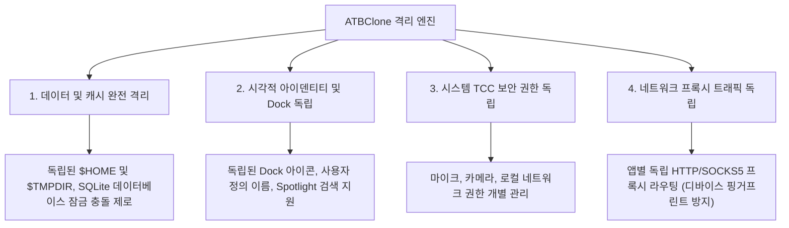

# 📖 ATBClone 사용자 설명서 (한국어판)

[English Version](../en/) | [簡體中文](../zh/) | [繁體中文](../zh-hant/) | [日本語](../ja/) | 한국어판

**ATBClone 공식 사용자 설명서**에 오신 것을 환영합니다. 본 매뉴얼은 초보자를 위한 기본 조작부터 클론 관리, 사용자 지정 레시피 구성, 내부 아키텍처 원리 분석, 시스템 진단 및 트러블슈팅에 이르기까지 macOS 앱 다중 인스턴스 실행 및 샌드박스 격리 엔진의 모든 기능을 단계별로 안내합니다.

---

## 🧭 챕터 내비게이션

사용자 수준 및 필요에 따라 적합한 챕터를 확인하십시오:

| 챕터 | 제목 | 대상 독자 | 핵심 내용 요약 |
| :--- | :--- | :--- | :--- |
| **[제1장](01-basic-operations.md)** | **[기본 작업 및 클론 관리](01-basic-operations.md)** | 👶 **초보자 / 일반 사용자** | 7단계 대화형 마법사 클론 생성, 빠른 실행, 데이터 디렉토리 원클릭 이동, 원본 앱 업데이트 시 **무손실 동기화 업데이트**, **일괄 업데이트 및 일괄 삭제**, 안전 삭제(데이터 보존 vs 완전 삭제). |
| **[제2장](02-advanced-custom-recipes.md)** | **[사용자 정의 레시피 및 기본 매개변수](02-advanced-custom-recipes.md)** | ⚡ **중급 사용자** | **App Prober (스마트 프로버)** 를 통한 미지원 앱 정밀 스캔, 시각적 레시피 편집기, **기본 매개변수 심층 분석** (`bundle_id`, `strategy`, `strip_sandbox`, `proxy`). |
| **[제3장](03-under-the-hood-and-internals.md)** | **[내부 동작 원리 및 고급 매개변수 심층 분석](03-under-the-hood-and-internals.md)** | 🔬 **파워 유저 / 개발자** | 소프트 클론과 하드 클론의 하위 메커니즘, **하드 클론 3대 핵심 기술과 바이너리 래퍼 하이재킹 (Wrapper Hijack)** 분석, 데이터-로직 분리 설계, **고급 매개변수** (`environment_injection`, `symlink_whitelist`, 동적 경로 매크로). |
| **[제4장](04-faq-and-troubleshooting.md)** | **[자주 묻는 질문 (FAQ), 시스템 진단 및 피드백](04-faq-and-troubleshooting.md)** | 🩺 **모든 사용자** | 고빈도 FAQ (데이터 안전 격리, 저장 경로 및 백업 이전, 계정 차단 방지 원리, 관리자 권한 미요구 구조), Doctor 시스템 진단, **클론 세부 정보 추출 및 GitHub Issue 제출 가이드**. |

---

## 🌟 왜 ATBClone인가?

macOS 플랫폼에서 기존의 앱 다중 실행 방식(단순한 `cp -R` 앱 복사 또는 터미널 심볼릭 링크 생성 등)은 충돌하거나 실패하기 쉽습니다. 최신 macOS 애플리케이션은 사용자 환경설정, 키체인 및 데이터베이스를 시스템 전역에서 공유하기 때문입니다.

ATBClone 은 독창적인 격리 엔진 구조를 통해 진정한 **"4중 격리(Quadruple Isolation)"**를 구현합니다:

1. **📦 데이터 및 캐시 완전 격리**: 각 클론은 전용 격리 홈 디렉토리(`$HOME`) 또는 사용자 지정 데이터 경로(`--user-data-dir`)를 보유합니다. 여러 계정으로 동시 로그인해도 로컬 SQLite 데이터베이스와 캐시가 절대 충돌하지 않습니다.
2. **🎨 시각적 아이덴티티 및 Dock 독립**: 클론 앱은 고유한 이름과 사용자 정의 아이콘을 가지며, Spotlight 검색, Launchpad(런치패드), Dock(프로그램 독)에서 독립된 애플리케이션으로 인식됩니다.
3. **🛡️ 시스템 권한 (TCC) 독립**: 하드 클론은 `CFBundleIdentifier` 를 변경하여 고유한 시스템 식별자를 획득하므로, 카메라, 마이크, 손쉬운 사용 등 시스템 권한 승인이 원본 앱과 완전히 분리됩니다.
4. **🌐 네트워크 프록시 트래픽 독립**: 특정 클론 앱에 개별 HTTP 또는 SOCKS5 프록시 채널을 구성할 수 있습니다. 호스트 시스템 네트워크에 영향을 주지 않고 앱 단위로 다른 외부 IP를 적용할 수 있습니다.

---

## 📚 핵심 개념 및 용어 사전

설명서를 읽기 전에 다음 핵심 용어를 확인하십시오:

* **원본 앱 (Host App)**: Mac 에 설치된 공식 오리지널 애플리케이션 (일반적으로 `/Applications` 에 위치).
* **클론 앱 (Clone App)**: ATBClone 엔진에 의해 생성된 독립 인스턴스 (기본 저장 경로: `~/ATBClone/Apps`).
* **하드 클론 (Hard Clone / 물리적 복제 + 래퍼 하이재킹)**: App 번들 전체를 복제하고 고유 번들 ID로 변조하며, 환경 변수 래퍼를 주입하고 재서명합니다. WeChat, Telegram, 카카오톡, Discord, Slack 등 네이티브 앱에 적합합니다.
* **소프트 클론 (Soft Clone / 런처 래퍼)**: 바이너리를 복제하지 않고 데이터 경로 매개변수(`--user-data-dir`)를 전달하는 경량 런처를 생성합니다. Cursor, VS Code, Chrome, Edge, Firefox 등 브라우저와 개발 도구에 적합합니다.
* **레시피 (Recipe)**: 대상 앱을 복제, 격리 및 실행하는 방식을 정의한 YAML 형식의 설정 설명서.
* **격리된 데이터 디렉토리 (Data Directory)**: 클론 앱이 대화 기록, 설정, 캐시, 데이터베이스를 보관하는 전용 폴더 (기본값: `~/ATBClone/Data/<클론이름>`).

---

## 🚀 빠른 시작 가이드

1. **다운로드 및 설치**: [GitHub Releases](https://github.com/aitobox/ATBClone/releases) 에서 `ATBClone-*.dmg` 를 다운로드합니다. DMG 파일을 열고 `ATBClone.app` 을 `/Applications` 폴더로 드래그합니다.
2. **ATBClone 실행**: Launchpad 또는 응용 프로그램 폴더에서 ATBClone 을 실행합니다.
3. **마법사 시작**: 메인 화면 우측 상단의 **"+ 새 클론"** 버튼을 클릭합니다.
4. **7단계 가이드 진행**: 앱 선택 ➔ 레시피 확인 ➔ 클론 이름 설정 ➔ 설치 및 데이터 저장 위치 확인 ➔ **"지금 복제"** 클릭.
5. **사용 시작**: **"실행"** 버튼을 클릭하거나 Spotlight 검색을 통해 즉시 클론 앱을 시작합니다!

---

> [!NOTE]
> **다국어 버전 지원**: 본 설명서는 English, 简体中文, 繁體中文, 日本語, 한국어 등 다양한 언어로 제공됩니다. 상단 헤더의 언어 전환 메뉴를 통해 손쉽게 전환할 수 있습니다.
