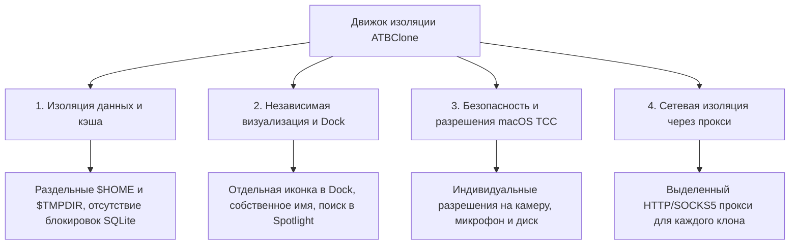

# 📖 Руководство пользователя ATBClone (Русская версия)

[English Version](../en/) | [簡體中文](../zh/) | [繁體中文](../zh-hant/) | [日本語](../ja/) | [한국어](../ko/) | [Deutsch](../de/) | [Français](../fr/) | [Español](../es/) | Русская версия

Добро пожаловать в официальное **Руководство пользователя ATBClone**. В этом руководстве подробно описаны все возможности запуска мульти-экземпляров и изоляции в песочнице (sandbox) приложений macOS — от базовых шагов для начинающих до глубокого анализа архитектуры и диагностики системы.

---

## 🧭 Навигация по главам

| Глава | Название | Аудитория | Основные темы |
| :--- | :--- | :--- | :--- |
| **[Глава 1](01-basic-operations.md)** | **[Базовые операции & Управление клонами](01-basic-operations.md)** | 👶 **Начинающие / Все пользователи** | Мастер создания из 7 шагов, запуск, прямой переход к каталогу данных, **синхронизация обновлений без потери данных**, табличный вид (**пакетное обновление и удаление**), безопасное удаление. |
| **[Глава 2](02-advanced-custom-recipes.md)** | **[Пользовательские рецепты & Базовые параметры](02-advanced-custom-recipes.md)** | ⚡ **Опытные пользователи** | Использование **App Prober (Умный зонд)** для анализа редких приложений, визуальный редактор рецептов, **описание параметров** (`bundle_id`, `strategy`, `strip_sandbox`, `proxy`). |
| **[Глава 3](03-under-the-hood-and-internals.md)** | **[Внутреннее устройство & Расширенные параметры](03-under-the-hood-and-internals.md)** | 🔬 **Разработчики / Эксперты** | Сравнение Soft и Hard клонов, **принципы Hard Clone и перехват бинарной обертки (Wrapper Hijack)**, разделение логики и данных, **расширенные параметры YAML** (`environment_injection`, `symlink_whitelist`, макросы путей). |
| **[Глава 4](04-faq-and-troubleshooting.md)** | **[Часто задаваемые вопросы (FAQ), Диагностика & Поддержка](04-faq-and-troubleshooting.md)** | 🩺 **Все пользователи** | Популярные вопросы (безопасность данных, пути хранения, защита от блокировок, работа без прав root), системная проверка Doctor, **копирование отчета и создание Issue на GitHub**. |

---

## 🌟 Почему ATBClone?

В macOS традиционные методы клонирования (простое копирование `.app` через `cp -R` или псевдонимы в терминале) часто приводят к сбоям, поскольку современные приложения совместно используют пользовательские настройки, базы данных SQLite и системную связку ключей (Keychain).

ATBClone решает эту проблему благодаря **четырехуровневой изоляции (Quadruple Isolation)**:

1. **📦 Изоляция данных и кэша**: Каждый клон использует собственную домашнюю директорию (`$HOME`) или `--user-data-dir`. Можно входить в несколько аккаунтов одновременно без конфликтов.
2. **🎨 Визуальная независимость**: Клоны имеют собственные имена и иконки, отображаясь отдельно в Spotlight, Launchpad и Dock.
3. **🛡️ Изоляция разрешений TCC**: Уникальный `CFBundleIdentifier` позволяет macOS управлять системными разрешениями клонов независимо от основного приложения.
4. **🌐 Сетевой трафик через прокси**: Возможность настроить индивидуальный HTTP или SOCKS5 прокси для каждого клона.
