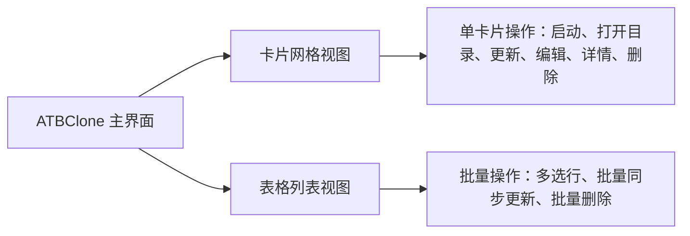

# 第一章：基础操作与分身管理

本章将手把手带您通过 7 步交互式向导创建您的第一个分身应用，并详细介绍分身的日常管理技巧，包括快速启动、一键打开数据目录、母体更新后的无损同步、表格视图批量操作与安全删除。

---

## 📑 本章目录

- [创建分身应用（7 步交互向导）](#创建分身应用7-步交互向导)
  - [步骤 1：选择母体应用](#步骤-1选择母体应用)
  - [步骤 2：规则匹配与策略确认](#步骤-2规则匹配与策略确认)
  - [步骤 3：分身命名与界面语言](#步骤-3分身命名与界面语言)
  - [步骤 4：选择安装目标目录](#步骤-4选择安装目标目录)
  - [步骤 5：设置独立数据存储目录](#步骤-5设置独立数据存储目录)
  - [步骤 6：配置独立网络代理（可选）](#步骤-6配置独立网络代理可选)
  - [步骤 7：确认配置并立即创建](#步骤-7确认配置并立即创建)
- [管理分身应用](#管理分身应用)
  - [启动分身应用](#启动分身应用)
  - [一键打开独立数据目录](#一键打开独立数据目录)
  - [编辑分身配置](#编辑分身配置)
  - [母体升级后的“无损同步更新”](#母体升级后的无损同步更新)
  - [批量操作（批量更新与批量删除）](#批量操作批量更新与批量删除)
  - [安全删除（保留数据 vs 彻底清理）](#安全删除保留数据-vs-彻底清理)

---

## 🪄 创建分身应用（7 步交互向导）

点击 ATBClone 主界面右上角的 **"+ 新建分身"** 按钮，即可唤起 7 步交互式创建向导。

```text
+-------------------------------------------------------------+
|  🧙 创建新分身 - 第 1 步 / 共 7 步                            |
|                                                             |
|  选择目标应用程序 (.app)                                     |
|  [/Applications/WeChat.app                   ] [ 浏览... ]  |
|                                                             |
|  [ 取消 ]                                    [ 下一步 > ]   |
+-------------------------------------------------------------+
```

### 步骤 1：选择母体应用
1. 点击 **"浏览..."** 按钮打开 macOS 原生文件选择窗口（默认定位在 `/Applications`）。
2. 选择您想要多开的应用程序（如 `WeChat.app`、`Telegram.app`、`Google Chrome.app` 或 `Cursor.app`）。
3. 点击 **"下一步 >"**。

> [!TIP]
> 您也可以直接将 `.app` 的完整路径复制并粘贴到输入框中。

---

### 步骤 2：规则匹配与策略确认
ATBClone 会自动对所选应用进行智能探测：
* **内置规则匹配**：如果应用在内置的 33+ 热门规则库中，引擎会自动匹配最佳克隆策略（如微信默认采用“物理克隆”，Cursor 默认采用“软包装”）。
* **智能探针推荐**：如果是未预设规则的小众应用，引擎会动态扫描其二进制架构和沙盒权限，自动推荐最优策略。
* **策略切换**：您可以按需调整策略：
  * `hard_clone`（物理克隆）：完整复制 App，伪装 Bundle ID 并注入环境劫持脚本。
  * `soft_clone`（软包装）：轻量启动器外壳，通过参数注入实现数据隔离。

点击 **"下一步 >"** 继续。

---

### 步骤 3：分身命名与界面语言
为您的分身应用配置独立的身份：

```text
分身代号:     [ WeChat2                         ]  (用于内部目录与配置文件命名)
显示名称:     [ 微信工作版                       ]  (显示在 Dock、聚焦搜索和访达中)
界面语言:     [ 简体中文 (zh-CN)              v ]  (分身专属独立语言)
```

1. **分身代号 (Clone Name)**：字母与数字组合（如 `WeChat2`、`Telegram-Work`）。
2. **显示名称 (Display Name)**：在 macOS 程序坞 (Dock)、聚焦搜索 (Spotlight) 和访达中展示的应用名称。默认会自动跟随分身代号，您可随时自定义。
3. **界面语言 (UI Language)**：为该分身指定独立的语言环境（例如母体保持中文，分身独立运行为英文或日文）。

点击 **"下一步 >"**。

---

### 步骤 4：选择安装目标目录
选择新生成的分身 `.app` 安装位置：

* **默认目录（`~/ATBClone/Apps` —— 强烈推荐）**：安装到当前用户的 ATBClone 应用目录。**全程无需管理员密码，免 Root 提权。**
* **系统目录（`/Applications`）**：安装到系统全局应用程序目录。ATBClone 会通过 macOS 原生授权弹窗请求一次写入权限。

点击 **"下一步 >"**。

---

### 步骤 5：设置独立数据存储目录
配置分身存放独立数据库、聊天记录、首选项和缓存的路径：

* **默认路径（`~/ATBClone/Data/<分身名称>`）**：系统自动分配并管理的专属隔离区。
* **自定义路径 / 外接移动硬盘**：点击 **"浏览..."** 可将数据存储指定到外接 SSD 或特定加密盘。

> [!NOTE]
> 对于无需或不支持重定向数据目录的特殊命令行工具，向导会提示该项由系统默认管理。

点击 **"下一步 >"**。

---

### 步骤 6：配置独立网络代理（可选）
如果您希望该分身通过独立的代理线路访问网络（用于办公/私人网络隔离或单应用防指纹关联）：

1. 开启 **"启用独立网络代理"** 开关。
2. 选择协议类型：`HTTP`、`HTTPS` 或 `SOCKS5`。
3. 填入代理服务器地址（默认 `127.0.0.1`）与端口号（如 `7890` 或 `1080`）。

点击 **"下一步 >"**。

---

### 步骤 7：确认配置并立即创建
核对摘要卡片上的所有信息：

* **母体应用**：`/Applications/WeChat.app`
* **分身代号**：`WeChat2`
* **克隆策略**：`hard_clone`
* **安装路径**：`~/ATBClone/Apps/WeChat2.app`
* **数据目录**：`~/ATBClone/Data/WeChat2`
* **独立代理**：`http://127.0.0.1:7890`

点击 **"立即克隆 🚀"**。进度条将自动完成物理拷贝、Plist 基因改造、沙盒剥离、壳劫持与 Ad-hoc 本地重签名。完成后分身即可立即运行！

---

## 🎛️ 管理分身应用

ATBClone 支持两种主视图浏览分身：**卡片网格视图 (Card Grid View)** 与 **表格列表视图 (Table View)**。



### 启动分身应用
* **从 ATBClone 启动**：在卡片或表格行中点击 **"启动"** 按钮。
* **从 Spotlight 聚焦搜索启动**：按下 `Cmd + 空格`，输入分身的显示名称（如 `微信工作版`）回车即可启动。
* **从访达或程序坞启动**：直接双击 `~/ATBClone/Apps/WeChat2.app`。

---

### 一键打开独立数据目录
想要查看分身下载的文件、清理缓存或备份数据库？
* 点击分身卡片或操作栏上的 **"打开目录"**（Open Dir）按钮。
* 访达将立即打开该分身的专属存储目录（`~/ATBClone/Data/<分身名称>`）。

---

### 编辑分身配置
需要修改分身的显示名称、界面语言或代理服务器？
1. 点击分身卡片或工具栏上的 **"编辑"** 按钮。
2. 在弹出窗口中调整：
   * **显示名称**：更改在程序坞和访达中的标题。
   * **语言环境**：切换分身界面语言。
   * **代理设置**：开启/关闭或更改代理服务器地址。
3. 点击 **"保存修改"**，下次启动分身时生效。

---

### 母体升级后的“无损同步更新”
当您的母体应用（如微信）通过 Mac App Store 或官方网站完成版本升级后：

1. 打开 ATBClone。
2. 选中需要更新的分身，点击 **"更新"**（Update）按钮。
3. ATBClone 将自动拉取最新母体二进制重新构建分身，并**100% 完整保留您原有的所有聊天记录、登录状态与配置数据**。

> [!IMPORTANT]
> **零数据丢失保障**：由于 ATBClone 采用了“数据与程序本体物理分离”的架构设计，重构或更新 `.app` 应用程序包绝对不会触碰您的本地数据库与聊天记录。

---

### 批量操作（批量更新与批量删除）
当您管理较多分身实例时：

1. 点击顶部工具栏切换为 **表格视图 (Table View)**。
2. 使用 macOS 标准快捷键进行多选：
   * `Cmd + 点击`：多选不连续的分身行。
   * `Shift + 点击`：连续框选多个分身行。
3. 底部操作栏将自动显示批量操作按钮：
   * **"更新 (N 个分身)"**：依次自动重新构建选中的全部多开实例。
   * **"删除 (N 个分身)"**：一键安全清理选中的分身。

---

### 安全删除（保留数据 vs 彻底清理）
点击 **"删除"**（或执行批量删除）时，ATBClone 会弹出双重确认安全对话框：

```text
+-------------------------------------------------------------+
|  ⚠️ 删除分身应用确认                                         |
|                                                             |
|  您确定要删除分身 'WeChat2' 吗？                            |
|                                                             |
|  [X] 同时彻底删除数据存储目录 (~/ATBClone/Data/WeChat2)      |
|                                                             |
|  [ 取消 ]                           [ 确认删除 ]            |
+-------------------------------------------------------------+
```

* **保留数据（默认不勾选）**：仅从 `~/ATBClone/Apps` 中移除 `.app` 应用程序包，聊天记录与数据库完整保存在 `~/ATBClone/Data/` 中。后续如需恢复，随时使用同名再次克隆即可瞬间找回所有记录。
* **彻底清除（勾选复选框）**：同时删除 `.app` 应用程序包与专属数据目录，释放磁盘空间。

---

## ⏭️ 下一步指引

* 想要为冷门应用编写专属分身规则？请阅读 **[第二章：冷门应用规则定制与基础参数](02-advanced-custom-recipes.md)**。
* 想要深入探索软硬分身底层原理？请阅读 **[第三章：实现原理解析与高级参数全解](03-under-the-hood-and-internals.md)**。
* 遇到疑问或需要提交问题？请阅读 **[第四章：常见问题 (FAQ)、系统体检与反馈](04-faq-and-troubleshooting.md)**。
