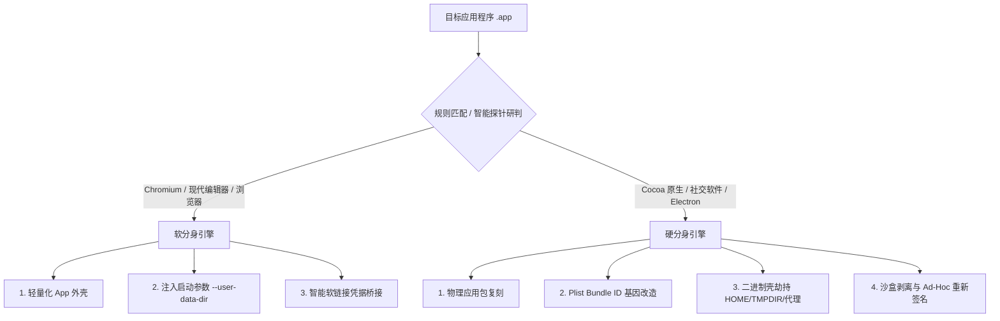

# 第三章：实现原理解析与高级参数全解

本章将深入剖析 ATBClone 的底层技术架构与黑科技原理。您将了解 **软分身** 与 **硬分身** 在 Mach-O 二进制与 macOS 系统层面的运作方式、独创的 **二进制壳劫持 (Wrapper Hijack)** 欺骗技术、**数据与程序本体分离** 的无损升级保障，以及规则中所有高级参数与宏变量的详细定义。

---

## 📑 本章目录

- [系统架构概览](#系统架构概览)
- [两大核心引擎机制：软分身 vs 硬分身](#两大核心引擎机制软分身-vs-硬分身)
  - [1. 软分身（启动器模式）](#1-软分身启动器模式)
  - [2. 硬分身（深度沙盒与壳劫持模式）](#2-硬分身深度沙盒与壳劫持模式)
- [硬分身独创“三板斧”核心技术](#硬分身独创三板斧核心技术)
  - [第一板斧：Bundle ID 基因改造（系统身份重组）](#第一板斧bundle-id-基因改造系统身份重组)
  - [第二板斧：二进制壳劫持与环境欺骗 (Wrapper Hijack)](#第二板斧二进制壳劫持与环境欺骗-wrapper-hijack)
  - [第三板斧：沙盒剥离与本地 Ad-Hoc 重新签名](#第三板斧沙盒剥离与本地-ad-hoc-重新签名)
- [“数据-逻辑分离”架构：为什么升级母体永不丢记录](#数据-逻辑分离架构为什么升级母体永不丢记录)
- [规则高级参数深度解析](#规则高级参数深度解析)
  - [1. `app_type`（底层框架引擎类型）](#1-app_type底层框架引擎类型)
  - [2. `environment_injection`（环境变量劫持）](#2-environment_injection环境变量劫持)
  - [3. `launch_args`（自定义启动参数注入）](#3-launch_args自定义启动参数注入)
  - [4. `symlink_whitelist`（智能软链接白名单）](#4-symlink_whitelist智能软链接白名单)
  - [5. 动态路径宏变量](#5-动态路径宏变量)
- [高级规则 YAML 配置完整示例](#高级规则-yaml-配置完整示例)
- [下一步指引](#下一步指引)

---

## 🏗️ 系统架构概览

macOS 拥有严格的应用沙盒（App Sandbox）、权限隐私管理（TCC）与代码签名（Gatekeeper）机制。传统的应用多开方案经常面临以下三大硬伤：

1. **数据库互斥冲突**：多实例同时向 `~/Library/Application Support/...` 写入数据导致 SQLite 死锁。
2. **凭据混淆**：应用通过硬编码的 `CFBundleIdentifier` 访问系统钥匙串，导致账号频繁掉线。
3. **子进程校验失败**：Chromium / Electron 等应用的 Helper 子进程通过 Mach Port 通信校验，导致崩溃或白屏。

ATBClone 通过动态分流引擎解决上述难题：



---

## ⚙️ 两大核心引擎机制：软分身 vs 硬分身

### 1. 软分身（启动器模式）
* **设计理念**：零磁盘浪费、毫秒级秒开、轻量化参数委托。
* **执行步骤**：
  1. 在 `~/Applications/<分身名称>.app` 创建极小尺寸的目录外壳（体积通常小于 200 KB）。
  2. 生成独立的 `Info.plist`，配置专属的应用代号与图标。
  3. 在 `Contents/MacOS/` 下写入可执行 Bash 启动脚本，直接调用母体应用的 Mach-O 实体并注入隔离参数：
     ```bash
     #!/bin/bash
     ORIGINAL_BIN="/Applications/Google Chrome.app/Contents/MacOS/Google Chrome"
     USER_DATA="$HOME/ATBClone/Data/Chrome2"
     
     exec "$ORIGINAL_BIN" --user-data-dir="$USER_DATA" "$@" >/dev/null 2>&1 &
     ```

---

### 2. 硬分身（深度沙盒与壳劫持模式）
* **设计理念**：彻底物理隔离、独立 Dock 图标、独立系统 TCC 权限分配。
* **执行步骤**：
  1. 将母体应用完整物理拷贝至目标目录。
  2. 篡改 `Info.plist` 中的 `CFBundleIdentifier`，赋予应用全新的系统身份。
  3. 按需提取并剔除沙盒 Entitlements 限制。
  4. 重命名原二进制文件，替换为同名 Wrapper 壳脚本进行环境变量欺骗。
  5. 清理隔离扩展属性（`xattr -cr`）并执行深层 Ad-Hoc 签名（`codesign --force --deep --sign -`）。

---

## 🪓 硬分身独创“三板斧”核心技术

### 第一板斧：Bundle ID 基因改造（系统身份重组）
macOS 系统通过 `CFBundleIdentifier` 来识别每个应用。麦克风权限、摄像头授权、通知中心以及 Dock 程序坞的分组归属全部与该 ID 绑定。

ATBClone 利用 `/usr/libexec/PlistBuddy` 对目标包进行身份突变（如将 `com.tencent.xinWeChat` 修改为 `com.tencent.xinWeChat.atbclone.WeChat2`），使 macOS 将分身判定为一个全新独立的合法原生程序。

---

### 第二板斧：二进制壳劫持与环境欺骗 (Wrapper Hijack)
为了在不逆向反编译、不修改已编译 Mach-O 机器码的前提下实现完美数据重定向，ATBClone 采用了独创的壳劫持技术：

1. 将原可执行文件 `Contents/MacOS/WeChat` 重命名为 `Contents/MacOS/WeChat.bin`。
2. 写入一个同名的中间代理脚本 `Contents/MacOS/WeChat` 并赋予执行权限（`chmod +x`）：
   ```bash
   #!/bin/bash
   DIR=$(dirname "$0")
   
   # 1. 家目录与临时目录欺骗重定向
   export HOME="/Users/username/ATBClone/Data/WeChat2/Home"
   export TMPDIR="/Users/username/ATBClone/Data/WeChat2/Tmp"
   
   # 2. 单应用专属网络代理注入 (可选)
   export HTTP_PROXY="http://127.0.0.1:7890"
   export HTTPS_PROXY="http://127.0.0.1:7890"
   export ALL_PROXY="socks5://127.0.0.1:7890"
   
   # 3. 启动母体二进制并透传所有参数
   exec "$DIR/WeChat.bin" "$@"
   ```
3. 应用启动时，读取到的 `$HOME` 即为隔离目录，自动将所有的聊天记录、配置文件和缓存写入专属沙盒，完美实现多账号互不干扰。

---

### 第三板斧：沙盒剥离与本地 Ad-Hoc 重新签名
Mac App Store 版本的应用受到 `com.apple.security.app-sandbox` 强沙盒限制，强行限制只能写入 `~/Library/Containers/<原BundleID>`。

当配置 `strip_sandbox: true` 时：
1. 提取原始 Entitlements 授权文件。
2. 使用 Python 正则剥离 `<key>com.apple.security.app-sandbox</key>` 限制节点。
3. 对整个 Bundle 及其内部嵌套的所有 Frameworks、Dylibs、Helpers 执行深度 Ad-Hoc 签名：
   ```bash
   codesign --force --deep --sign - --entitlements /tmp/clean_entitlements.plist "/Applications/WeChat2.app"
   ```

---

## 🔄 “数据-逻辑分离”架构：为什么升级母体永不丢记录

传统多开工具最令人头疼的问题就是“母体升级”——一旦 App Store 升级了微信，旧分身便无法登录，重新制作又担心聊天记录丢失。

ATBClone 彻底解决了这一痛点，核心在于**数据与逻辑的物理级解耦**：

```text
[ 程序逻辑层 (随时可丢弃重构) ]               [ 数据持久层 (永久保留安全隔离) ]
~/Applications/WeChat2.app                 ~/ATBClone/Data/WeChat2/
  ├── Contents/Info.plist                    ├── Home/
  ├── Contents/MacOS/WeChat (代理壳)          │   ├── Library/Application Support/...
  ├── Contents/MacOS/WeChat.bin              │   ├── Library/Preferences/...
  └── Contents/Frameworks/                   └── Tmp/
```

* **程序逻辑层**（`.app` 实体）：属于无状态的执行程序。
* **数据持久层**（`~/ATBClone/Data/<分身名称>`）：保存着您所有的本地聊天数据库、登录凭据、Cookie 和图片缓存。

当母体升级后，您在 ATBClone 中点击 **"更新"**，引擎会先杀死分身进程，删除旧的 `.app` 包，按照最新母体重新制作一份 `.app`。新分身启动后，由于其代理壳依然挂载原有的 `~/ATBClone/Data/WeChat2` 目录，因此**100% 毫发无损地继承所有历史聊天记录与登录态**！

---

## 🛠️ 规则高级参数深度解析

在 `~/ATBClone/recipes/<bundle_id>.yaml` 中，您可以配置以下高级参数：

### 1. `app_type`（底层框架引擎类型）
* **类型**：`enum`（可选值：`cocoa`、`electron`、`chromium`、`firefox`、`generic`，默认自动检测）
* **说明**：指示应用所采用的技术栈，指导引擎如何管理子进程与启动参数：
  * `cocoa`：标准原生 Swift / Objective-C 应用程序。
  * `electron`：基于 Node.js 与 Chromium 构建的跨平台应用（Slack、Discord、QQ、飞书）。
  * `chromium`：Chromium 内核浏览器（Chrome、Edge、Arc）。
  * `firefox`：Gecko 内核浏览器。
  * `generic`：通用或非标准 Mach-O 二进制程序。

---

### 2. `environment_injection`（环境变量劫持）
* **类型**：`map<string, string>`
* **说明**：在二进制代理壳执行前，强制注入的一组环境变量键值对。

```yaml
environment_injection:
  HOME: "{{ATB_DATA_DIR}}/Home"
  TMPDIR: "{{ATB_DATA_DIR}}/Tmp"
  XDG_CONFIG_HOME: "{{ATB_DATA_DIR}}/Config"
  ELECTRON_ENABLE_LOGGING: "true"
```

---

### 3. `launch_args`（自定义启动参数注入）
* **类型**：`list<string>`
* **说明**：启动二进制时传递的自定义命令行参数列表。

```yaml
launch_args:
  - "--user-data-dir={{ATB_DATA_DIR}}"
  - "--disable-features=Translate"
```

---

### 4. `symlink_whitelist`（智能软链接白名单）
* **类型**：`list<string>`
* **说明**：在构建伪装的 `$HOME` 数据目录时，指定需要自动**软链接回真实宿主家目录**的白名单路径，防止凭据丢失或特定功能损坏。

```yaml
symlink_whitelist:
  - "Library/Keychains"    # 保持 macOS 钥匙串访问，防止登录频繁掉线
  - ".ssh"                 # 保留 SSH 密钥，确保 Git 功能正常
  - "Library/Fonts"        # 保留用户已安装的自定义字体访问权限
```

---

### 5. 动态路径宏变量
在 `environment_injection` 和 `launch_args` 中，支持使用动态模板变量，引擎在克隆时会自动解析并替换：

| 宏变量 | 含义说明 | 示例解析结果 |
| :--- | :--- | :--- |
| `{{ATB_DATA_DIR}}` | 当前分身专属数据存储目录绝对路径 | `/Users/username/ATBClone/Data/WeChat2` |
| `{{CLONE_NAME}}` | 当前分身的应用代号 | `WeChat2` |
| `{{BUNDLE_ID}}` | 母体应用的原始 Bundle Identifier | `com.tencent.xinWeChat` |
| `{{ORIGINAL_BIN}}` | 母体应用的可执行文件绝对路径 | `/Applications/WeChat.app/Contents/MacOS/WeChat` |

---

## 📄 高级规则 YAML 配置完整示例

```yaml
# ========================================================
# ATBClone 高级规则 - Cursor AI 编辑器
# 保存路径: ~/ATBClone/recipes/com.todesktop.230313mzl4w4u92.yaml
# ========================================================

bundle_id: com.todesktop.230313mzl4w4u92
app_name: Cursor
strategy: soft_clone
app_type: electron
strip_sandbox: false

environment_injection:
  HOME: "{{ATB_DATA_DIR}}/Home"
  VSCODE_PORTABLE: "{{ATB_DATA_DIR}}/UserData"

launch_args:
  - "--user-data-dir={{ATB_DATA_DIR}}/UserData"
  - "--extensions-dir={{ATB_DATA_DIR}}/Extensions"

symlink_whitelist:
  - "Library/Keychains"
  - ".ssh"
  - ".gitconfig"

proxy:
  enabled: false
  type: http
  host: 127.0.0.1
  port: 7890
```

---

## ⏭️ 下一步指引

* 查阅高频疑问解答、系统体检工具与 GitHub 问题反馈流程？请阅读 **[第四章：常见问题 (FAQ)、系统体检与反馈](04-faq-and-troubleshooting.md)**。
