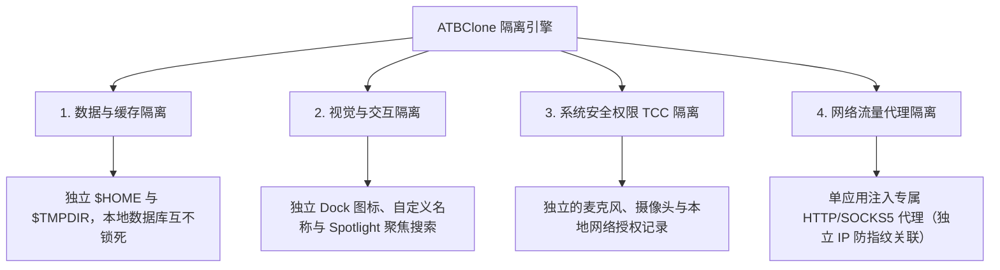

# 📖 ATBClone 用户使用手册（简体中文版）

[English Version (英文版)](../en/README.md) | 简体中文版

欢迎查阅 **ATBClone（艾特智能分身）官方使用手册**。本手册将手把手带您熟悉 macOS 应用多开与沙盒隔离的各项功能，涵盖从新手基础操作、日常管理、冷门应用规则定制、底层隔离原理解析到系统体检与故障反馈的完整内容。

---

## 🧭 章节导航地图

无论您是刚接触多开工具的小白用户，还是需要配置独立代理与 Mach-O 沙盒剥离的极客玩家，均可按需查阅对应章节：

| 章节 | 章节名称 | 适用人群 | 核心内容提要 |
| :--- | :--- | :--- | :--- |
| **[第一章](01-basic-operations.md)** | **[基础操作与分身管理](01-basic-operations.md)** | 👶 **小白用户 / 普通用户** | 7 步交互式向导创建分身、快捷启动、一键直达数据目录、母体升级**无损同步更新**、表格视图**批量更新与批量删除**、安全删除（保留数据 vs 彻底清理）。 |
| **[第二章](02-advanced-custom-recipes.md)** | **[冷门应用规则定制与基础参数](02-advanced-custom-recipes.md)** | ⚡ **进阶用户** | 使用 **App Prober (智能探针)** 深度扫描未知应用、可视化规则编辑器、**基础参数全解**（`bundle_id`、`strategy`、`strip_sandbox`、`proxy`）。 |
| **[第三章](03-under-the-hood-and-internals.md)** | **[实现原理解析与高级参数全解](03-under-the-hood-and-internals.md)** | 🔬 **极客玩家 / 开发者** | 软分身与硬分身底层机制、**硬分身“三板斧”与二进制壳劫持 (Wrapper Hijack)** 深度剖析、数据-逻辑分离架构、**高级参数详解**（`environment_injection`、`symlink_whitelist`、动态路径宏）。 |
| **[第四章](04-faq-and-troubleshooting.md)** | **[常见问题 (FAQ)、系统体检与反馈](04-faq-and-troubleshooting.md)** | 🩺 **全体用户** | 高频 FAQ（数据安全隔离、存放路径与备份迁移、封号风险与防关联原理解析、免 Root 权限机制）、Doctor 系统体检、**分身详情信息提取与提报 GitHub Issue 标准指引**。 |

---

## 🌟 为什么选择 ATBClone？

在 macOS 平台上，传统的应用多开方法（例如简单的 `cp -R` 复制应用或简单的终端软链接别名）极易崩溃或失效，因为绝大多数现代 macOS 应用程序共享用户首选项、系统钥匙串及数据库。

ATBClone 通过独创的引擎体系，实现了真正的**“四重隔离”**：

1. **📦 数据与缓存隔离**：每个分身拥有专属的独立家目录（`$HOME`）或自定义数据存储路径（`--user-data-dir`）。多账号同时登录，本地 SQLite 数据库与缓存互不冲突。
2. **🎨 视觉与交互隔离**：分身应用拥有独立的名称与图标，在 Spotlight（聚焦搜索）、Launchpad（启动台）和 Dock（程序坞）中均作为独立应用存在。
3. **🛡️ 系统权限 (TCC) 隔离**：硬分身通过修改 `CFBundleIdentifier` 赋予应用全新的系统身份，摄像头、麦克风、辅助功能等系统授权与母体完全独立。
4. **🌐 网络流量代理隔离**：支持为指定分身应用单独配置独立的 HTTP 或 SOCKS5 代理通道，不影响宿主系统网络与母体应用，实现单应用独立 IP 防指纹关联。

---

## 📚 核心概念与术语速查

在阅读本手册前，您可以先了解以下常用名词：

* **母体应用 (Host App)**：您 Mac 上安装的原版应用程序（通常位于 `/Applications`）。
* **分身应用 (Clone App)**：由 ATBClone 引擎生成的独立副本体（默认存放在 `~/Applications`）。
* **硬分身 (Hard Clone / 物理克隆 + 壳劫持)**：完整复制 App 实体，修改唯一 Bundle ID，注入环境变量启动脚本并重新签名。适合微信、Telegram、QQ、飞书、Discord 等绝大多数社交和原生应用。
* **软分身 (Soft Clone / 软包装启动器)**：仅生成轻量级启动器外壳，通过启动参数（如 `--user-data-dir`）重定向数据。适合 Cursor、VS Code、Chrome、Edge、Firefox 等浏览器与开发工具。
* **规则 (Recipe)**：指示 ATBClone 如何处理该应用的 YAML 格式配置说明书。
* **数据目录 (Data Directory)**：分身应用存放聊天记录、配置、缓存和数据库的独立文件夹（默认位于 `~/ATBClone/Data/<分身名称>`）。

---

## 🚀 极速入门指引

1. **下载与安装**：前往 [GitHub Releases](https://github.com/aitobox/ATBClone/releases) 下载 `ATBClone-arm-0.9.7.dmg`。打开 DMG 并将 `ATBClone.app` 拖入 `Applications` 文件夹。
2. **打开 ATBClone**：在启动台或应用程序文件夹中启动 ATBClone。
3. **启动向导**：点击主界面右上角的 **"+ 新建分身"** 按钮。
4. **跟随 7 步指引**：选择应用 ➔ 确认规则 ➔ 设置分身名称 ➔ 确认安装与数据目录 ➔ 点击 **"立即克隆"**。
5. **开始使用**：点击 **"启动"** 按钮，或者直接通过 Spotlight 搜索启动分身！

---

> [!NOTE]
> **多语言版本**：本手册提供 English 与 简体中文双语版本。欢迎查阅顶部的语言切换链接。
