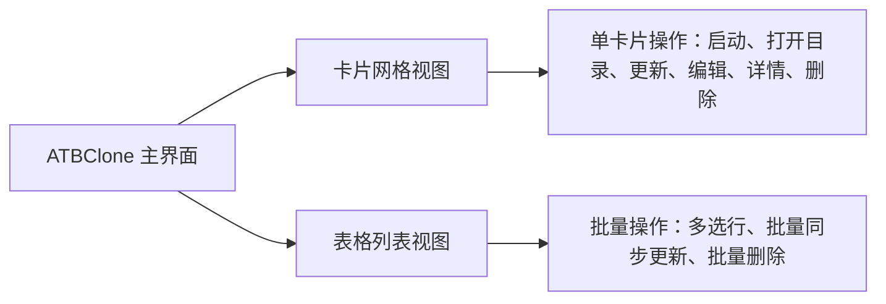

# 第一章：基礎操作與分身管理


本章將手把手帶您透過 7 步互動式精靈建立您的第一個分身應用程式，並詳細介紹分身的日常管理技巧，包括快速啟動、一鍵開啟資料目錄、母體更新後的無損同步、表格檢視批次操作與安全刪除。

---

## 📑 本章目錄

- [建立分身應用（7 步交互向導）](#建立分身應用7-步交互向導)
  - [步驟 1：選擇母體應用](#步驟-1選擇母體應用)
  - [步驟 2：規則匹配與策略確認](#步驟-2規則匹配與策略確認)
  - [步驟 3：分身命名與介面語言](#步驟-3分身命名與介面語言)
  - [步驟 4：選擇安裝目標目錄](#步驟-4選擇安裝目標目錄)
  - [步驟 5：設定獨立資料儲存目錄](#步驟-5設定獨立資料儲存目錄)
  - [步驟 6：配置獨立網路代理（可選）](#步驟-6配置獨立網路代理可選)
  - [步驟 7：確認配置並立即建立](#步驟-7確認配置並立即建立)
- [管理分身應用](#管理分身應用)
  - [啟動分身應用](#啟動分身應用)
  - [一鍵開啟獨立資料目錄](#一鍵開啟獨立資料目錄)
  - [編輯分身配置](#編輯分身配置)
  - [母體升級後的“無損同步更新”](#母體升級後的無損同步更新)
  - [批次操作（批次更新與批次刪除）](#批次操作批次更新與批次刪除)
  - [安全刪除（保留資料 vs 徹底清理）](#安全刪除保留資料-vs-徹底清理)

---

## 🪄 建立分身應用（7 步交互向導）

點選 ATBClone 主介面右上角的 **"+ 新建分身"** 按鈕，即可喚起 7 步互動式建立嚮導。

```text
+-------------------------------------------------------------+
|  🧙 创建新分身 - 第 1 步 / 共 7 步                            |
|                                                             |
|  选择目标应用程序 (.app)                                     |
|  [/Applications/WeChat.app                   ] [ 浏览... ]  |
|                                                             |
|  [ 取消 ]                                    [ 下一步 > ]   |
+-------------------------------------------------------------+
```

### 步驟 1：選擇母體應用
1. 點選 **"瀏覽..."** 按鈕開啟 macOS 原生檔案選擇視窗（預設定位在 `/Applications`）。
2. 選擇您想要多開的應用程式（如 `WeChat.app`、`Telegram.app`、`Google Chrome.app` 或 `Cursor.app`）。
3. 點選 **"下一步 >"**。

> [!TIP]
> 您也可以直接將 `.app` 的完整路徑複製並貼上到輸入框中。

---

### 步驟 2：規則匹配與策略確認
ATBClone 會自動對所選應用進行智慧探測：

* **內建規則匹配**：如果應用在內建的 33+ 熱門規則庫中，引擎會自動匹配最佳克隆策略（如微信預設採用“物理克隆”，Cursor 預設採用“軟包裝”）。
* **智慧探針推薦**：如果是未預設規則的小眾應用，引擎會動態掃描其二進位制架構和沙盒許可權，自動推薦最優策略。
* **策略切換**：您可以按需調整策略：
  * `hard_clone`（物理克隆）：完整複製 App，偽裝 Bundle ID 並注入環境隔離機制。
  * `soft_clone`（軟包裝）：輕量啟動器外殼，通過引數注入實現資料隔離。
* **注入模式 (Injection Mode)**：在物理克隆模式下，您可以精細指定環境注入技術：
  * `auto`（自動檢測，預設推薦）：引擎先靜態掃描 Mach-O 二進位制頭部 Padding 空間。原生應用空間充裕時，自動採用 **動態庫無感注入 (`dylib`)**，零程序替換，完美支援頂部選單欄圖示與系統通知中心；若空間不足或需命令列引數，則自動平滑降級為 **啟動器包裝 (`launcher`)**。
  * `dylib`（動態庫注入）：強制執行原程序動態庫注入。如頭部空間不足，嚮導將明確報警避免損壞二進位制。適合微信、Telegram 等原生通訊軟體。
  * `launcher`（啟動器包裝）：強制採用編譯原生 Mach-O C 語言啟動器並備份 `.bin` 的傳統方案。

點選 **"下一步 >"** 繼續。

---

### 步驟 3：分身命名與介面語言
為您的分身應用配置獨立的身份：

```text
分身代号:     [ WeChat2                         ]  (用于内部目录与配置文件命名)
显示名称:     [ 微信工作版                       ]  (显示在 Dock、聚焦搜索和访达中)
界面语言:     [ 简体中文 (zh-CN)              v ]  (分身专属独立语言)
```

1. **分身代號 (Clone Name)**：字母與數字組合（如 `WeChat2`、`Telegram-Work`）。
2. **顯示名稱 (Display Name)**：在 macOS 程式塢 (Dock)、Spotlight 搜尋 (Spotlight) 和訪達中展示的應用名稱。預設會自動跟隨分身代號，您可隨時自定義。
3. **介面語言 (UI Language)**：為該分身指定獨立的語言環境（例如母體保持中文，分身獨立執行為英文或日文）。

點選 **"下一步 >"**。

---

### 步驟 4：選擇安裝目標目錄
選擇新生成的分身 `.app` 安裝位置：

* **預設目錄（`~/ATBClone/Apps` —— 強烈推薦）**：安裝到當前使用者的 ATBClone 應用目錄。**全程無需管理員密碼，免 Root 提權。**
* **系統目錄（`/Applications`）**：安裝到系統全域性應用程式目錄。ATBClone 會通過 macOS 原生授權彈窗請求一次寫入許可權。

點選 **"下一步 >"**。

---

### 步驟 5：設定獨立資料儲存目錄
配置分身存放獨立資料庫、聊天記錄、首選項和快取的路徑：

* **預設路徑（`~/ATBClone/Data/<分身名称>`）**：系統自動分配並管理的專屬隔離區。
* **自定義路徑 / 外接行動硬碟**：點選 **"瀏覽..."** 可將資料儲存指定到外接 SSD 或特定加密盤。

> [!NOTE]
> 對於無需或不支援重定向資料目錄的特殊命令列工具，嚮導會提示該項由系統預設管理。

點選 **"下一步 >"**。

---

### 步驟 6：配置獨立網路代理（可選）
如果您希望該分身通過獨立的代理線路訪問網路（用於辦公/私人網路隔離或單應用防指紋關聯）：

1. 開啟 **"啟用獨立網路代理"** 開關。
2. 選擇協議型別：`HTTP`、`HTTPS` 或 `SOCKS5`。
3. 填入代理伺服器地址（預設 `127.0.0.1`）與埠號（如 `7890` 或 `1080`）。

點選 **"下一步 >"**。

---

### 步驟 7：確認配置並立即建立
核對摘要卡片上的所有資訊：

* **母體應用**：`/Applications/WeChat.app`
* **分身代號**：`WeChat2`
* **克隆策略**：`hard_clone`
* **安裝路徑**：`~/ATBClone/Apps/WeChat2.app`
* **資料目錄**：`~/ATBClone/Data/WeChat2`
* **獨立代理**：`http://127.0.0.1:7890`

點選 **"立即克隆 🚀"**。進度條將自動完成物理複製、Plist 基因改造、沙盒剝離、殼劫持與 Ad-hoc 本地重簽名。完成後分身即可立即執行！

---

## 🎛️ 管理分身應用

ATBClone 支援兩種主檢視瀏覽分身：**卡片網格檢視 (Card Grid View)** 與 **表格列表檢視 (Table View)**。



### 啟動分身應用
* **從 ATBClone 啟動**：在卡片或表格行中點選 **"啟動"** 按鈕。
* **從 Spotlight Spotlight 搜尋啟動**：按下 `Cmd + 空格`，輸入分身的顯示名稱（如 `微信工作版`）回車即可啟動。
* **從訪達或程式塢啟動**：直接雙擊 `~/ATBClone/Apps/WeChat2.app`。

---

### 一鍵開啟獨立資料目錄
想要檢視分身下載的檔案、清理快取或備份資料庫？

* 點選分身卡片或操作欄上的 **"開啟目錄"**（Open Dir）按鈕。
* 訪達將立即開啟該分身的專屬儲存目錄（`~/ATBClone/Data/<分身名称>`）。

---

### 編輯分身配置
需要修改分身的顯示名稱、介面語言或代理伺服器？

1. 點選分身卡片或工具欄上的 **"編輯"** 按鈕。
2. 在彈出視窗中調整：
   * **顯示名稱**：更改在程式塢和訪達中的標題。
   * **語言環境**：切換分身介面語言。
   * **代理設定**：開啟/關閉或更改代理伺服器地址。
3. 點選 **"儲存修改"**，下次啟動分身時生效。

---

### 母體升級後的“無損同步更新”
當您的母體應用（如微信）通過 Mac App Store 或官方網站完成版本升級後：

1. 開啟 ATBClone。
2. 選中需要更新的分身，點選 **"更新"**（Update）按鈕。
3. ATBClone 將自動拉取最新母體二進位制重新構建分身，並**100% 完整保留您原有的所有聊天記錄、登入狀態與配置資料**。

> [!IMPORTANT]
> **零資料丟失保障**：由於 ATBClone 採用了“資料與程式本體物理分離”的架構設計，重構或更新 `.app` 應用程式包絕對不會觸碰您的本地資料庫與聊天記錄。

---

### 批次操作（批次更新與批次刪除）
當您管理較多分身例項時：

1. 點選頂部工具欄切換為 **表格檢視 (Table View)**。
2. 使用 macOS 標準快捷鍵進行多選：
   * `Cmd + 点击`：多選不連續的分身行。
   * `Shift + 点击`：連續框選多個分身行。
3. 底部操作欄將自動顯示批次操作按鈕：
   * **"更新 (N 個分身)"**：依次自動重新構建選中的全部多開例項。
   * **"刪除 (N 個分身)"**：一鍵安全清理選中的分身。

---

### 安全刪除（保留資料 vs 徹底清理）
點選 **"刪除"**（或執行批次刪除）時，ATBClone 會彈出雙重確認安全對話方塊：

```text
+-------------------------------------------------------------+
|  ⚠️ 删除分身应用确认                                         |
|                                                             |
|  您确定要删除分身 'WeChat2' 吗？                            |
|                                                             |
|  [X] 同时彻底删除数据存储目录 (~/ATBClone/Data/WeChat2)      |
|                                                             |
|  [ 取消 ]                           [ 确认删除 ]            |
+-------------------------------------------------------------+
```

* **保留資料（預設不勾選）**：僅從 `~/ATBClone/Apps` 中移除 `.app` 應用程式包，聊天記錄與資料庫完整儲存在 `~/ATBClone/Data/` 中。後續如需恢復，隨時使用同名再次克隆即可瞬間找回所有記錄。
* **徹底清除（勾選核取方塊）**：同時刪除 `.app` 應用程式包與專屬資料目錄，釋放磁碟空間。

---

## ⏭️ 下一步指引

* 想要為冷門應用編寫專屬分身規則？請閱讀 **[第二章：冷門應用規則定製與基礎引數](02-advanced-custom-recipes.md)**。
* 想要深入探索軟硬分身 (Hard Clone)底層原理？請閱讀 **[第三章：實現原理解析與高階引數全解](03-under-the-hood-and-internals.md)**。
* 遇到疑問或需要提交問題？請閱讀 **[第四章：常見問題 (FAQ)、系統體檢與反饋](04-faq-and-troubleshooting.md)**。
