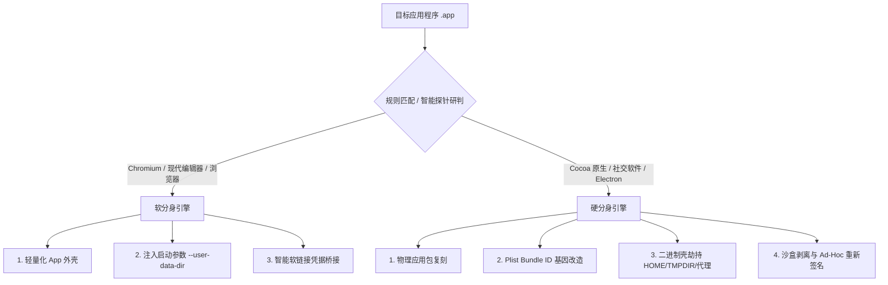

# 第三章：實現原理解析與高階引數全解

本章將深入剖析 ATBClone 的底層技術架構與黑科技原理。您將瞭解 **軟分身 (Soft Clone)** 與 **硬分身 (Hard Clone)** 在 Mach-O 二進位制與 macOS 系統層面的運作方式、獨創的 **二進位制殼劫持 (Wrapper Hijack)** 欺騙技術、**資料與程式本體分離** 的無損升級保障，以及規則中所有高階引數與宏變數的詳細定義。

---

## 📑 本章目錄

- [系統架構概覽](#系統架構概覽)
- [兩大核心引擎機制：軟分身 (Soft Clone) vs 硬分身 (Hard Clone)](#兩大核心引擎機制軟分身 (Soft Clone)-vs-硬分身 (Hard Clone))
  - [1. 軟分身 (Soft Clone)（啟動器模式）](#1-軟分身 (Soft Clone)啟動器模式)
  - [2. 硬分身 (Hard Clone)（深度沙盒與殼劫持模式）](#2-硬分身 (Hard Clone)深度沙盒與殼劫持模式)
- [硬分身 (Hard Clone)獨創“三板斧”核心技術](#硬分身 (Hard Clone)獨創三板斧核心技術)
  - [第一板斧：Bundle ID 基因改造（系統身份重組）](#第一板斧bundle-id-基因改造系統身份重組)
  - [第二板斧：二進位制殼劫持與環境欺騙 (Wrapper Hijack)](#第二板斧二進位制殼劫持與環境欺騙-wrapper-hijack)
  - [第三板斧：沙盒剝離與本地 Ad-Hoc 重新簽名](#第三板斧沙盒剝離與本地-ad-hoc-重新簽名)
- [“資料-邏輯分離”架構：為什麼升級母體永不丟記錄](#資料-邏輯分離架構為什麼升級母體永不丟記錄)
- [規則高階引數深度解析](#規則高階引數深度解析)
  - [1. `app_type`（底層框架引擎型別）](#1-app_type底層框架引擎型別)
  - [2. `environment_injection`（環境變數劫持）](#2-environment_injection環境變數劫持)
  - [3. `launch_args`（自定義啟動引數注入）](#3-launch_args自定義啟動引數注入)
  - [4. `symlink_whitelist`（智慧符號連結 (Symlink)白名單）](#4-symlink_whitelist智慧符號連結 (Symlink)白名單)
  - [5. 動態路徑宏變數](#5-動態路徑宏變數)
- [高階規則 YAML 配置完整示例](#高階規則-yaml-配置完整示例)
- [下一步指引](#下一步指引)

---

## 🏗️ 系統架構概覽

macOS 擁有嚴格的應用沙盒（App Sandbox）、許可權隱私管理（TCC）與程式碼簽名（Gatekeeper）機制。傳統的應用多開方案經常面臨以下三大硬傷：

1. **資料庫互斥衝突**：多例項同時向 `~/Library/Application Support/...` 寫入資料導致 SQLite 死鎖。
2. **憑據混淆**：應用通過硬編碼的 `CFBundleIdentifier` 訪問系統鑰匙圈，導致賬號頻繁掉線。
3. **子程序校驗失敗**：Chromium / Electron 等應用的 Helper 子程序通過 Mach Port 通訊校驗，導致崩潰或白屏。

ATBClone 通過動態分流引擎解決上述難題：



---

## ⚙️ 兩大核心引擎機制：軟分身 (Soft Clone) vs 硬分身 (Hard Clone)

### 1. 軟分身 (Soft Clone)（啟動器模式）
* **設計理念**：零磁碟浪費、毫秒級秒開、輕量化引數委託。
* **執行步驟**：
  1. 在 `~/ATBClone/Apps/<分身名称>.app` 創建極小尺寸的目錄外殼（體積通常小於 200 KB）。
  2. 生成獨立的 `Info.plist`，配置專屬的應用代號與圖示。
  3. 在 `Contents/MacOS/` 下寫入可執行 Bash 啟動指令碼，直接呼叫母體應用的 Mach-O 實體並注入隔離引數：
     ```bash
     #!/bin/bash
     ORIGINAL_BIN="/Applications/Google Chrome.app/Contents/MacOS/Google Chrome"
     USER_DATA="$HOME/ATBClone/Data/Chrome2"
     
     exec "$ORIGINAL_BIN" --user-data-dir="$USER_DATA" "$@" >/dev/null 2>&1 &
     ```

---

### 2. 硬分身 (Hard Clone)（深度沙盒與殼劫持模式）
* **設計理念**：徹底物理隔離、獨立 Dock 圖示、獨立系統 TCC 許可權分配。
* **執行步驟**：
  1. 將母體應用完整物理複製至目標目錄。
  2. 篡改 `Info.plist` 中的 `CFBundleIdentifier`，賦予應用全新的系統身份。
  3. 按需提取並剔除沙盒 Entitlements 限制。
  4. 重新命名原二進位制檔案，替換為同名 Wrapper 殼指令碼進行環境變數欺騙。
  5. 清理隔離擴充套件屬性（`xattr -cr`）並執行深層 Ad-Hoc 簽名（`codesign --force --deep --sign -`）。

---

## 🪓 硬分身 (Hard Clone)獨創“三板斧”核心技術

### 第一板斧：Bundle ID 基因改造（系統身份重組）
macOS 系統通過 `CFBundleIdentifier` 來識別每個應用。麥克風許可權、攝像頭授權、通知中心以及 Dock 程式塢的分組歸屬全部與該 ID 繫結。

ATBClone 利用 `/usr/libexec/PlistBuddy` 對目標包進行身份突變（如將 `com.tencent.xinWeChat` 修改為 `com.tencent.xinWeChat.atbclone.WeChat2`），使 macOS 將分身判定為一個全新獨立的合法原生程式。

---

### 第二板斧：原生動態庫注入與環境隔離 (Native In-Process Dylib Injection)
為了在保證資料完全隔離的同時，完美契合 macOS 14 (Sonoma) 和 15 (Sequoia) 苛刻的 **RunningBoardServices (RBS)** 與系統服務生命週期管控，ATBClone 實現了獨創的原生動態庫注入與智慧降級體系：

#### 1. 為什麼傳統的 `execv` 包裝會失效？
過去採用 Shell 指令碼或獨立 C 二進位制啟動器包裝真實應用時，啟動器呼叫 `execv` 切換到真實二進位制（如 `WeChat.bin`），Darwin 核心會遞增程序版本號 (`PIDVersion`)。
macOS 的兩大系統元件：

* **`MenuBarAgent`**（負責頂部選單欄圖示與狀態列駐留 `NSStatusItem`）
* **`usernoted`**（負責通知中心彈窗與許可權繫結）

在接收 XPC 連線時都會校驗程序 `audit_token`。一旦發生 `execv` 程序替換，RBS 會報告 `mismatched pid version` 錯誤並丟棄連線，導致選單欄圖示消失、系統通知靜默失效。

#### 2. 原生動態庫無感注入 (`libatbclone_env.dylib`)
為徹底解決此問題，ATBClone 研發了原生動態庫注入架構：

1. **保留原版執行檔**：不重新命名原版二進位制，執行檔保持為官方原生 Mach-O。
2. **輕量動態庫預置**：在 `Contents/Frameworks/` 下編譯極簡通用動態庫 `libatbclone_env.dylib`。其內部通過 C 語言 `__attribute__((constructor))` 建構函式，在 dyld 裝載映象、進入主程式 `main()` 前完成 `HOME`、`TMPDIR`、網路代理等環境重定向。
3. **Mach-O `LC_LOAD_DYLIB` 指令追加**：純 Python 解析 Mach-O 結構，直接在 Load Commands 列表中安全追加 `@executable_path/../Frameworks/libatbclone_env.dylib`。
4. **零程序替換**：整個生命週期保持單一原生程序，與 LaunchServices / RBS 100% 吻合。

#### 3. 靜態 Headroom 探測與優雅降級
為防止在非標準編譯器或緊湊打包的應用上強行追加指令損壞 Mach-O Section，引擎內建靜態頭部空間探測器：
$$\text{Padding} = \text{first\_section\_offset} - (32 + \text{sizeofcmds})$$

* **頭部空間充足時**：自動啟用原生動態庫無感注入（如微信剩餘 50KB+，安全注入）；
* **頭部空間不足或需啟動引數時**：自動平滑降級為輕量編譯的 **原生 Mach-O C 啟動器包裝**，徹底杜絕應用崩潰風險。

---

### 第三板斧：沙盒剝離與本地 Ad-Hoc 重新簽名
Mac App Store 版本的應用受到 `com.apple.security.app-sandbox` 強沙盒限制，強行限制只能寫入 `~/Library/Containers/<原BundleID>`。

當配置 `strip_sandbox: true` 時：

1. 提取原始 Entitlements 授權檔案。
2. 使用 Python 正則剝離 `<key>com.apple.security.app-sandbox</key>` 限制節點。
3. 對整個 Bundle 及其內部巢狀的所有 Frameworks、Dylibs、Helpers 執行深度 Ad-Hoc 簽名：
   ```bash
   codesign --force --deep --sign - --entitlements /tmp/clean_entitlements.plist "/Applications/WeChat2.app"
   ```

---

## 🔄 “資料-邏輯分離”架構：為什麼升級母體永不丟記錄

傳統多開工具最令人頭疼的問題就是“母體升級”——一旦 App Store 升級了微信，舊分身便無法登入，重新制作又擔心聊天記錄丟失。

ATBClone 徹底解決了這一痛點，核心在於**資料與邏輯的物理級解耦**：

```text
[ 程序逻辑层 (随时可丢弃重构) ]               [ 数据持久层 (永久保留安全隔离) ]
~/ATBClone/Apps/WeChat2.app                 ~/ATBClone/Data/WeChat2/
  ├── Contents/Info.plist                    ├── Home/
  ├── Contents/MacOS/WeChat (代理壳)          │   ├── Library/Application Support/...
  ├── Contents/MacOS/WeChat.bin              │   ├── Library/Preferences/...
  └── Contents/Frameworks/                   └── Tmp/
```

* **程式邏輯層**（`.app` 實體）：屬於無狀態的執行程式。
* **資料持久層**（`~/ATBClone/Data/<分身名称>`）：儲存著您所有的本地聊天資料庫、登入憑據、Cookie 和圖片快取。

當母體升級後，您在 ATBClone 中點選 **"更新"**，引擎會先殺死分身程序，刪除舊的 `.app` 包，按照最新母體重新制作一份 `.app`。新分身啟動後，由於其代理殼依然掛載原有的 `~/ATBClone/Data/WeChat2` 目錄，因此**100% 毫髮無損地繼承所有歷史聊天記錄與登入態**！

---

## 🛠️ 規則高階引數深度解析

在 `~/ATBClone/recipes/<bundle_id>.yaml` 中，您可以配置以下高階引數：

### 1. `app_type`（底層框架引擎型別）
* **型別**：`enum`（可選值：`cocoa`、`electron`、`chromium`、`firefox`、`generic`，預設自動檢測）
* **說明**：指示應用所採用的技術棧，指導引擎如何管理子程序與啟動引數：
  * `cocoa`：標準原生 Swift / Objective-C 應用程式。
  * `electron`：基於 Node.js 與 Chromium 構建的跨平臺應用（Slack、Discord、QQ、飛書）。
  * `chromium`：Chromium 核心瀏覽器（Chrome、Edge、Arc）。
  * `firefox`：Gecko 核心瀏覽器。
  * `generic`：通用或非標準 Mach-O 二進位制程式。

---

### 2. `environment_injection`（環境變數劫持）
* **型別**：`map<string, string>`
* **說明**：在二進位制代理殼執行前，強制注入的一組環境變數鍵值對。

```yaml
environment_injection:
  HOME: "{{ATB_DATA_DIR}}/Home"
  TMPDIR: "{{ATB_DATA_DIR}}/Tmp"
  XDG_CONFIG_HOME: "{{ATB_DATA_DIR}}/Config"
  ELECTRON_ENABLE_LOGGING: "true"
```

---

### 3. `launch_args`（自定義啟動引數注入）
* **型別**：`list<string>`
* **說明**：啟動二進位制時傳遞的自定義命令列引數列表。

```yaml
launch_args:
  - "--user-data-dir={{ATB_DATA_DIR}}"
  - "--disable-features=Translate"
```

---

### 4. `symlink_whitelist`（智慧符號連結 (Symlink)白名單）
* **型別**：`list<string>`
* **說明**：在構建偽裝的 `$HOME` 資料目錄時，指定需要自動**符號連結 (Symlink)回真實宿主家目錄**的白名單路徑，防止憑據丟失或特定功能損壞。

```yaml
symlink_whitelist:
  - "Library/Keychains"    # 保持 macOS 钥匙串访问，防止登录频繁掉线
  - ".ssh"                 # 保留 SSH 密钥，确保 Git 功能正常
  - "Library/Fonts"        # 保留用户已安装的自定义字体访问权限
```

---

### 5. 動態路徑宏變數
在 `environment_injection` 和 `launch_args` 中，支援使用動態模板變數，引擎在克隆時會自動解析並替換：

| 宏變數 | 含義說明 | 示例解析結果 |
| :--- | :--- | :--- |
| `{{ATB_DATA_DIR}}` | 當前分身專屬資料儲存目錄絕對路徑 | `/Users/username/ATBClone/Data/WeChat2` |
| `{{CLONE_NAME}}` | 當前分身的應用代號 | `WeChat2` |
| `{{BUNDLE_ID}}` | 母體應用的原始 Bundle Identifier | `com.tencent.xinWeChat` |
| `{{ORIGINAL_BIN}}` | 母體應用的執行檔絕對路徑 | `/Applications/WeChat.app/Contents/MacOS/WeChat` |

---

## 📄 高階規則 YAML 配置完整示例

```yaml
# ========================================================
# ATBClone 高级规则 - Cursor AI 编辑器
# 保存路径: ~/ATBClone/recipes/com.todesktop.230313mzl4w4u92.yaml
# ========================================================

bundle_id: com.todesktop.230313mzl4w4u92
app_name: Cursor
strategy: soft_clone
app_type: electron
strip_sandbox: false

environment_injection:
  HOME: "{{ATB_DATA_DIR}}/Home"
  VSCODE_PORTABLE: "{{ATB_DATA_DIR}}/UserData"

launch_args:
  - "--user-data-dir={{ATB_DATA_DIR}}/UserData"
  - "--extensions-dir={{ATB_DATA_DIR}}/Extensions"

symlink_whitelist:
  - "Library/Keychains"
  - ".ssh"
  - ".gitconfig"

proxy:
  enabled: false
  type: http
  host: 127.0.0.1
  port: 7890
```

---

## ⏭️ 下一步指引

* 查閱高頻疑問解答、系統體檢工具與 GitHub 問題反饋流程？請閱讀 **[第四章：常見問題 (FAQ)、系統體檢與反饋](04-faq-and-troubleshooting.md)**。
