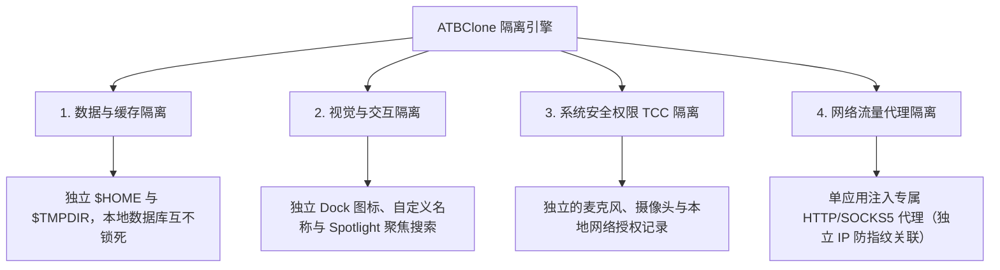

# 📖 ATBClone 使用者手冊（繁體中文版）

[English Version (英文版)](../en/) | 繁體中文版

歡迎查閱 **ATBClone（艾特智慧分身）官方使用手冊**。本手冊將手把手帶您熟悉 macOS 應用多開與沙盒隔離的各項功能，涵蓋從新手基礎操作、日常管理、冷門應用規則定製、底層隔離原理解析到系統體檢與故障反饋的完整內容。

---

## 🧭 章節導航地圖

無論您是剛接觸多開工具的小白使用者，還是需要配置獨立代理與 Mach-O 沙盒剝離的極客玩家 / 開發者，均可按需查閱對應章節：

| 章節 | 章節名稱 | 適用人群 | 核心內容提要 |
| :--- | :--- | :--- | :--- |
| **[第一章](01-basic-operations.md)** | **[基礎操作與分身管理](01-basic-operations.md)** | 👶 **小白使用者 / 普通使用者** | 7 步互動式嚮導建立分身、快捷啟動、一鍵直達資料目錄、母體升級**無損同步更新**、表格檢視**批次更新與批次刪除**、安全刪除（保留資料 vs 徹底清理）。 |
| **[第二章](02-advanced-custom-recipes.md)** | **[冷門應用規則定製與基礎引數](02-advanced-custom-recipes.md)** | ⚡ **進階使用者** | 使用 **App Prober (智慧探針)** 深度掃描未知應用、視覺化規則編輯器、**基礎引數全解**（`bundle_id`、`strategy`、`strip_sandbox`、`proxy`）。 |
| **[第三章](03-under-the-hood-and-internals.md)** | **[實現原理解析與高階引數全解](03-under-the-hood-and-internals.md)** | 🔬 **極客玩家 / 開發者 / 開發者** | 軟分身 (Soft Clone)與硬分身 (Hard Clone)底層機制、**硬分身 (Hard Clone)“三板斧”與二進位制殼劫持 (Wrapper Hijack)** 深度剖析、資料-邏輯分離架構、**高階引數詳解**（`environment_injection`、`symlink_whitelist`、動態路徑宏）。 |
| **[第四章](04-faq-and-troubleshooting.md)** | **[常見問題 (FAQ)、系統體檢與反饋](04-faq-and-troubleshooting.md)** | 🩺 **全體使用者** | 高頻 FAQ（資料安全隔離、存放路徑與備份遷移、封號風險與防關聯原理解析、免 Root 許可權機制）、Doctor 系統體檢、**分身詳情資訊提取與提報 GitHub Issue 標準指引**。 |

---

## 🌟 為什麼選擇 ATBClone？

在 macOS 平臺上，傳統的應用多開方法（例如簡單的 `cp -R` 複製應用或簡單的終端符號連結 (Symlink)別名）極易崩潰或失效，因為絕大多數現代 macOS 應用程式共享使用者首選項、系統鑰匙圈及資料庫。

ATBClone 通過獨創的引擎體系，實現了真正的**“四重隔離”**：

1. **📦 資料與快取隔離**：每個分身擁有專屬的獨立家目錄（`$HOME`）或自定義資料儲存路徑（`--user-data-dir`）。多賬號同時登入，本地 SQLite 資料庫與快取互不衝突。
2. **🎨 視覺與互動隔離**：分身應用擁有獨立的名稱與圖示，在 Spotlight（Spotlight 搜尋）、Launchpad（啟動臺）和 Dock（程式塢）中均作為獨立應用存在。
3. **🛡️ 系統許可權 (TCC) 隔離**：硬分身 (Hard Clone)通過修改 `CFBundleIdentifier` 賦予應用全新的系統身份，攝像頭、麥克風、輔助功能等系統授權與母體完全獨立。
4. **🌐 網路流量代理隔離**：支援為指定分身應用單獨配置獨立的 HTTP 或 SOCKS5 代理通道，不影響宿主系統網路與母體應用，實現單應用獨立 IP 防指紋關聯。

---

## 📚 核心概念與術語速查

在閱讀本手冊前，您可以先了解以下常用名詞：

* **母體應用 (Host App)**：您 Mac 上安裝的原版應用程式（通常位於 `/Applications`）。
* **分身應用 (Clone App)**：由 ATBClone 引擎生成的獨立副本體（預設存放在 `~/ATBClone/Apps`）。
* **硬分身 (Hard Clone) (Hard Clone / 物理克隆 + 殼劫持)**：完整複製 App 實體，修改唯一 Bundle ID，注入環境變數啟動指令碼並重新簽名。適合微信、Telegram、QQ、飛書、Discord 等絕大多數社交和原生應用。
* **軟分身 (Soft Clone) (Soft Clone / 軟包裝啟動器)**：僅生成輕量級啟動器外殼，通過啟動引數（如 `--user-data-dir`）重定向資料。適合 Cursor、VS Code、Chrome、Edge、Firefox 等瀏覽器與開發工具。
* **規則 (Recipe)**：指示 ATBClone 如何處理該應用的 YAML 格式配置說明書。
* **資料目錄 (Data Directory)**：分身應用存放聊天記錄、配置、快取和資料庫的獨立資料夾（預設位於 `~/ATBClone/Data/<分身名称>`）。

---

## 🚀 極速入門指引

1. **下載與安裝**：前往 [GitHub Releases](https://github.com/aitobox/ATBClone/releases) 下載 `ATBClone-arm-0.9.7.dmg`。開啟 DMG 並將 `ATBClone.app` 拖入 `Applications` 資料夾。
2. **開啟 ATBClone**：在啟動臺或應用程式資料夾中啟動 ATBClone。
3. **啟動向導**：點選主介面右上角的 **"+ 新建分身"** 按鈕。
4. **跟隨 7 步指引**：選擇應用 ➔ 確認規則 ➔ 設定分身名稱 ➔ 確認安裝與資料目錄 ➔ 點選 **"立即克隆"**。
5. **開始使用**：點選 **"啟動"** 按鈕，或者直接通過 Spotlight 搜尋啟動分身！

---

> [!NOTE]
> **多語言版本**：本手冊提供 English 與 簡體中文雙語版本。歡迎查閱頂部的語言切換連結。
