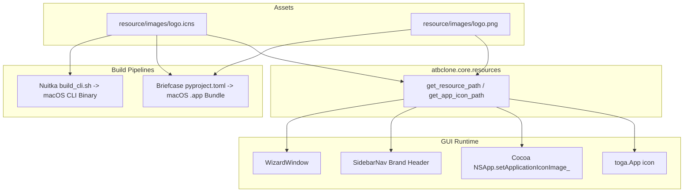

# ATBClone App Icon & macOS Dock Integration Design

- **Date**: 2026-08-20
- **Status**: Approved
- **Target**: ATBClone v0.6.0+

## 1. Overview & Goals

The user provided two new brand icon files:
- `resource/images/logo.icns`: High-resolution Apple Icon Image format with full mipmap sizes for macOS bundles and Finder/Dock display.
- `resource/images/logo.png`: Lossless RGBA PNG image for in-app UI widgets (e.g., Toga sidebar, window icons).

The goal of this design is to integrate these brand assets across the entire project lifecycle:
1. **Centralized Resource Management**: Provide a robust path resolution module (`atbclone.core.resources`) that works across local development, packaged Briefcase `.app` bundles, and Nuitka standalone binaries.
2. **macOS Dock & Window Runtime Integration**:
   - Explicitly bind the Dock icon in native Cocoa via `NSApplication.sharedApplication.setApplicationIconImage_` so that local Python development (`python -m atbclone.gui`) immediately displays the custom logo in the Dock.
   - Set the application and window icons on `toga.App`, `toga.MainWindow`, and `toga.Window` (`WizardWindow`).
3. **In-App Branding**: Display the logo thumbnail (e.g. 28x28) alongside the app title in `SidebarNav`.
4. **Build & Packaging Integration**:
   - Briefcase (`pyproject.toml` & `scripts/build_gui.sh`): Declare `icon = "resource/images/logo"` and ensure `Info.plist` / `Contents/Resources/` contains the icon bundle.
   - Nuitka (`scripts/build_cli.sh`): Add `--macos-app-icon=resource/images/logo.icns` and `--include-data-dir=resource=resource`.

---

## 2. Architectural Design



---

## 3. Detailed Component Specifications

### 3.1 Resource Management (`src/atbclone/core/resources.py`)

A standalone, lightweight module responsible for locating project and packaged static resources:
- `get_resource_dir() -> Path`: Resolves the root resource directory.
  - Priority 1: Current repo `PROJECT_ROOT / "resource"`.
  - Priority 2: macOS App Bundle `Contents/Resources/resource` or `Contents/Resources`.
  - Priority 3: PyInstaller/Nuitka bundle directory (`getattr(sys, "_MEIPASS", ...)` or `sys.prefix / "share" / "atbclone"`).
- `get_resource_path(relative_path: str) -> Path`: Resolves sub-paths (e.g., `"images/logo.png"`).
- `get_app_icon_path(prefer_format: str = "png") -> Path | None`: Helper returning the absolute path to `logo.png` or `logo.icns`.

### 3.2 Native Cocoa Dock Bridge & App Initialization (`src/atbclone/gui/app.py`, `src/atbclone/gui/__init__.py`)

- **Cocoa Dock Setter**:
  ```python
  def set_macos_dock_icon(icon_path: Path | None = None) -> bool:
      if icon_path is None:
          icon_path = get_app_icon_path("png")
      if not icon_path or not icon_path.exists():
          return False
      try:
          from toga_cocoa.libs.appkit import NSApplication, NSImage
          ns_img = NSImage.alloc().initWithContentsOfFile_(str(icon_path))
          if ns_img:
              NSApplication.sharedApplication.setApplicationIconImage_(ns_img)
              return True
      except Exception:
          pass
      return False
  ```
- **App Factory (`build_app`)**:
  ```python
  def build_app():
      from .app import ATBCloneApp
      from atbclone.core.resources import get_app_icon_path
      icon_path = get_app_icon_path("png")
      return ATBCloneApp("ATBClone", "com.atbclone.app", icon=icon_path)
  ```
- **Main Window & Wizard Window**:
  - `ATBCloneApp.startup()` calls `set_macos_dock_icon()` and passes `icon=self.icon` to `MainWindow`.
  - `WizardWindow.__init__()` configures `self.icon = icon_path`.

### 3.3 Sidebar Navigation Branding (`src/atbclone/gui/components/sidebar.py`)

- Update the header section in `SidebarNav`:
  ```python
  header_box = toga.Box(style=Pack(direction=ROW, alignment=CENTER, margin=(16, 12, 12, 12)))
  logo_path = get_app_icon_path("png")
  if logo_path and logo_path.exists():
      try:
          logo_image = toga.Image(logo_path)
          logo_view = toga.ImageView(logo_image, style=Pack(width=28, height=28, margin_right=8))
          header_box.add(logo_view)
      except Exception:
          pass

  text_box = toga.Box(style=Pack(direction=COLUMN))
  title_label = toga.Label("ATBClone", style=Pack(font_weight="bold", font_size=16, color=Theme.TEXT_PRIMARY))
  ver_label = toga.Label(f"v{__version__} App Cloner", style=Pack(font_size=10, color=Theme.TEXT_MUTED, margin_top=2))
  text_box.add(title_label)
  text_box.add(ver_label)
  header_box.add(text_box)
  ```

---

## 4. Packaging & Build Configurations

### 4.1 Briefcase Configuration (`pyproject.toml`)

- Update `pyproject.toml`:
  ```toml
  [tool.briefcase.app.atbclone]
  formal_name = "ATBClone"
  description = "macOS App Cloning Engine"
  icon = "resource/images/logo"
  sources = ["src/atbclone"]
  resources = ["resource/images"]
  requires = [
      "toga>=0.4.0",
      "pydantic>=2.0",
      "pyyaml>=6.0",
  ]

  [tool.briefcase.app.atbclone.macOS]
  icon = "resource/images/logo"
  requires = [
      "std-nslog",
  ]
  ```

### 4.2 GUI Build Script (`scripts/build_gui.sh`)

- Ensure the Briefcase packaging step copies and integrates `resource/images/logo.icns` into `Contents/Resources/ATBClone.icns`.
- Add post-build assertion verifying the existence of the icon file in the packaged `.app` bundle.

### 4.3 CLI Build Script (`scripts/build_cli.sh`)

- Pass `--macos-app-icon=resource/images/logo.icns` and `--include-data-dir=resource=resource` to Nuitka compiler flags.

---

## 5. Testing & Verification Plan

### Automated Tests
1. `tests/test_resources.py`:
   - Verify `get_resource_dir()`, `get_resource_path()`, `get_app_icon_path("png")`, and `get_app_icon_path("icns")` return existing files.
   - Test fallback behavior when running from alternate paths.
2. `tests/gui/test_theme_and_components.py` & `tests/gui/test_sidebar.py`:
   - Verify `SidebarNav` successfully initializes with the logo image view without crashing when image is present or missing.
3. `tests/gui/test_app_integration.py`:
   - Verify `set_macos_dock_icon()` runs safely without unhandled exceptions.
4. Regression suite:
   - `PYTHONPATH=src conda run -n ATBClone python -m pytest tests/`

### Manual Verification
1. Run GUI locally via `conda run -n ATBClone python -m atbclone.gui`:
   - Inspect macOS Dock to confirm ATBClone icon appears.
   - Inspect SidebarNav to confirm logo thumbnail aligns with title.
2. Validate `pyproject.toml` and packaging command invocations.
