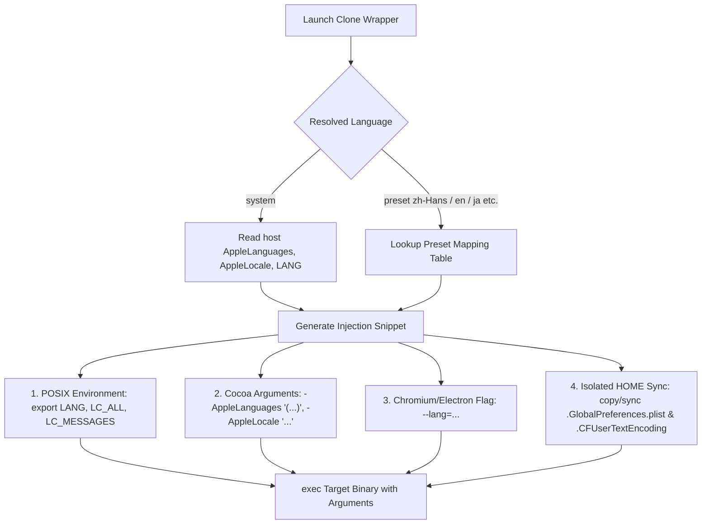

# App Clone Language & Locale Management Design

- **Date**: 2026-08-21
- **Status**: Draft (Approved in Brainstorming)
- **Author**: Antigravity & User

---

## 1. Problem Statement

When cloning macOS applications using ATBClone, cloned applications frequently revert to English as their default user interface language upon launch, regardless of the host system's language setting (e.g., Simplified Chinese).

### Root Causes
1. **Isolated `HOME` Directory without Global Preferences**:
   In hard clones or recipes where `HOME` is redirected (e.g. `HOME="{{ATB_DATA_DIR}}/Home"` for WeChat and others), the newly created `$HOME` has no `~/Library/Preferences/.GlobalPreferences.plist` and `~/.CFUserTextEncoding`. Cocoa/AppKit frameworks rely on these files to determine the user's preferred language list. When missing, they fall back to the bundle's base development region (`CFBundleDevelopmentRegion`, usually `en`).
2. **New Bundle Identifier**:
   Per-app language settings in macOS are keyed by `CFBundleIdentifier` via `defaults write <bundle_id> AppleLanguages`. A clone receives a new Bundle ID (e.g., `com.tencent.xinWeChat.atbclone.1`), losing any prior app-specific language preferences.
3. **Missing Launch-Time Language Arguments & Environment Variables**:
   Neither `SoftCloneEngine` nor `HardCloneEngine` wrapper scripts explicitly passed Cocoa language overrides (`-AppleLanguages`, `-AppleLocale`), Chromium/Electron flags (`--lang`), or POSIX environment variables (`LANG`, `LC_ALL`).

---

## 2. Goals & Strategy

We adopt **Option C**:
- **Automatic System Inheritance (Default)**: Clones automatically detect and inherit the host macOS language order and locale out-of-the-box, without requiring any manual configuration.
- **Explicit Override per Clone**: Users can override the language for any specific clone via the Creation Wizard, Clone Edit dialog, Recipe YAML, or CLI `--language` flag.

---

## 3. Architecture & Technical Design

### 3.1 Multi-Layer Injection Mechanism

When the wrapper script launches the target application, it injects language settings across all major desktop application frameworks:



### 3.2 Language Presets & Mapping Table

We define a dedicated resolver module `src/atbclone/core/locale.py` with the following presets:

| Language ID | Display Name (i18n) | Cocoa `-AppleLanguages` | Cocoa `-AppleLocale` | POSIX `LANG` | Chromium `--lang` |
| :--- | :--- | :--- | :--- | :--- | :--- |
| `system` | 跟随系统 / Follow System | System `AppleLanguages` | System `AppleLocale` | Host `$LANG` or `zh_CN.UTF-8` | System primary language |
| `zh-Hans` | 简体中文 (Simplified Chinese) | `("zh-Hans-CN", "zh-Hans", "en")` | `zh_CN` | `zh_CN.UTF-8` | `zh-CN` |
| `zh-Hant` | 繁体中文 (Traditional Chinese) | `("zh-Hant-TW", "zh-Hant", "en")` | `zh_TW` | `zh_TW.UTF-8` | `zh-TW` |
| `en` | English (US) | `("en-US", "en")` | `en_US` | `en_US.UTF-8` | `en-US` |
| `ja` | 日本語 (Japanese) | `("ja-JP", "ja", "en")` | `ja_JP` | `ja_JP.UTF-8` | `ja-JP` |
| `ko` | 한국어 (Korean) | `("ko-KR", "ko", "en")` | `ko_KR` | `ko_KR.UTF-8` | `ko-KR` |

### 3.3 Isolated HOME Preference Synchronization

For recipes that redirect `HOME` (e.g. `HOME="{{ATB_DATA_DIR}}/Home"`):
1. During clone creation and wrapper execution, if the target `$HOME/Library/Preferences/.GlobalPreferences.plist` does not exist:
   - Synchronize or copy `~/Library/Preferences/.GlobalPreferences.plist` to `$HOME/Library/Preferences/.GlobalPreferences.plist`.
   - Copy `~/.CFUserTextEncoding` to `$HOME/.CFUserTextEncoding` if present.
2. If the user explicitly sets a specific language (e.g. `en` or `zh-Hans`), the wrapper passes `-AppleLanguages` which overrides `NSGlobalDomain` at the `NSArgumentDomain` level (highest priority in macOS preference hierarchy).

### 3.4 Wrapper Script Generation

In `SoftCloneEngine` and `HardCloneEngine`:
```bash
# Language Environment Injection
export LANG="zh_CN.UTF-8"
export LC_ALL="zh_CN.UTF-8"

# If isolated HOME is configured, ensure preference directories and global plist are present
if [ -n "$HOME" ] && [ "$HOME" != "$REAL_HOME" ]; then
    mkdir -p "$HOME/Library/Preferences"
    if [ ! -f "$HOME/Library/Preferences/.GlobalPreferences.plist" ] && [ -f "$REAL_HOME/Library/Preferences/.GlobalPreferences.plist" ]; then
        cp "$REAL_HOME/Library/Preferences/.GlobalPreferences.plist" "$HOME/Library/Preferences/.GlobalPreferences.plist" 2>/dev/null || true
    fi
    if [ ! -f "$HOME/.CFUserTextEncoding" ] && [ -f "$REAL_HOME/.CFUserTextEncoding" ]; then
        cp "$REAL_HOME/.CFUserTextEncoding" "$HOME/.CFUserTextEncoding" 2>/dev/null || true
    fi
fi

# Execute with Cocoa and Chromium/Electron language arguments
exec "$APP_BIN" -AppleLanguages '("zh-Hans-CN","zh-Hans","en")' -AppleLocale zh_CN --lang=zh-CN "$@"
```

---

## 4. Component Changes

### 4.1 Data Models
1. **`src/atbclone/core/locale.py` (NEW)**:
   - `SUPPORTED_LANGUAGES`: Dictionary of supported language IDs and metadata.
   - `get_system_languages()`: Reads host system `AppleLanguages` and `AppleLocale`.
   - `build_language_env_and_args(language: str)`: Returns environment dictionary, launch argument list, and shell script snippets.
2. **`src/atbclone/recipes/models.py`**:
   - Add `language: str = "system"` to `Recipe`.
3. **`src/atbclone/core/clone_task.py`**:
   - Add `language: str = "system"` to `CloneTask`.
4. **`src/atbclone/core/state.py`**:
   - Add `language: str = "system"` to `CloneRecord`.
   - Handle backward-compatible loading of existing state files.

### 4.2 Clone Engines
1. **`src/atbclone/core/engines.py`**:
   - In `CloneEngine`, add helper `_build_language_snippet(task: CloneTask)`.
   - Update `SoftCloneEngine` and `HardCloneEngine` to embed language environment variables, launch arguments, and preference sync into the wrapper script.

### 4.3 GUI Components
1. **`src/atbclone/gui/windows/wizard.py`**:
   - Add Language dropdown selection in Step 3 (Naming & Basic Config).
   - Pass selected language into `CloneTask`.
2. **`src/atbclone/gui/windows/clone_edit.py`**:
   - Add Language dropdown selection to edit existing clone's language.
   - On save, re-generate the wrapper or update the clone record and wrapper script.
3. **`src/atbclone/gui/components/clone_card.py` & `src/atbclone/gui/windows/clone_detail.py`**:
   - Display current language badge/info (e.g. `语言: 跟随系统` or `语言: 简体中文`).
4. **`src/atbclone/core/i18n.py`**:
   - Add i18n keys for all language names and labels in English and Simplified Chinese.

### 4.4 CLI
1. **`src/atbclone/cli/cmd_clone.py`**:
   - Add `--language` / `-l` option with choices `["system", "zh-Hans", "zh-Hant", "en", "ja", "ko"]`.

---

## 5. Verification Plan

### Automated Tests
- `pytest tests/test_locale.py`: Verify language resolution for `system`, `zh-Hans`, `en`, `ja`, `ko`, and fallbacks.
- `pytest tests/test_engines.py`: Verify wrapper script generation contains correct `LANG`, `-AppleLanguages`, `-AppleLocale`, `--lang`, and preference sync logic.
- `pytest tests/test_state.py`: Verify `CloneRecord` serialization and backward compatibility with older state files.
- `pytest tests/test_cli.py`: Verify CLI `--language` option handling.

### Manual Verification
- Clone a hard-clone app (such as WeChat or test bundle) and launch it; verify it opens with Chinese locale without defaulting to English.
- Edit a clone to set language to English (`en`); verify wrapper script reflects `-AppleLanguages '("en-US", "en")'`.
- Run full pytest test suite with `PYTHONPATH=src conda run -n ATBClone python -m pytest tests/`.
