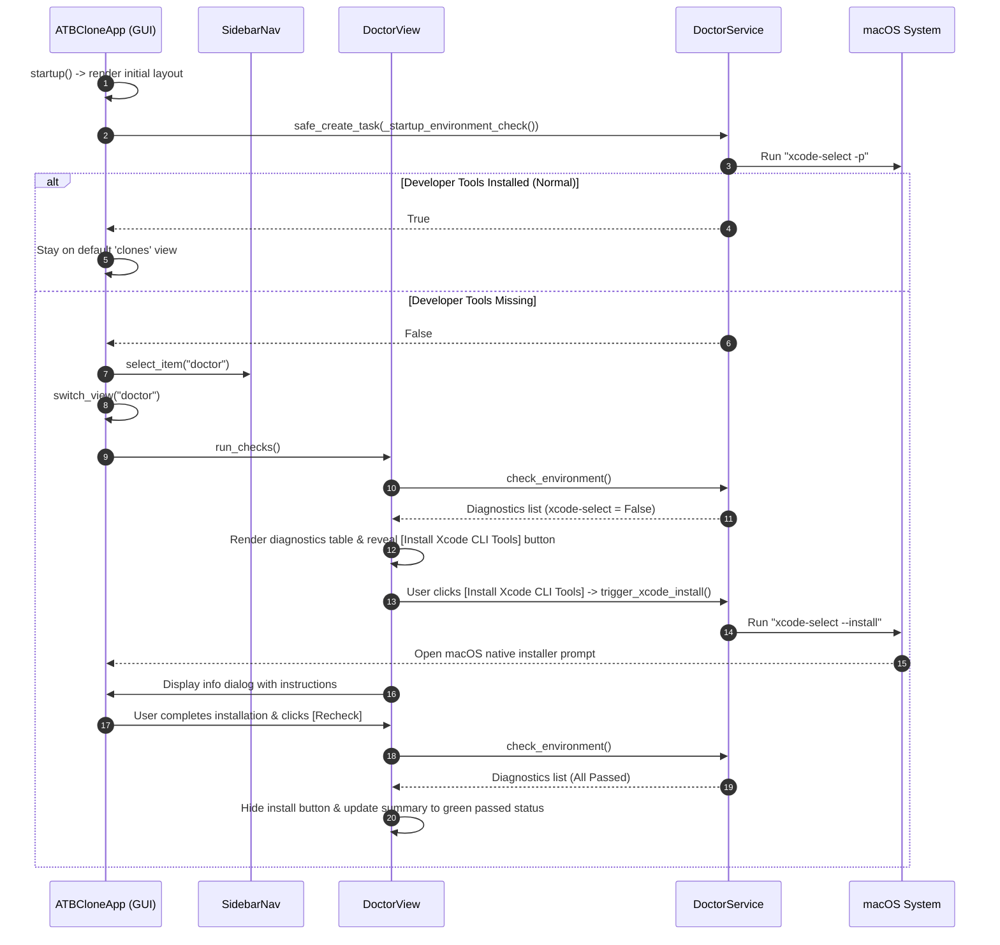

# Startup Defensive Xcode-Select Check & Guided Doctor Self-Inspection Design

## 1. Overview
ATBClone requires macOS developer tools (such as `xcode-select`, `codesign`, and `PlistBuddy`) for critical operations including binary probing, entitlement extraction, signature stripping, and ad-hoc code re-signing.

This feature implements:
1. **Startup Defensive Health Check**: Automatically running a non-blocking check (`xcode-select -p`) when ATBClone launches.
2. **Auto-Navigation to Doctor View**: If developer tools are missing, automatically switching the main window to the "Doctor" (环境自检) view and running an environment scan.
3. **Interactive Repair & Native Installer Invocation**: Providing a prominent action button in `DoctorView` that executes `xcode-select --install` to launch the native macOS 2GB Command Line Tools installer dialog, alongside comprehensive user guidance.
4. **Recheck Workflow**: Allowing the user to easily click "Recheck" (重新检测) once installation finishes to verify full environment readiness and transition the UI to a healthy state.

---

## 2. Architecture & Component Flow

---

## 3. Detailed Component Specifications

### 3.1 `DoctorService` (`src/atbclone/gui/services/doctor_service.py`)
- **`check_xcode_select_installed() -> bool`**:
  - Non-blocking execution of `xcode-select -p` in the event loop executor.
  - Returns `True` if exit code is 0 and output points to an existing developer directory; `False` otherwise.
- **`trigger_xcode_install() -> tuple[bool, str]`**:
  - Executes `xcode-select --install` via `subprocess.run`.
  - Parses stderr/stdout:
    - Returncode 0 or note "install requested": returns `(True, "launched")`.
    - "already installed": returns `(True, "already_installed")`.
    - Other errors: returns `(False, error_message)`.
- **`check_environment() -> list[DoctorCheckItem]`**:
  - Updates the `xcode-select` hint to clearly reference the UI install button and the CLI command.

### 3.2 `ATBCloneApp` (`src/atbclone/gui/app.py`)
- **`startup()`**:
  - In addition to standard initialization, schedules `self.safe_create_task(self._startup_environment_check())`.
- **`_startup_environment_check()`**:
  - Awaits `self.doctor_service.check_xcode_select_installed()`.
  - If `False`:
    - Calls `self.sidebar.select_item("doctor")`.
    - Logs diagnostic warning to `logger.warning`.

### 3.3 `DoctorView` (`src/atbclone/gui/views/doctor_view.py`)
- **Summary Header Card**:
  - Contains `self.label_summary` (status summary) and `self.btn_install_xcode` (repair action button).
  - `self.btn_install_xcode` is dynamically shown if `xcode-select` failed, and hidden if all checks pass.
- **`action_install_xcode()`**:
  - Temporarily disables button to prevent double triggering.
  - Calls `await self.doctor_service.trigger_xcode_install()`.
  - Displays Toga `info_dialog` informing the user to proceed with the macOS native download dialog (~2GB) and click [Recheck] upon completion.
  - Re-enables button.

### 3.4 Multi-Language Localization (`src/atbclone/core/i18n.py`)
Add keys across 9 languages (`zh`, `en`, `zh_TW`, `ja`, `ko`, `de`, `fr`, `ru`, `es`):
- `doctor_btn_install_xcode`: Label for the one-click installer button.
- `doctor_hint_xcode_select`: Table hint explaining repair via UI button or terminal.
- `doctor_dialog_install_title`: Title for the installation instruction modal.
- `doctor_dialog_install_msg`: Body message explaining the 2GB download and recheck requirement.
- `doctor_dialog_install_already_msg`: Message if installation was already requested or exists.
- `doctor_dialog_install_error_msg`: Error fallback message.

---

## 4. Error Handling & Edge Cases
1. **Headless / CI / Non-macOS Environment**:
   - `check_xcode_select_installed()` and `trigger_xcode_install()` safely handle `FileNotFoundError` or OS incompatibility without throwing unhandled exceptions.
2. **Double Triggering**:
   - Install button is disabled while the command is in-flight.
3. **Active Downloads**:
   - If macOS indicates the prompt is already open or installation is active, an informative message instructs the user to wait for completion.

---

## 5. Testing & Verification Plan

### Automated Tests
1. **`tests/gui/test_services.py`**:
   - Test `DoctorService.check_xcode_select_installed()` for both success and failure cases.
   - Test `DoctorService.trigger_xcode_install()` simulating success, already installed, and error outputs.
2. **`tests/gui/test_app_integration.py`**:
   - Test `ATBCloneApp._startup_environment_check()` redirecting to "doctor" when tools are missing and staying on "clones" when tools exist.
3. **`tests/gui/test_probe_and_doctor_ui.py`**:
   - Test `DoctorView` displaying and hiding `btn_install_xcode` according to diagnostic scan results.
   - Test `action_install_xcode` triggering service and dialog.
4. **Full Test Suite Execution**:
   - Run `PYTHONPATH=src conda run -n ATBClone python -m pytest tests/` and verify all tests pass.

### Manual Verification
- Launch ATBClone with mock/environment checks to verify smooth navigation and UI responsiveness.
