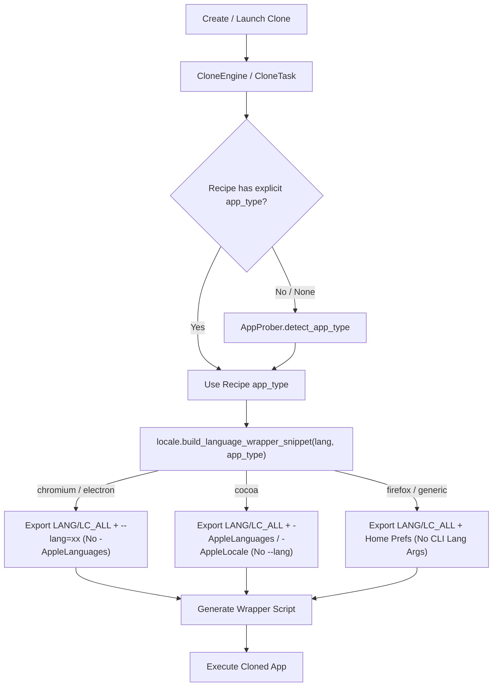

# App Type Probing and Adaptive Language Argument Injection Design

## 1. Context & Motivation

When cloning macOS applications with custom or system language configurations, ATBClone previously injected both Cocoa launch arguments (`-AppleLanguages '("...")'`, `-AppleLocale ...`) and Chromium flags (`--lang=...`) unconditionally into all clone wrapper scripts.

For standard Cocoa (AppKit/SwiftUI) applications, `-AppleLanguages` and `-AppleLocale` are parsed by Cocoa's `NSUserDefaults` runtime. However, Chromium-based applications (Google Chrome, Microsoft Edge, Arc, Brave) and Gecko-based browsers (Firefox) implement custom command-line parsers. When Chromium receives single-dash options or unexpected positional arguments (such as `'("zh-Hans-CN", "zh-Hans", "en")'` and `zh_CN`), it interprets them as navigation targets (URLs), leading to unwanted tabs opened on startup (e.g. `http://("zh-hans-cn")/` and `http://zh_cn/`).

To fix this and make launch argument injection robust across diverse application frameworks, ATBClone needs application framework probing and adaptive argument injection based on detected or declared `app_type`.

## 2. Supported App Types and Injection Matrix

| `app_type` | Framework Examples | POSIX Env (`LANG`, `LC_ALL`) | Isolated HOME Prefs Sync | Cocoa Args (`-AppleLanguages`, `-AppleLocale`) | Chromium Flag (`--lang`) |
| :--- | :--- | :--- | :--- | :--- | :--- |
| `chromium` | Google Chrome, Edge, Brave, Arc | Yes | Yes | **No** | Yes (`--lang=xx`) |
| `electron` | VS Code, Slack, Discord, Lark | Yes | Yes | **No** | Yes (`--lang=xx`) |
| `cocoa` | Native AppKit / SwiftUI (WeChat, Telegram) | Yes | Yes | Yes | **No** |
| `firefox` | Firefox, Tor Browser | Yes | Yes | **No** | **No** |
| `generic` | Java / JetBrains, Qt, Flutter, CLI tools | Yes | Yes | **No** | **No** |

## 3. Architecture & Component Changes



### 3.1 Recipe Model (`atbclone.recipes.models.Recipe`)
- Add `app_type` field:
  ```python
  AppType = Literal["cocoa", "chromium", "electron", "firefox", "generic"]

  class Recipe(BaseModel):
      ...
      app_type: AppType | None = None
  ```
- Backwards compatible: defaults to `None` when omitted in existing YAML recipes.

### 3.2 App Prober (`atbclone.core.app_prober.AppProber`)
- Implement `detect_app_type(path: Path | str, bundle_id: str = "", frameworks: list[str] | None = None) -> AppType`:
  1. Inspect `Contents/Frameworks/` (or iOS wrapper frameworks):
     - Contains `Electron Framework.framework` -> `electron`
     - Contains `Chromium Framework.framework` or `Google Chrome Framework.framework` -> `chromium`
     - Contains `XUL.framework` -> `firefox`
  2. Inspect bundle ID / binary names:
     - Matches `chrome`, `chromium`, `microsoft.edge`, `arc`, `brave` -> `chromium`
     - Matches `electron`, `vscode`, `code`, `slack`, `discord`, `lark` -> `electron`
     - Matches `firefox`, `torbrowser` -> `firefox`
  3. Inspect binary metadata & App layout:
     - Standard `Contents/MacOS` Cocoa application -> `cocoa`
     - Otherwise fallback -> `generic`
- Update `AppProber.analyze()` to populate `recipe.app_type` in dynamic probe results.

### 3.3 Locale Resolver (`atbclone.core.locale`)
- Update `build_language_wrapper_snippet(language: str | None, app_type: str = "cocoa") -> tuple[str, list[str]]`:
  - `chromium` / `electron`: `launch_args = [f"--lang={cfg.chromium_lang}"]`
  - `cocoa`: `launch_args = ["-AppleLanguages", apple_langs_arg, "-AppleLocale", cfg.apple_locale]`
  - `firefox` / `generic`: `launch_args = []`
  - Always export POSIX `LANG` & `LC_ALL`, and synchronize `.GlobalPreferences.plist` for isolated HOME environments.

### 3.4 Clone Engines (`atbclone.core.engines.CloneEngine`)
- In `CloneEngine._build_language_env_and_args(task: CloneTask)`:
  - Check `task.recipe.app_type`. If `None`, call `AppProber.detect_app_type(task.source.path, task.source.bundle_id)` to resolve.
  - Pass resolved `app_type` to `build_language_wrapper_snippet(lang, app_type)`.

### 3.5 Built-in Recipes
- Add `app_type` to built-in recipes:
  - `com.google.Chrome.yaml`, `com.brave.Browser.yaml`, `com.microsoft.edgemac.yaml`, `company.thebrowser.Browser.yaml` -> `app_type: chromium`
  - `com.microsoft.VSCode.yaml`, `com.tinyspeck.slackmacgap.yaml`, `com.electron.lark.yaml` -> `app_type: electron`
  - `org.mozilla.firefox.yaml`, `org.torproject.torbrowser.yaml` -> `app_type: firefox`
  - `com.tencent.xinWeChat.yaml`, `ru.keepcoder.Telegram.yaml` -> `app_type: cocoa`

## 4. Verification & Testing

- **`tests/test_locale.py`**:
  - Verify `build_language_wrapper_snippet` produces only `--lang` for `chromium`/`electron`.
  - Verify `-AppleLanguages` and `-AppleLocale` are produced for `cocoa`.
  - Verify empty launch args for `firefox` and `generic`.
- **`tests/test_app_prober.py`**:
  - Test framework and bundle ID detection across Chromium, Electron, Cocoa, Firefox, and Generic apps.
- **`tests/test_engines.py`**:
  - Verify wrapper scripts generated for Chrome clones do not contain `-AppleLanguages` or `-AppleLocale`.
  - Verify wrapper scripts for Cocoa clones contain `-AppleLanguages` and `-AppleLocale`.
